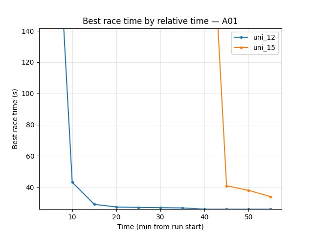
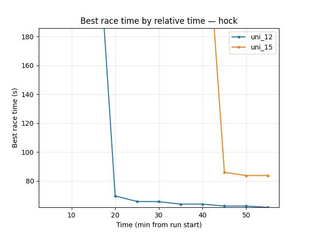
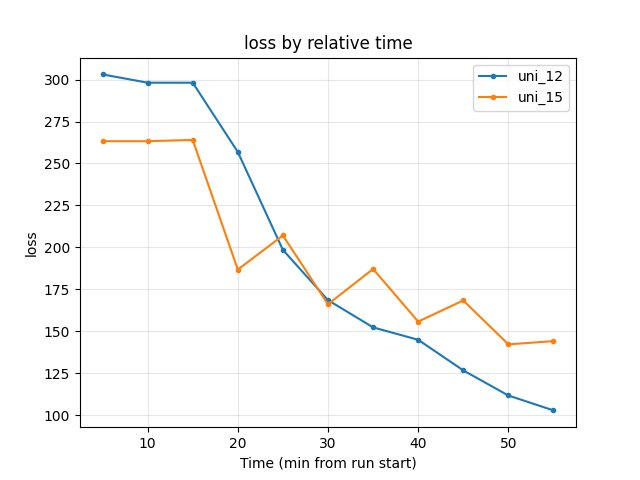
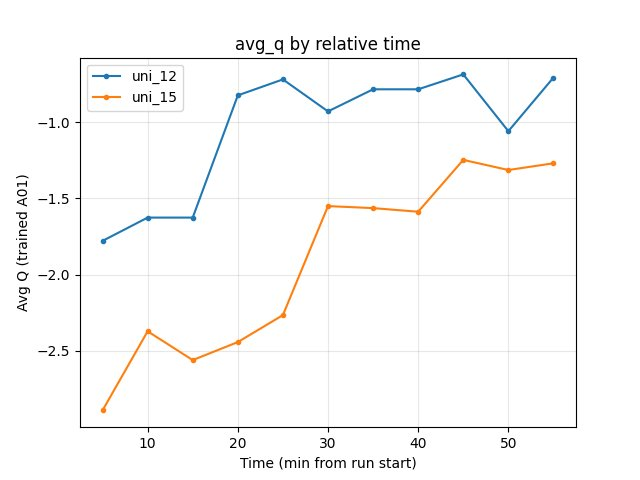

Epsilon-Greedy Exploration
==========================

This experiment tests the effect of **epsilon_schedule** (epsilon-greedy exploration) on convergence and policy quality. Both runs use **temporal_mini_race_duration_ms = 7000** (7 s); the only change is exploration: **uni_15** uses higher epsilon (0.5 at 300k steps, 0.1 at end) vs **uni_12** baseline (default: 0.1 at 300k, 0.03 at end).

**Runs:** **uni_12** (baseline exploration, 7 s segment), **uni_15** (increased exploration, 7 s segment). Comparison is by **relative time** over the common window up to 55 min.

Experiment Overview
-------------------

We compared epsilon schedules: **uni_12** (default: epsilon 0.1 at 300k steps, 0.03 at 3M) vs **uni_15** (0.5 at 300k steps, 0.1 at 3M). uni_12 ran ~55 min; uni_15 ~160 min; comparison is by **relative time** over the common window up to 55 min. The primary change is more exploration in uni_15 (slower decay, higher final epsilon).

Results
-------

**Important:** Findings are by **relative time** (minutes from run start). Common window up to 55 min (uni_12 ended at 55 min; uni_15 ran ~160 min); metrics are compared at the same checkpoints (5, 10, …, 55 min).

**Data source:** Numbers from ``scripts/analyze_experiment_by_relative_time.py`` (per-race tables: **Hock** = long track ~55–70 s, **A01** = short track ~24–25 s). Reproduce: ``python scripts/analyze_experiment_by_relative_time.py uni_12 uni_15 --interval 5`` (``--logdir "<path>"`` if needed).

**Key findings (uni_12 vs uni_15):**

- **uni_12 (default exploration)** converges faster: A01 (eval) 24.85s by 20 min and holds; uni_15 reaches 33.98s by 10 min, 27.03s by 40 min, 26.73s at 55 min. At 55 min **A01** uni_12 24.85s, uni_15 26.73s → **uni_12 better**.
- **Hock (explo):** uni_12 69.61s by 20 min, 61.68s at 55 min; uni_15 first Hock finish only at ~44 min (85.89s), at 55 min 83.75s → **uni_12 much better** on Hock over the common window.
- **Training loss** at 55 min: uni_12 102.84, uni_15 144.12 → **uni_12 lower** (better).
- **RL/avg_Q_trained_A01** at 55 min: uni_12 -0.71, uni_15 -1.27 → **uni_12 better** (less negative).
- **GPU utilization** similar (~71–74% uni_12, ~68–70% uni_15).

**Conclusion:** Over the common 55 min window, **increased exploration (uni_15)** slows convergence: uni_12 reaches better A01 and Hock times earlier and has lower loss and better Q at 55 min. The higher epsilon schedule (0.5 at 300k, 0.1 at end) did not help within 55 min; default (0.1 at 300k, 0.03 at end) is better for this horizon.

Run Analysis
------------

- **uni_12**: epsilon_schedule default (0.1 at 300k, 0.03 at 3M), temporal_mini_race_duration_ms = 7000, **~55 min**
- **uni_15**: epsilon_schedule (0.5 at 300k, 0.1 at 3M), temporal_mini_race_duration_ms = 7000, **~160 min**

TensorBoard logs: ``tensorboard\uni_12``, ``tensorboard\uni_15``. Reproduce: ``python scripts/analyze_experiment_by_relative_time.py uni_12 uni_15 --interval 5`` (``--logdir "<path>"`` if not from project root).

Detailed TensorBoard Metrics Analysis
-------------------------------------

**Methodology — Relative time:** Metrics at checkpoints 5, 10, 15, …, 55 min; common window up to 55 min. Race times from per-race tables; loss/Q/GPU% = last value at that moment. The figures below show one metric per graph (runs as lines, by relative time).

A01 (per-race eval_race_time_trained_A01)
~~~~~~~~~~~~~~~~~~~~~~~~~~~~~~~~~~~~~~~~~

- **uni_12**: at 20 min 24.85s; at 55 min **24.85s**.
- **uni_15**: at 10 min 33.98s; at 40 min 27.03s; at 55 min **26.73s**.
- **uni_12** reaches best A01 by 20 min and is better at 55 min (24.85s vs 26.73s).

Hock (per-race explo_race_time_trained_hock)
~~~~~~~~~~~~~~~~~~~~~~~~~~~~~~~~~~~~~~~~~~~~

- **uni_12**: at 20 min 69.61s; at 55 min **61.68s**.
- **uni_15**: first finish at ~44 min (85.89s); at 55 min **83.75s**.
- **uni_12** much better on Hock over the common window (61.68s vs 83.75s at 55 min).

Training loss
~~~~~~~~~~~~~

- **uni_12**: at 55 min 102.84.
- **uni_15**: at 55 min 144.12; higher through most of the window.
- **uni_12** lower (better) at end of common window.

Average Q-values (RL/avg_Q_trained_A01)
~~~~~~~~~~~~~~~~~~~~~~~~~~~~~~~~~~~~~~~

- **uni_12**: at 20 min -0.83; at 55 min -0.71.
- **uni_15**: at 55 min -1.27; more negative over the run.
- **uni_12** better (less negative) at 55 min.

GPU utilization (Performance/learner_percentage_training)
~~~~~~~~~~~~~~~~~~~~~~~~~~~~~~~~~~~~~~~~~~~~~~~~~~~~~~~~~

- **uni_12**: ~71–74% over the window; at 55 min 71.9%.
- **uni_15**: ~68–70% over the window; at 55 min 68.6%.
- Similar; uni_12 slightly higher.

Configuration Changes
----------------------

**Exploration** (``exploration`` section in config YAML):

**uni_12 (baseline — default):**

.. code-block:: python

   epsilon_schedule = [
       (0, 1),
       (50_000, 1),
       (300_000, 0.1),   # default
       (3_000_000 * global_schedule_speed, 0.03),  # default
   ]

**uni_15 (experimental — increased exploration):**

.. code-block:: python

   epsilon_schedule = [
       (0, 1),
       (50_000, 1),
       (300_000, 0.5),   # 0.1 in default
       (3_000_000 * global_schedule_speed, 0.1),  # 0.03 in default
   ]

**Environment:** Both runs used ``temporal_mini_race_duration_ms = 7000`` (same as baseline in temporal_mini_race_duration experiment).

Hardware
--------

- **GPU**: RTX 5090 (same as other experiments)
- **Parallel instances**: 8 collectors
- **System**: Same across runs

Conclusions
-----------

1. Over the common 55 min window, **uni_12 (default epsilon)** outperforms **uni_15 (increased exploration)**: faster convergence on A01 (24.85s by 20 min vs 26.73s at 55 min) and much better Hock (61.68s vs 83.75s at 55 min), lower loss (102.84 vs 144.12), and better Q (-0.71 vs -1.27).
2. **Higher epsilon schedule** (0.5 at 300k, 0.1 at end) **slowed convergence**; default (0.1 at 300k, 0.03 at end) is preferable for the same wall-clock horizon.
3. **Recommendation:** Keep **default epsilon_schedule** (0.1 at 300k, 0.03 at 3M) for fastest convergence. Use higher epsilon only if testing much longer runs or different exploration strategies.

Recommendations
---------------

- **Default:** Prefer **default epsilon_schedule** (0.1 at 300k steps, 0.03 at 3M): faster convergence and better race times over 55 min vs increased exploration (uni_15).
- **When to try higher epsilon:** Only for longer runs or dedicated exploration experiments; over 55 min, increased exploration did not improve results.

**Analysis tools:**

- **By relative time** (2+ runs): ``python scripts/analyze_experiment_by_relative_time.py uni_12 uni_15 --interval 5`` (``--logdir "<path>"`` if not from project root).
- Key metrics: Per-race ``Race/eval_race_time_*``, ``Race/explo_race_time_*``; scalars ``alltime_min_ms_hock``, ``alltime_min_ms_A01``, ``Training/loss``, ``RL/avg_Q_trained_A01``, ``Performance/learner_percentage_training`` (see :doc:`tensorboard_metrics`).
