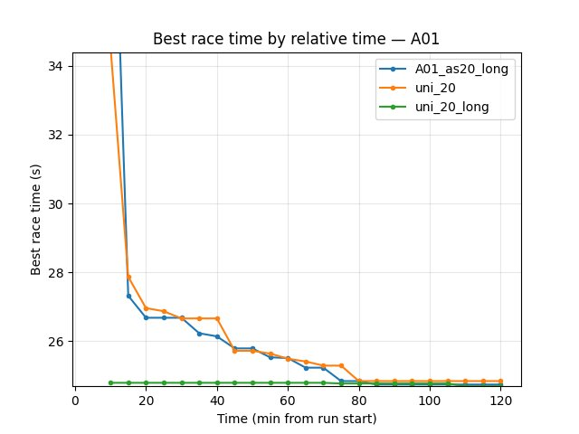
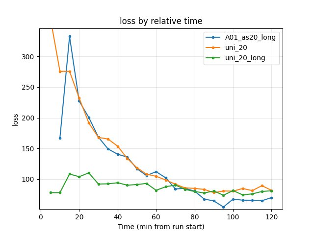
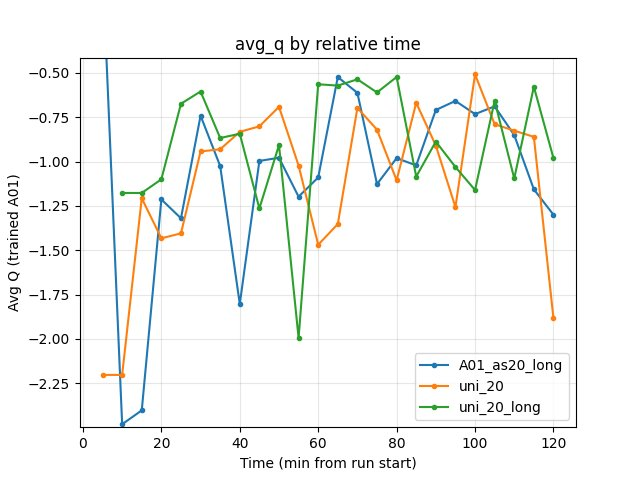
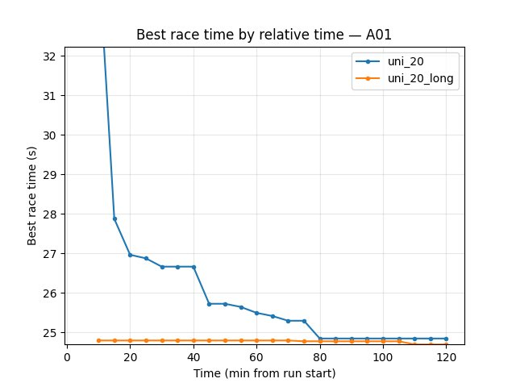
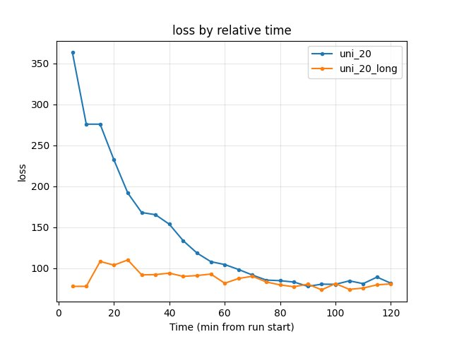
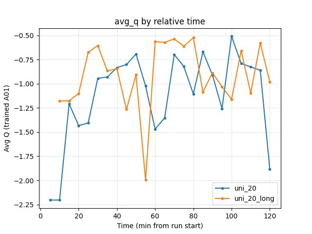
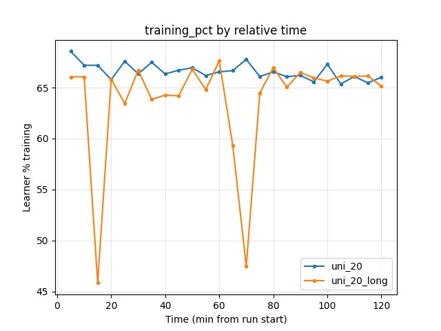

Extended Training, One vs Two Maps
==================================

This experiment tests **(1) the effect of very long training** (from checkpoint and from scratch) and **(2) whether training on one map or two maps yields better final quality**, given a small model with limited capacity.

- **uni_20**: Two maps (A01 + Hock), trained from scratch, ~120 min.
- **uni_20_long**: Two maps, continuation from uni_20 checkpoint, ~824 min (~13.7 h). Same config as uni_20.
- **A01_as20_long**: **Single map (A01 only)**, same architecture as uni_20, long training from scratch (``tensorboard_suffix_schedule`` up to 150M steps). Same image size, embedding, DDQN, batch 512, speed 512.

**Main questions:**

- Does long training make sense? (for both two-track and one-track setups)
- Is it better to train on one or two tracks in terms of final quality on the target map(s)? (capacity may limit multi-map performance.)

**Interpretation:** The script merges logs from all ``tensorboard_suffix_schedule`` directories (e.g. uni_20_long_2, _3, _4; A01_as20_long_2, _3, …). Comparisons are by **relative time** and by **steps**; when run durations differ, use the common window (e.g. up to 120 min when comparing to uni_20).

Experiment Overview
-------------------

We compared **uni_20** (baseline, two maps, from scratch ~120 min), **uni_20_long** (two maps, from uni_20 checkpoint, ~824 min), and **A01_as20_long** (single map A01, from scratch, long run). Same architecture and hyperparameters where applicable; only differences are map cycle (one vs two maps) and initialization (from scratch vs from checkpoint). Goal: (1) see how extended training behaves; (2) see how training on one map vs two maps affects final A01 performance and whether long single-map training improves time on that map.

Results
-------

**Important:** Run durations differ (uni_20 ~120 min, uni_20_long ~824 min, A01_as20_long variable). All findings below are by **relative time** over the common window (and by steps when comparing equal gradient updates). In the common 120 min window: uni_20 trains from scratch (cold start); uni_20_long trains from checkpoint (warm start); A01_as20_long trains from scratch on A01 only.

**Key Findings (uni_20 vs uni_20_long, at 120 min):**

- **uni_20_long better on race times:** A01 best 24.61s vs 24.72s (uni_20); Hock best 56.67s vs 58.42s (~1.75s faster). Explo A01 24.69s vs 24.84s.
- **Finish rates:** uni_20_long 78% (eval), 82% (explo) vs uni_20 76%, 70%.
- **Training loss:** At 120 min similar (uni_20 81.61, uni_20_long 80.88).
- **GPU utilization:** ~65–67% both; similar throughput.

**Key Findings (A01_as20_long vs uni_20 / uni_20_long, at 120 min, common window):**

- **A01 best time:** A01_as20_long **24.59s** (best of the three), uni_20_long 24.61s, uni_20 24.72s. Single-map long achieves the best A01 time at 120 min.
- **A01 finish rate (eval):** uni_20_long 78%, uni_20 76%, A01_as20_long 56%. Two-map runs have higher finish rate; single-map trades off rate for peak time.
- **Training loss at 120 min:** A01_as20_long 69.74 (lowest), uni_20_long 80.88, uni_20 81.61.
- **A01_as20_long duration:** ~495 min (logs merged from 3 dirs: A01_as20_long, _2, _3).

**Conclusion:** (1) **Long training makes sense** for both setups: uni_20_long (two maps, from checkpoint) improves over uni_20 in the same 120 min; A01_as20_long (one map, from scratch) reaches the best A01 time (24.59s) at 120 min. (2) **One vs two tracks:** For best A01 time at 120 min, single-map (A01_as20_long) slightly wins (24.59s vs 24.61s); for finish rate and multi-map capability, two-map is better. With a small model, single-map concentrates capacity on A01 and can achieve a marginal gain on that map; two-map gives better stability and Hock performance.

Run Analysis
------------

- **uni_20**: Baseline — trained from scratch, two maps. W_downsized = 64, H_downsized = 64, iqn_embedding_dimension = 128, use_ddqn = True, batch 512, speed 512, map cycle 64 hock – 64 A01. **~120 min** (relative time).
- **uni_20_long**: Same config (two maps); **initialized from uni_20 checkpoint**. **~824 min (~13.7 h)** — logs merged from 4 dirs (uni_20_long, uni_20_long_2, uni_20_long_3, uni_20_long_4) via ``tensorboard_suffix_schedule``.
- **A01_as20_long**: **Single map (A01 only)** — same architecture and training params as uni_20 (batch 512, speed 512, same lr/gamma schedules), map_cycle = A01 only (64 explo + 1 eval). Long run with ``tensorboard_suffix_schedule`` (e.g. 6M, 15M, 30M steps); logs merged from 3 dirs. Trained from scratch. **~495 min** (relative time).

TensorBoard logs: ``tensorboard\uni_20``, ``tensorboard\uni_20_long`` (and _2, _3, _4), ``tensorboard\A01_as20_long`` (and _2, _3, …). Reproduce two-run comparison: ``python scripts/analyze_experiment_by_relative_time.py uni_20 uni_20_long --interval 5``. **Triple comparison (all three runs):** ``python scripts/analyze_experiment_by_relative_time.py A01_as20_long uni_20 uni_20_long --interval 5 --step_interval 50000`` (``--logdir "<path>"`` if not from project root). Long runs may take several minutes to load.

Detailed TensorBoard Metrics Analysis
-------------------------------------

**Methodology — Relative time and by steps:** Metrics at checkpoints 5, 10, … min (common window up to 120 min when comparing all three runs) and at step checkpoints (e.g. 50k, 100k, …). The figures below show one metric per graph (runs as lines, by relative time).

Triple comparison: A01_as20_long vs uni_20 vs uni_20_long (common window 120 min)
~~~~~~~~~~~~~~~~~~~~~~~~~~~~~~~~~~~~~~~~~~~~~~~~~~~~~~~~~~~~~~~~~~~~~~~~~~~~~~~~~~

- **A01_as20_long**: at 120 min A01 best **24.59s**, eval finish rate 56%; first eval finish ~8.3 min. Explo A01 best 24.74s at 120 min.
- **uni_20**: at 120 min A01 best 24.72s, rate 76%; first eval finish ~15.5 min.
- **uni_20_long**: at 120 min A01 best 24.61s, rate 78%; first eval finish ~10.4 min (from checkpoint).
- Single-map long reaches the best A01 time but with lower finish rate; two-map long is close on time and much better on rate.

A01 (per-race eval_race_time_trained_A01) — uni_20 vs uni_20_long
~~~~~~~~~~~~~~~~~~~~~~~~~~~~~~~~~~~~~~~~~

- **uni_20**: at 20 min 24.97s (first eval finish ~15.5 min); at 120 min **24.72s**, finish rate 76%.
- **uni_20_long**: at 25 min 24.75s; at 120 min **24.61s**, finish rate 78%.
- **uni_20_long** slightly better best time (24.61s vs 24.72s) and higher finish rate — warm start + same 120 min training.

Hock (per-race explo_race_time_trained_hock)
~~~~~~~~~~~~~~~~~~~~~~~~~~~~~~~~~~~~~~~~~~~~

- **uni_20**: at 120 min best **58.42s**, finish rate 28%.
- **uni_20_long**: at 5 min 57.85s (from checkpoint); at 120 min **56.67s**, finish rate 34%.
- **uni_20_long** ~1.75s faster on Hock at 120 min.

.. image:: ../_static/exp_extended_training_uni20_uni20long_hock_best.jpg
   :alt: Hock explo best time by relative time (uni_20 vs uni_20_long)

Training loss
~~~~~~~~~~~~~

- **uni_20**: at 5 min 363.15; at 120 min 81.61.
- **uni_20_long**: at 5 min 77.83 (from checkpoint); at 120 min 80.88.
- Similar at 120 min; uni_20_long starts lower (warm start).

Average Q-values (RL/avg_Q_trained_A01)
~~~~~~~~~~~~~~~~~~~~~~~~~~~~~~~~~~~~~~~

- **uni_20**: at 5 min -2.20; at 120 min -1.88.
- **uni_20_long**: at 5 min -1.18; at 120 min -0.98.
- Similar range; both volatile over the window.

GPU utilization (Performance/learner_percentage_training)
~~~~~~~~~~~~~~~~~~~~~~~~~~~~~~~~~~~~~~~~~~~~~~~~~~~~~~~~~

- **uni_20**: ~65–68% over the window.
- **uni_20_long**: ~47–67% (some dips); similar overall.
- No substantial difference in throughput.

Configuration Changes
----------------------

**uni_20 / uni_20_long:** Same config; only change for uni_20_long is ``run_name: "uni_20_long"`` and checkpoint path to load from uni_20. Map cycle: 64 hock – 64 A01.

**A01_as20_long:** Same architecture and training section as uni_20 (batch 512, speed 512, same lr/gamma schedules, ``tensorboard_suffix_schedule``). Only difference: ``run_name: "A01_as20_long"`` and **map_cycle = A01 only** (Hock entry commented out): 64 A01 explo + 1 A01 eval per cycle. No checkpoint load; trained from scratch.

Hardware
--------

- **GPU**: Same as uni_20 (see iqn experiment docs).
- **Parallel instances**: 4 collectors (gpu_collectors_count = 4).
- **System**: Same as other experiments.

Conclusions
-----------

- **Does long training make sense?** Yes. For two maps, continuing from checkpoint (uni_20_long) outperforms from-scratch (uni_20) over 120 min (A01 24.61s vs 24.72s, Hock 56.67s vs 58.42s, higher finish rates). For one map, A01_as20_long (~495 min) reaches the best A01 time (24.59s) at 120 min and shows that long single-map training keeps improving that map.
- **One map vs two maps?** At 120 min on A01: single-map (A01_as20_long) has the best time (24.59s) but lowest eval finish rate (56%); two-map long (uni_20_long) has 24.61s and 78%. So for peak best time on one track, single-map can slightly win; for stability (finish rate) and for driving a second track (Hock), two-map is better. With a small model (limited capacity), single-map concentrates capacity on A01; two-map trades a small A01 peak gain for much better finish rate and multi-map capability.
- **Extended training:** uni_20_long ran ~13.7 h, A01_as20_long ~495 min. Use BY STEP tables or later checkpoints to assess gains beyond 120 min.

Recommendations
---------------

- **When to continue from checkpoint:** If you have a good model (e.g. uni_20) and want to squeeze more performance, continuing from its checkpoint is viable and yields immediate gains in the first minutes.
- **One map vs two maps:** If the goal is the best possible time on a single track and the model is small, single-map long training (e.g. A01_as20_long) can give a slight edge on that map (24.59s vs 24.61s) but with lower finish rate. For higher finish rate and for multiple tracks, train on two maps (or more).
- **To assess long-training effect:** Use ``analyze_experiment_by_relative_time.py`` with all three runs and compare by relative time (common window 120 min) and by steps (BY STEP tables in the script output).

**Analysis Tools:**

- Two runs: ``python scripts/analyze_experiment_by_relative_time.py uni_20 uni_20_long --interval 5 [--step_interval 50000]``.
- **Triple comparison (A01_as20_long, uni_20, uni_20_long):** ``python scripts/analyze_experiment_by_relative_time.py A01_as20_long uni_20 uni_20_long --interval 5 --step_interval 50000`` (``--logdir "<path>"`` if not from project root; may take ~1 min for long runs).
- The script **auto-merges** logs from ``tensorboard_suffix_schedule`` dirs (run, run_2, run_3, …).
- With plots: ``--plot --output-dir docs/source/_static --prefix exp_extended_training_uni20_uni20long`` (two runs) or ``--prefix exp_extended_training_A01_uni20_uni20long`` (three runs).
- Or use ``python scripts/generate_experiment_plots.py --experiments extended_training``.
