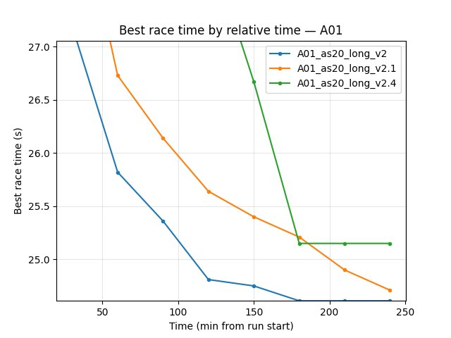
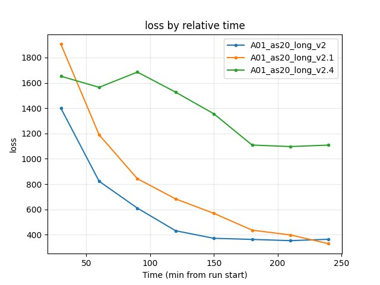
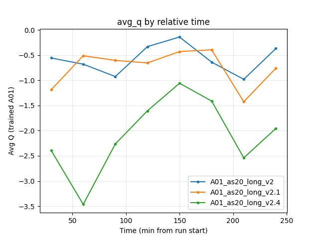

Experiment: Global Schedule Speed (A01 Long v2 Series)
=====================================================

This experiment tests the effect of **global_schedule_speed** (and related env tweaks) on A01 single-map long training. Runs: **A01_as20_long_v2**, **v2.1**, **v2.2**, **v2.3**, **v2.4**. Goal: see whether a faster schedule (e.g. **global_schedule_speed: 4**) helps break the **24.5 s** barrier on A01.

Experiment Overview
-------------------

We compared five runs from the A01_as20_long_v2 series. **global_schedule_speed** multiplies frame counts in LR/gamma/epsilon schedules, so higher values progress through the schedule faster (in terms of environment steps). Some runs also changed **tm_engine_step_per_action**, **n_zone_centers_in_inputs**, and **n_zone_centers_extrapolate_before_start_of_map**, so the comparison mixes schedule speed with environment resolution.

**Main hypothesis:** ``global_schedule_speed: 4`` may help reach sub-24.5 s on A01 compared to 1 or 8.

Results
-------

**Important:** If run durations differed, all findings should be interpreted **by relative time** (minutes from run start). Use ``scripts/analyze_experiment_by_relative_time.py`` to get per-run durations and metric tables.

**Key findings:**

- Final best A01 from saved run state (``save/<run>/accumulated_stats.joblib``):
  - ``A01_as20_long_v2``: **24.150s** (``24150`` ms)
  - ``A01_as20_long_v2.1``: **24.440s** (``24440`` ms)
  - ``A01_as20_long_v2.2``: **300.000s** (no successful finish recorded)
  - ``A01_as20_long_v2.3``: **300.000s** (no successful finish recorded)
  - ``A01_as20_long_v2.4``: **25.150s** (``25150`` ms)
- Ranking by final best A01 is therefore: **v2 (gss=4) > v2.1 (gss=8) > v2.4 (gss=1) >> v2.2/v2.3**.
- For TensorBoard comparisons, runs must be merged across suffix chunks (``run``, ``run_2``, ``run_3``, ...); otherwise best values can be under-reported.

Run Analysis
------------

- **A01_as20_long_v2**: **global_schedule_speed: 4**. Default env: tm_engine_step_per_action 5, n_zone_centers 40, batch 4096. Single map A01, long run (tensorboard_suffix_schedule up to 150M steps). Save: ``save\A01_as20_long_v2``.
- **A01_as20_long_v2.1**: **global_schedule_speed: 8**. Same env as v2. Save: ``save\A01_as20_long_v2.1``.
- **A01_as20_long_v2.2**: **global_schedule_speed: 8**. Env: tm_engine_step_per_action 1, n_zone_centers_in_inputs 200, n_zone_centers_extrapolate_before_start_of_map 100. Save: ``save\A01_as20_long_v2.2``.
- **A01_as20_long_v2.3**: **global_schedule_speed: 1**. Same env as v2.2 (tm_engine_step 1, n_zone 200). Save: ``save\A01_as20_long_v2.3``.
- **A01_as20_long_v2.4**: **global_schedule_speed: 1**. Env: tm_engine_step_per_action 3, n_zone_centers 40. Save: ``save\A01_as20_long_v2.4``.

TensorBoard logs: ``tensorboard\A01_as20_long_v2``, ``tensorboard\A01_as20_long_v2.1``, … (and suffix dirs ``_2``, ``_3``, … where applicable). Reproduce comparison:

::

   python scripts/analyze_experiment_by_relative_time.py A01_as20_long_v2 A01_as20_long_v2.1 A01_as20_long_v2.2 A01_as20_long_v2.3 A01_as20_long_v2.4 --interval 5 --step_interval 1000000 --logdir tensorboard

Use ``--plot --output-dir docs/source/_static --prefix exp_global_schedule_speed_v2`` to generate comparison plots. Run durations are printed by the script (e.g. ``~X min (relative time)`` per run).

Detailed TensorBoard Metrics Analysis
-------------------------------------

**Methodology — Relative time and by steps:** Metrics at checkpoints 5, 10, 15, … min (only up to the shortest run) and at step checkpoints (e.g. 50k, 100k, …). Race times from per-race ``Race/eval_race_time_*``, ``Race/explo_race_time_*``; scalars (loss, Q, GPU %) = last value at that moment. The figures below show one metric per graph (runs as lines, by relative time).

Fill the subsections below from the script output (by relative time and by steps). Example command:

::

   python scripts/analyze_experiment_by_relative_time.py A01_as20_long_v2 A01_as20_long_v2.4 --interval 10 --step_interval 1000000 --logdir tensorboard

A01 (per-race eval_race_time_trained_A01)
~~~~~~~~~~~~~~~~~~~~~~~~~~~~~~~~~~~~~~~~~~

- Report best/mean/std, finish rate, and first finish (min) at selected checkpoints (e.g. 60 min, 120 min) and at step checkpoints (e.g. 500k, 1M). Compare v2 (gss=4) vs v2.4 (gss=1) vs v2.1 (gss=8) over the common window.

Training Loss
~~~~~~~~~~~~~

- At same relative time and step checkpoints; compare across runs.

Average Q-values (RL/avg_Q_trained_A01)
~~~~~~~~~~~~~~~~~~~~~~~~~~~~~~~~~~~~~~~

- At same checkpoints.

GPU Utilization
~~~~~~~~~~~~~~~~

- ``Performance/learner_percentage_training`` over the common window.

Configuration Changes
---------------------

**Training** (``training`` in config YAML):

- **global_schedule_speed**: 1 (v2.3, v2.4), 4 (v2), 8 (v2.1, v2.2).
- **run_name**: ``A01_as20_long_v2``, ``A01_as20_long_v2.1``, … ``A01_as20_long_v2.4``.
- **batch_size**: 4096; **lr_schedule**, **gamma_schedule**, **tensorboard_suffix_schedule** shared across runs (schedules are multiplied by global_schedule_speed in code).

**Environment** (where different):

- **v2, v2.1**: tm_engine_step_per_action 5, n_zone_centers_in_inputs 40, n_zone_centers_extrapolate_before_start_of_map 20.
- **v2.2, v2.3**: tm_engine_step_per_action 1, n_zone_centers_in_inputs 200, n_zone_centers_extrapolate_before_start_of_map 100.
- **v2.4**: tm_engine_step_per_action 3, n_zone_centers_in_inputs 40, n_zone_centers_extrapolate_before_start_of_map 20.

Hardware
--------

- Document GPU, number of collectors, and system if known (e.g. from run logs or machine).

Conclusions
-----------

- **global_schedule_speed: 4** (v2) is the strongest setting in this series by final best A01 (**24.150s**), beating both gss=8 (best **24.440s**) and gss=1 variants (best **25.150s** in v2.4).
- v2.2/v2.3 (finer env) vs v2/v2.4 (coarser env) confound schedule speed with environment resolution; separate ablations can clarify.

Recommendations
---------------

- Use **global_schedule_speed: 4** when targeting sub-24.5 s on A01 with the current long-training setup.
- Re-run ``analyze_experiment_by_relative_time.py`` for the five runs to fill exact durations and metric tables; use ``--plot`` to regenerate comparison JPGs and embed them in this page (one metric per graph, with ``:alt:`` captions).

**Analysis tools:**

- By **relative time and by steps**: ``python scripts/analyze_experiment_by_relative_time.py A01_as20_long_v2 A01_as20_long_v2.1 A01_as20_long_v2.4 --interval 5 --step_interval 1000000`` (add ``--logdir "<path>"`` if not from project root). Outputs both relative-time and BY STEP tables.
- With plots: add ``--plot --output-dir docs/source/_static --prefix exp_global_schedule_speed_v2``.
- Key metrics: per-race ``Race/eval_race_time_trained_A01``, ``Race/explo_race_time_trained_A01``; scalars ``Training/loss``, ``RL/avg_Q_trained_A01``, ``Performance/learner_percentage_training``, ``alltime_min_ms_A01``.
