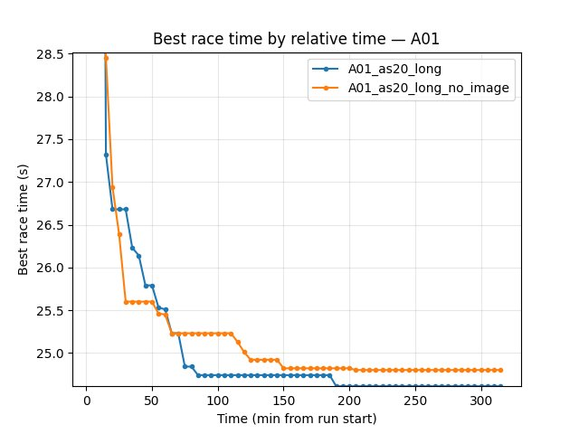
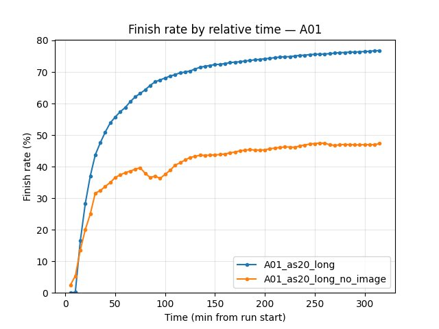
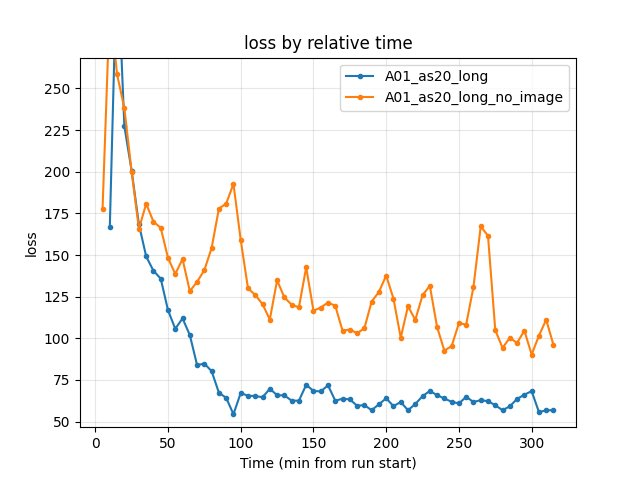
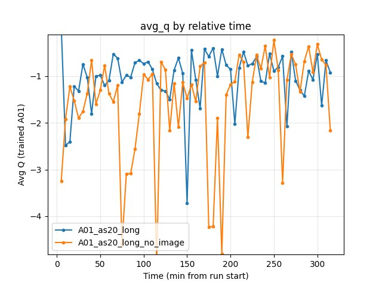
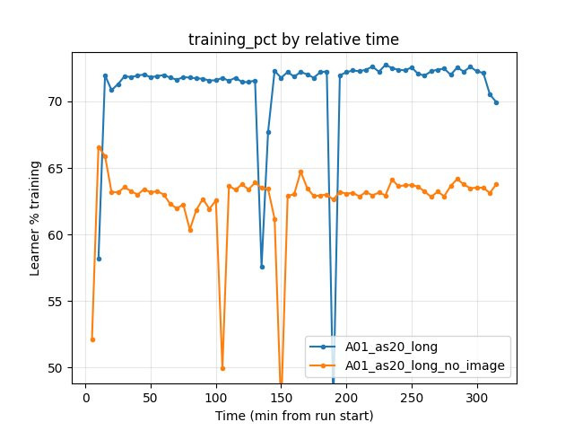

Experiment: IQN Without Image Head (Float-Only)
================================================

Experiment Overview
-------------------

This experiment tests RL training with the IQN **image head disabled** (``use_iqn_image_head: false``). The agent uses only **float features** (waypoints, speed, gear, etc.); the CNN that processes screen pixels is not created or used. This serves as an **ablation** to measure how much the visual stream contributes to performance and as a baseline for float-only setups (e.g. when vision is unavailable or deferred).

**Goal:** Compare learning speed and final performance of float-only IQN vs full IQN (with image head) on the same map cycle and training schedule.

**Key parameter:** ``neural_network.use_iqn_image_head: false``. All other settings (batch_size, running_speed, map_cycle, rewards, etc.) match a comparable run with image head for a fair comparison.

Results
-------

**Important:** Run durations differed (baseline ~495 min, no_image ~320 min). All findings below are by **relative time** (minutes from run start); comparison uses the common window up to 320 min.

**Key findings (by relative time):**

- **A01 best time:** With image head (A01_as20_long) reaches better best times at every checkpoint. At 85 min: baseline 24.71s, no_image 25.02s. At 315 min: baseline 24.53s, no_image 24.79s (~0.26s gap). Float-only learns but plateaus ~0.2–0.3s slower.
- **First finish:** Baseline first finish 8.3 min, no_image 10.4 min. Finish rate at 85 min: baseline 53%, no_image 38%; by 315 min baseline 65%, no_image 47%.
- **Training loss:** Baseline lower throughout (e.g. at 85 min: 67.3 vs 177.9; at 315 min: 56.9 vs 96.1). Float-only has higher loss and more variance.
- **GPU utilization:** Baseline ~71–72% learner training; no_image ~62–64% (smaller network, less compute per batch).
- **Conclusion:** The image head improves sample efficiency and final A01 times; float-only is viable but consistently worse on this map.

Run Analysis
------------

- **A01_as20_long** (baseline): ``use_iqn_image_head: true``, batch_size 512, running_speed 512, map cycle 64× A01 + 1× eval. **~495 min** (relative time). TensorBoard: ``tensorboard/A01_as20_long`` (+ _2, _3).
- **A01_as20_long_no_image**: ``use_iqn_image_head: false``, batch_size 512, running_speed 512, gpu_collectors_count 4, map cycle 64× A01 + 1× eval. **~320 min** (relative time). Save dir: ``save/A01_as20_long_no_image``; TensorBoard: ``tensorboard/A01_as20_long_no_image`` (+ _2, _3).

Comparison uses common window up to **320 min** (shortest run). Reproduce: ``python scripts/analyze_experiment_by_relative_time.py A01_as20_long A01_as20_long_no_image --interval 5 --step_interval 50000``.

Detailed TensorBoard Metrics Analysis
-------------------------------------

**Methodology — Relative time and by steps:** Metrics are compared at checkpoints 5, 10, 15, 20, … min (only up to the shortest run, 320 min) and at step checkpoints (BY STEP tables). For race times we use per-race events (best/mean/std, finish rate); for loss/Q/GPU% the last value at that moment. The figures below show one metric per graph (runs as lines, by relative time).

A01 (per-race eval_race_time_trained_A01, common window up to 320 min)
~~~~~~~~~~~~~~~~~~~~~~~~~~~~~~~~~~~~~~~~~~~~~~~~~~~~~~~~~~~~~~~~~~~~~~

- **A01_as20_long (baseline):** At 85 min best 24.71s, mean 28.27s, finish rate 53%; at 315 min best 24.53s, mean 26.27s, finish rate 65%. First finish 8.3 min.
- **A01_as20_long_no_image:** At 85 min best 25.02s, mean 29.03s, finish rate 38%; at 315 min best 24.79s, mean 27.45s, finish rate 47%. First finish 10.4 min. Best time lags baseline by ~0.2–0.3s throughout.

Training Loss
~~~~~~~~~~~~~

- **A01_as20_long:** At 85 min 67.3; at 315 min 56.9.
- **A01_as20_long_no_image:** At 85 min 177.9; at 315 min 96.1. Float-only has higher loss and more variance over the run.

Average Q-values
~~~~~~~~~~~~~~~~

- **A01_as20_long:** At 315 min ~-0.92 (varies by checkpoint).
- **A01_as20_long_no_image:** At 315 min ~-2.17. Both runs show fluctuating Q; no_image tends more negative in the second half of the window.

GPU Utilization (training %)
~~~~~~~~~~~~~~~~~~~~~~~~~~~~

- **A01_as20_long:** ~71–72% over the window.
- **A01_as20_long_no_image:** ~62–64%. Smaller network (no CNN) yields slightly lower learner percentage.

Configuration Changes
----------------------

**Neural network** (``neural_network`` section in config YAML):

.. code-block:: yaml

   use_iqn_image_head: false   # No CNN image head; IQN uses only float features.

**Training** (unchanged from default A01 long setup):

.. code-block:: yaml

   run_name: "A01_as20_long_no_image"
   batch_size: 512

**Performance:**

.. code-block:: yaml

   gpu_collectors_count: 4
   running_speed: 512

**Map cycle:** 64× A01 exploration, 1× A01 eval (same as other A01 long runs).

Hardware
--------

Document GPU model, number of collectors, and system when you run the experiment (e.g. 4 GPU collectors, RTX 5090).

Conclusions
----------

- Float-only IQN (no image head) trains on the same float inputs and reaches a reasonable policy (A01 best ~24.79s by 315 min) but is **consistently worse** than the baseline with image head (~24.53s, ~0.26s faster) over the common window (320 min). First finish is later (10.4 min vs 8.3 min); finish rate stays lower; loss is higher.
- The **image head adds clear value** on A01: better sample efficiency, lower loss, and better best times. Use float-only for ablation or when vision is unavailable; for best performance keep ``use_iqn_image_head: true``.

Recommendations
---------------

- Use **use_iqn_image_head: false** for ablation (how much does vision help?) or when training without screen input.
- For a fair comparison, keep batch_size, running_speed, map_cycle, and rewards identical; only change ``use_iqn_image_head``. Note: no_image run used 4 collectors vs 8 for baseline in config; durations differ (320 min vs 495 min), so comparison is by relative time only.

**Analysis tools:**

- By **relative time and by steps**: ``python scripts/analyze_experiment_by_relative_time.py <baseline_run> A01_as20_long_no_image [--interval 5] [--step_interval 50000]`` (use ``--logdir "<path>"`` if not from project root). Outputs both relative-time and BY STEP tables.
- With comparison plots: add ``--plot --output-dir docs/source/_static --prefix exp_iqn_no_image_head`` to the command above; then embed the generated ``exp_iqn_no_image_head_*.jpg`` files in this RST.
- By last value only: ``python scripts/analyze_experiment.py <baseline_run> A01_as20_long_no_image`` (less meaningful when durations differ).
