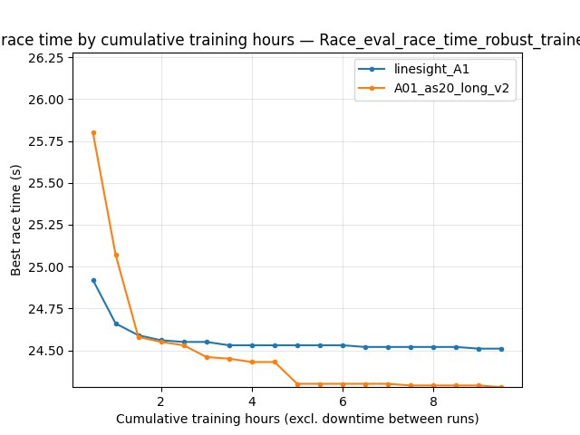
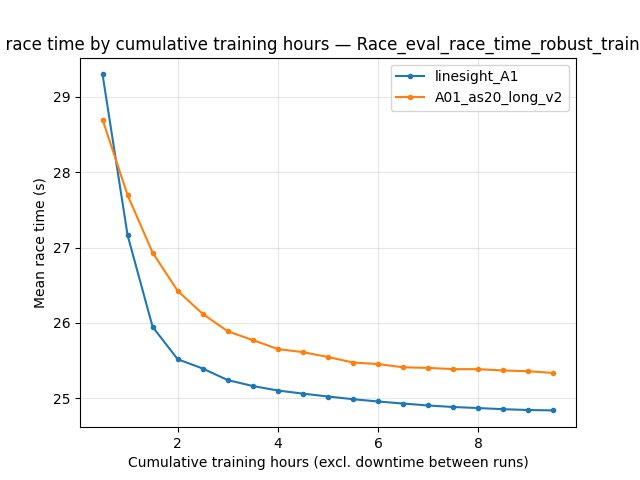
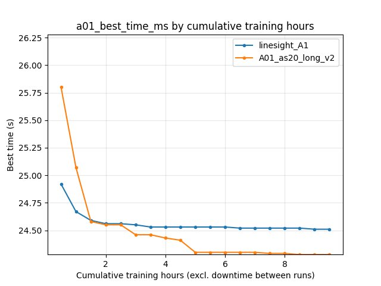
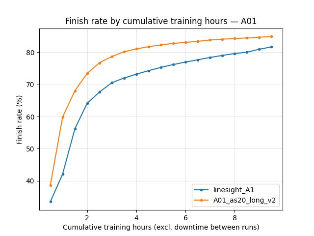
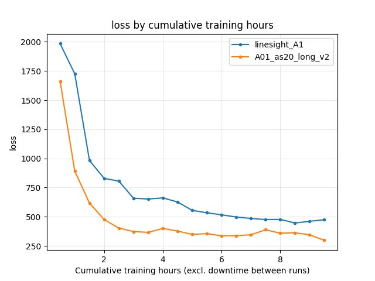
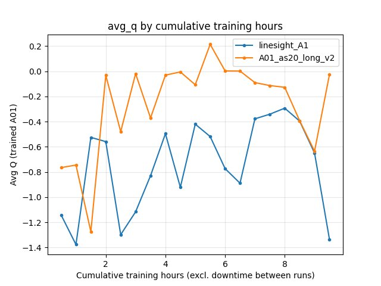
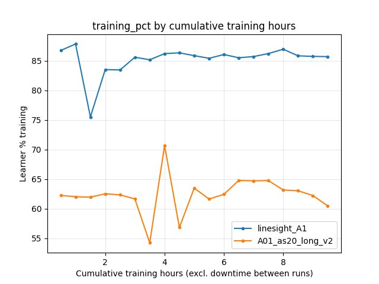

Experiment: Linesight-style RL on A01 vs ``A01_as20_long_v2``
================================================================

Experiment Overview
-------------------

This experiment compares a run trained with **Linesight-aligned** hyperparameters on the **A01** map cycle (``run_name``: ``linesight_A1``, config based on ``config_files/rl/config_linesight.yaml`` / upstream `Linesight-RL/linesight <https://github.com/Linesight-RL/linesight/tree/main/config_files>`__) against the established long-run baseline **``A01_as20_long_v2``** (default-style IQN on A01 with **``global_schedule_speed: 4``**).

**Goal:** See whether the upstream Linesight recipe (160x120 CNN, IQN embedding 64, no DDQN, vanilla IQN without BTR, ``weight_decay_lr_ratio: 0.02``, ``global_schedule_speed: 1``, etc.) matches or beats the tuned Rulka long baseline on **best A01 time**, **robust eval**, and **stability** (mean time, finish rate), when both use **batch 4096** and the **same A01 map and reference line**, but see **map_cycle repeats** below (not identical sampling mix).

**Important:** This is **not** a single-parameter ablation. Differences include **schedule speed**, **vision resolution**, **IQN / target-update settings**, **exploration schedules**, **reward shaping** (engineered slide bonuses and ``final_speed_reward_as_if_duration_s`` on v2 only), **map_cycle exploration repeat** (**4** vs **64** per cycle block for ``linesight_A1`` vs v2; see Configuration Changes), **performance block** (``running_speed``, network broadcast cadence; **same** ``gpu_collectors_count`` and **``max_rollout_queue_size``** in both snapshots), and **BTR** (explicitly off on ``linesight_A1``; v2 snapshot has **no** ``btr:`` section and used the codebase defaults at run time — historically the tuned stack with DDQN / smaller CNN, not the Linesight vanilla recipe).

Results
-------

**Primary outcome:** On **saved best A01 time** from ``accumulated_stats.joblib``, **``A01_as20_long_v2`` remains better**: **24.150 s** (``24150`` ms) vs **24.510 s** (``24510`` ms) for ``linesight_A1``.

**TensorBoard / per-race (cumulative training hours, common window ~0--9.7 h):**

- **Robust eval best** (``Race/eval_race_time_robust_trained_A01``): ``linesight_A1`` improves to ~**24.51 s** by ~9 h; **v2** reaches ~**24.28--24.29 s** in the same window (better).
- **Eval mean time** and **finish rate** favor **v2** throughout the shared window (e.g. at **9 h** cumulative training: trained-eval mean ~**105.6 s** vs ~**88.6 s**; finish rate ~**71%** vs ~**77%**).

**By equal training steps (BY STEP, common window up to ~51M steps):**

- Early (e.g. **10M** steps): **robust** best is similar (~**24.56 s** vs ~**24.58 s**).
- Late (**51M** steps): **v2** leads on **``alltime_min_ms_A01``** and robust best (~**24.28 s** vs ~**24.51 s**).

**Learner utilization:** ``linesight_A1`` shows much higher **``Performance/learner_percentage_training``** (~**85--87%** vs ~**62--64%** at comparable steps). **Both runs used eight collectors** (see snapshots); the gap is **not** from 2 vs 8. Plausible contributors include **``running_speed``** (80 vs 32), **weight/inference broadcast cadence** (``send_shared_network_every_n_batches`` / ``update_inference_network_every_n_actions``), and **heavier per-step compute** on the Linesight-side vision stack (160x120 vs 64x64), which changes how the learner spends time relative to IPC and buffer work.

Run Analysis
------------

- **``linesight_A1``**: Linesight-style config on A01; TensorBoard merged across **5** dirs (``linesight_A1`` … ``linesight_A1_5``). **~9.67 h** cumulative training time (``cumul_training_hours``). Wall span from TB merge ~**580 min** (not equivalent to training time; short run).
- **``A01_as20_long_v2``**: Historical long baseline; TensorBoard merged across **3** dirs. **~17.74 h** cumulative training time. Wall span ~**2902 min** (includes idle gaps; see :doc:`time_axis_conventions`).

**Common comparison windows**

- **By cumulative training time:** compare up to **~9.67 h** (when ``linesight_A1`` stops).
- **By steps:** compare up to **~51M** steps (max step in the shorter merged run).

Detailed TensorBoard Metrics Analysis
-------------------------------------

**Methodology:** Metrics are compared (1) on the **cumulative training hours** axis (``--time-axis cumul_training_hours``) and (2) in **BY STEP** tables (1M step grid). For long runs, **wall-clock minutes** from TensorBoard are misleading when the learner is idle between sessions; do not equate TB wall span with training duration. Command used:

.. code-block:: text

   python scripts/analyze_experiment_by_relative_time.py linesight_A1 A01_as20_long_v2 --time-axis cumul_training_hours --interval-training-hours 1 --step_interval 1000000

The figures below show **one metric per graph** (both runs as lines, **cumulative training hours** on the X axis where applicable).

A01 robust eval best (common window up to ~9.7 training hours)
~~~~~~~~~~~~~~~~~~~~~~~~~~~~~~~~~~~~~~~~~~~~~~~~~~~~~~~~~~~~~~~

At **9 h** cumulative training, robust eval best is ~**24.51 s** (``linesight_A1``) vs ~**24.29 s** (``A01_as20_long_v2``).

A01 robust eval mean
~~~~~~~~~~~~~~~~~~~~

Scalar ``alltime_min_ms_A01``
~~~~~~~~~~~~~~~~~~~~~~~~~~~~~

Eval finish rate (trained A01)
~~~~~~~~~~~~~~~~~~~~~~~~~~~~~~~

Training loss
~~~~~~~~~~~~~

Average Q (``RL/avg_Q_trained_A01``)
~~~~~~~~~~~~~~~~~~~~~~~~~~~~~~~~~~~~~

Learner training percentage
~~~~~~~~~~~~~~~~~~~~~~~~~~~~

BY STEP highlights (1M checkpoints, excerpt)
~~~~~~~~~~~~~~~~~~~~~~~~~~~~~~~~~~~~~~~~~~~~~

**``Race/eval_race_time_robust_trained_A01`` best:** at **10M** steps ~**24.56 s** vs ~**24.58 s**; at **51M** ~**24.51 s** vs ~**24.28 s** (v2 better at the end of the common step window).

**``alltime_min_ms_A01``:** at **51M** steps ~**24.51 s** vs ~**24.28 s** (aligns directionally with save-state check below).

Save-state cross-check (mandatory)
~~~~~~~~~~~~~~~~~~~~~~~~~~~~~~~~~~

Final bests from ``save/<run>/accumulated_stats.joblib`` (``alltime_min_ms['A01']`` in ms):

- **``linesight_A1``:** **24510** ms (~**24.510 s**).
- **``A01_as20_long_v2``:** **24150** ms (~**24.150 s**).

At the **last common BY STEP checkpoint** (~51M), TensorBoard ``alltime_min_ms_A01`` shows the same ordering (~24.51 s vs ~24.28 s). **v2** continued training well past that; its saved **24150** ms reflects the full long run, not only the shared window.

Configuration Changes
---------------------

**Training (representative deltas, from ``save/.../config_snapshot.yaml``)**

.. code-block:: text

   # linesight_A1 (Linesight-style)
   global_schedule_speed = 1
   weight_decay_lr_ratio = 0.02
   # epsilon_boltzmann second knot at 3M steps (Linesight)
   # epsilon schedule knots match v2 for the listed steps (through 3M)
   # engineered slide schedules: [[0, 0]] only; final_speed_reward_as_if_duration_s = 0
   # multi_action_exploration: per_action (present in linesight snapshot)

   # A01_as20_long_v2 (baseline)
   global_schedule_speed = 4
   weight_decay_lr_ratio = 0.1
   # epsilon_boltzmann second knot at 10M steps
   # engineered speedslide / neoslide schedules with mid-training bonuses; final_speed_reward_as_if_duration_s = 2
   # multi_action_exploration: omitted in snapshot (schema default at run time)

**Neural / algorithm**

.. code-block:: text

   # linesight_A1
   w_downsized = 160, h_downsized = 120
   iqn_embedding_dimension = 64
   use_ddqn = false
   number_memories_trained_on_between_target_network_updates = 2048
   # btr: all false (vanilla IQN)

   # A01_as20_long_v2
   w_downsized = 64, h_downsized = 64
   iqn_embedding_dimension = 128
   use_ddqn = true
   number_memories_trained_on_between_target_network_updates = 128

**Performance**

.. code-block:: text

   # linesight_A1
   gpu_collectors_count = 8
   running_speed = 80
   send_shared_network_every_n_batches = 10
   update_inference_network_every_n_actions = 20

   # A01_as20_long_v2
   gpu_collectors_count = 8
   running_speed = 32
   send_shared_network_every_n_batches = 128
   update_inference_network_every_n_actions = 128

**Map cycle (both use A01 + ``A01_0.5m_cl.npy``; repeat counts differ)**

.. code-block:: text

   # linesight_A1: 4 exploration rollouts per 1 eval-style entry (Linesight-like ratio on A01)
   # entries: explore repeat=4, then eval repeat=1

   # A01_as20_long_v2: 64 exploration rollouts per 1 eval-style entry (long-run Rulka recipe)
   # entries: explore repeat=64, then eval repeat=1

**Also shared:** ``batch_size: 4096``, ``max_rollout_queue_size: 4``, ``n_prev_actions_in_inputs: 5``, same checkpoint / road / timeout environment block in snapshots.

Hardware
--------

- **Parallel game clients:** **8** for **both** runs (``gpu_collectors_count`` in each ``config_snapshot.yaml``).
- **In-game speed:** **80** vs **32** (``performance.running_speed``).
- **GPU / CPU model:** not recorded for this write-up; use your machine specs when reproducing.

Conclusions
-----------

- **``A01_as20_long_v2``** keeps a **better final A01 best** (**24.150 s** saved) and **better robust eval / mean / finish rate** than **``linesight_A1``** in the **common cumulative-training-time** and **common BY STEP** windows.
- The Linesight-style setup **does not**, in this run, outperform the accelerated-schedule + default Rulka vision/IQN recipe on **pure best time**, despite **higher reported learner training percentage** (same collector count; see Results).
- Differences in **``global_schedule_speed``**, **reward extras**, **architecture**, **game speed**, **broadcast cadence**, and especially **exploration vs eval mix** (**4:1** vs **64:1** repeats per map-cycle block) are confounded; a stricter ablation would match ``map_cycle`` repeats or isolate one block at a time.

Recommendations
---------------

- Treat **``A01_as20_long_v2``** as the stronger **A01 single-map** reference for **best time** until a Linesight-style run matches it under controlled hardware and schedule.
- Interpret **``Performance/learner_percentage_training``** together with **transitions/s**, **``running_speed``**, and wall time (:doc:`time_axis_conventions`); the same **``gpu_collectors_count``** does not imply the same effective load on the learner.
- Re-run pairwise analysis after longer **``linesight_A1``** training if you extend the run past ~51M steps.

**Analysis tools**

- **By cumulative training hours + BY STEP:** ``python scripts/analyze_experiment_by_relative_time.py linesight_A1 A01_as20_long_v2 --time-axis cumul_training_hours --interval-training-hours 1 --step_interval 1000000``
- **Plots (committed JPGs):** ``python scripts/analyze_experiment_by_relative_time.py linesight_A1 A01_as20_long_v2 --time-axis cumul_training_hours --interval-training-hours 0.5 --step_interval 1000000 --plot --output-dir docs/source/_static --prefix exp_linesight_A1_vs_A01_as20_long_v2``
- **Wall vs training audit:** ``python scripts/audit_tensorboard_training_timeline.py --runs linesight_A1 A01_as20_long_v2``
