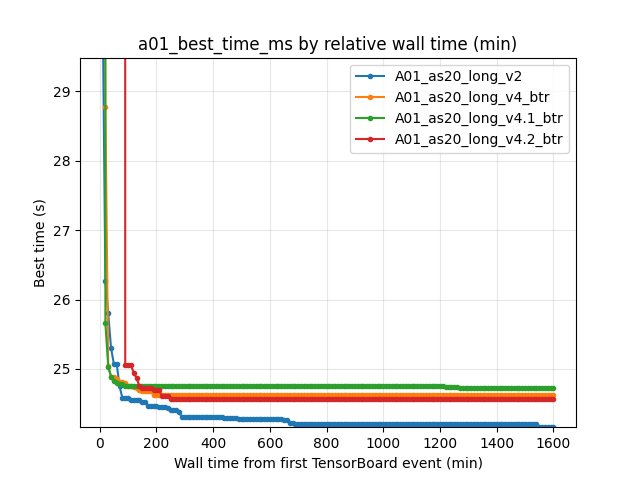
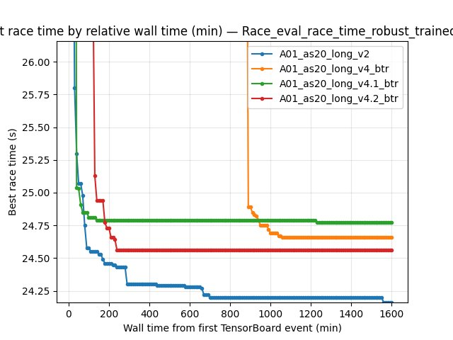
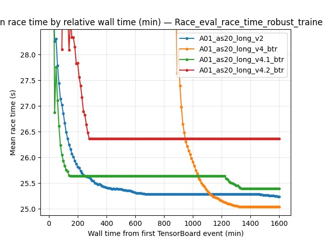
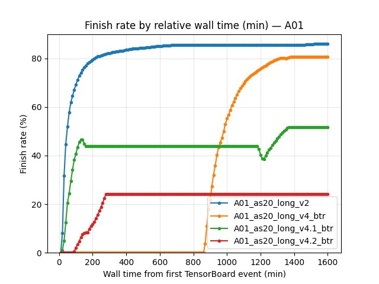
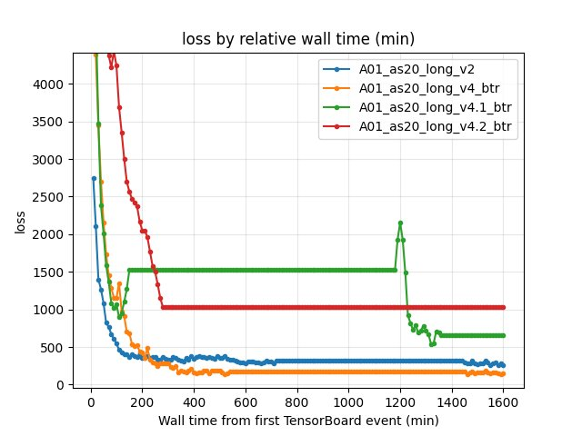
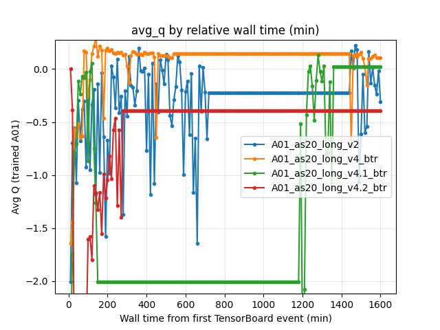
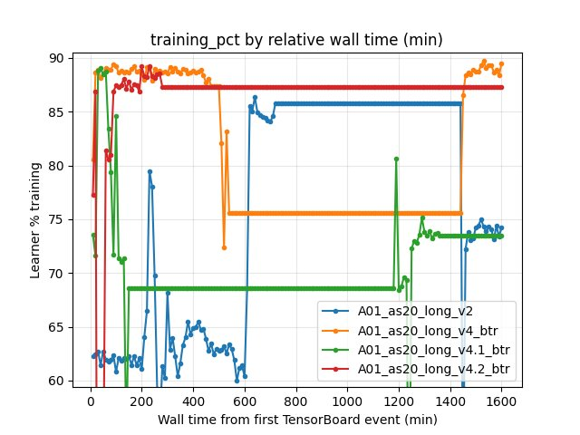

Experiment: BTR (Beyond The Rainbow) on A01
=============================================

Experiment Overview
-------------------

This experiment tested the effect of enabling the full BTR recipe (paper-aligned components mirrored under ``btr:`` in the RL config) on long training for map ``A01``.

Compared runs:

- Baseline: ``A01_as20_long_v2`` (BTR disabled)
- BTR variants: ``A01_as20_long_v4_btr``, ``A01_as20_long_v4.1_btr``, ``A01_as20_long_v4.2_btr`` (BTR enabled)

Goal: determine whether BTR improves the best achievable A01 time and the learning dynamics (by equal training steps).

Results
-------

**Important:** run wall-clock durations differ across BTR variants, so all “by time” conclusions are valid only on the *common window* shared by the compared runs (up to ~1600 wall-min; the shortest run is ``A01_as20_long_v4_btr``).

**Key findings:**

- Final best A01 time (save-state ``alltime_min_ms['A01']``): the baseline ``v2`` is substantially better than all BTR variants.
- BY STEP comparison at equal compute (10M and 20M steps) also shows ``v2`` ahead on robust A01 eval best time.
- BTR improves some early/mid training metrics (e.g. earlier A01 “best-so-far” reached by ~60–90 wall minutes), but it does not translate into a better final record.

Run Analysis
------------

Durations (wall minutes from the first merged TensorBoard event):

- ``A01_as20_long_v2``: ~2902 min
- ``A01_as20_long_v4_btr``: ~1604 min
- ``A01_as20_long_v4.1_btr``: ~2920 min
- ``A01_as20_long_v4.2_btr``: ~2911 min

Detailed TensorBoard Metrics Analysis
--------------------------------------

The tables below summarize key metrics by (1) relative wall time (minutes from the first merged TensorBoard event) and (2) by training steps (common checkpoints on equal gradient updates).

The figures below show one metric per graph (runs as lines) using relative wall time.

Methodology — common windows and checkpoints:

- By relative time: evaluated at wall-minute checkpoints with interval 10 min, and interpreted only up to the common window (shortest run ended around ~1600 min).
- By steps: evaluated only at common step checkpoints (here: 10M and 20M steps).

Map Performance (A01) — best so far
~~~~~~~~~~~~~~~~~~~~~~~~~~~~~~~~~~~~

Metric: scalar ``alltime_min_ms_A01`` (best race time achieved so far, seconds = ms/1000).

Values within the common wall-time window:

- At 20 min: ``v2`` 26.270s vs ``v4_btr`` 28.780s vs ``v4.1_btr`` 25.660s vs ``v4.2_btr`` 300.000s
- At 60 min: ``v2`` 25.070s vs ``v4_btr`` 24.850s vs ``v4.1_btr`` 24.800s vs ``v4.2_btr`` 300.000s
- At 90 min: ``v2`` 24.580s vs ``v4_btr`` 24.790s vs ``v4.1_btr`` 24.760s vs ``v4.2_btr`` 25.060s
- At 150 min: ``v2`` 24.530s vs ``v4_btr`` 24.680s vs ``v4.1_btr`` 24.750s vs ``v4.2_btr`` 24.730s
- At ~1600 min (end of common wall window): ``v2`` 24.160s vs ``v4_btr`` 24.620s vs ``v4.1_btr`` 24.720s vs ``v4.2_btr`` 24.560s

Interpretation:

Early best-so-far (60–90 min) is often *better* for BTR than for ``v2``. However, the baseline continues improving and ends with a much better final record.

Map Performance (A01) — robust eval best time (by steps)
~~~~~~~~~~~~~~~~~~~~~~~~~~~~~~~~~~~~~~~~~~~~~~~~~~~~~~~~~~~~~

Metric: per-race ``Race/eval_race_time_robust_trained_A01``.

BY STEP checkpoints (common compute):

- 10M steps:
  - ``v2`` best 24.580s (mean 26.74s, std 2.18s)
  - ``v4_btr`` best 24.660s (mean 25.27s, std 1.25s)
  - ``v4.1_btr`` best 24.770s (mean 25.39s, std 1.19s)
  - ``v4.2_btr`` best 24.560s (mean 26.48s, std 2.52s)
- 20M steps:
  - ``v2`` best **24.460s** (mean 25.80s, std 1.71s)
  - ``v4_btr`` best 24.660s (mean 25.00s, std 0.86s)
  - ``v4.1_btr`` best 24.700s (mean 25.16s, std 0.81s)
  - ``v4.2_btr`` best 24.550s (mean 25.39s, std 1.68s)

Finish-rate columns were reported as ``-`` in this comparison output (consistent “finished” event mapping was not available for the robust tag within these checkpoints).

Training Loss (by steps)
~~~~~~~~~~~~~~~~~~~~~~~~~~

Metric: scalar ``Training/loss`` (last value at the step checkpoint).

- 10M steps: ``v2`` 546.07 vs ``v4_btr`` 269.78 vs ``v4.1_btr`` 553.35 vs ``v4.2_btr`` 1149.84
- 20M steps: ``v2`` 351.09 vs ``v4_btr`` 167.62 vs ``v4.1_btr`` 283.07 vs ``v4.2_btr`` 643.43

Average Q-values (by steps)
~~~~~~~~~~~~~~~~~~~~~~~~~~~~~

Metric: scalar ``RL/avg_Q_trained_A01`` (last value at the step checkpoint).

- 10M steps: ``v2`` -0.9310 vs ``v4_btr`` 0.1308 vs ``v4.1_btr`` 0.0269 vs ``v4.2_btr`` -1.3968
- 20M steps: ``v2`` -0.6688 vs ``v4_btr`` 0.0990 vs ``v4.1_btr`` 0.0367 vs ``v4.2_btr`` -0.0931

Throughput / learner busy time (by steps)
~~~~~~~~~~~~~~~~~~~~~~~~~~~~~~~~~~~~~~~~~~~~~

Metric: scalar ``Performance/learner_percentage_training``.

- 10M steps: ``v2`` 60.8% vs ``v4_btr`` 89.3% vs ``v4.1_btr`` 73.2% vs ``v4.2_btr`` 88.5%
- 20M steps: ``v2`` 61.1% vs ``v4_btr`` 88.7% vs ``v4.1_btr`` 78.5% vs ``v4.2_btr`` 78.8%

Takeaway:

BTR improves “learner training time share” in these runs (often much higher than the baseline), but A01 robust best time still favors ``v2`` at equal step budgets.

Configuration Changes
----------------------

Training / network setup differences between baseline and BTR runs:

1) Baseline (BTR disabled) — ``A01_as20_long_v2``

- ``global_schedule_speed = 4``
- ``dense_hidden_dimension = 1024``, ``iqn_embedding_dimension = 128``
- ``use_ddqn = true``, ``clip_grad_norm = 30``
- ``weight_decay_lr_ratio = 0.1``

2) BTR enabled — ``A01_as20_long_v4_btr`` and ``A01_as20_long_v4.1_btr``

- BTR bundle: ``nn.vis.cnn`` IMPALA + maxpool + spectral norm on; ``btr:`` munchausen + layer norm + NoisyNet (``use_munchausen``, ``use_layer_norm``, ``use_noisy_linear``, etc.)
- ``dense_hidden_dimension = 1024``, ``iqn_embedding_dimension = 128``
- ``use_ddqn = true``, ``clip_grad_norm = 30``
- ``weight_decay_lr_ratio = 0.1``
- ``global_schedule_speed`` differs:
  - ``v4_btr``: ``global_schedule_speed = 4``
  - ``v4.1_btr``: ``global_schedule_speed = 1``

3) BTR enabled (smaller network + softer optimizer) — ``A01_as20_long_v4.2_btr``

- ``dense_hidden_dimension = 512``, ``iqn_embedding_dimension = 64``
- ``use_ddqn = false``, ``clip_grad_norm = 10``
- ``weight_decay_lr_ratio = 0``
- ``global_schedule_speed = 1``
- same BTR + vision bundle as above (reference ``config_btr.yaml``).

Hardware
--------

- ``gpu_collectors_count`` from config snapshots: ``8`` (parallel collectors)
- ``running_speed``: ``32``
- GPU model / device specifics were not captured in the config snapshots used for this write-up.

Conclusions
-----------

- BTR is not a clear win for long A01 training in these experiments.
- While BTR variants can produce better early “best-so-far” A01 times (common-window by wall minutes), the baseline ``A01_as20_long_v2`` reaches a significantly better final best time.
- At equal step budgets (10M and 20M), ``v2`` has better robust eval best time than most BTR variants (and ties/breaches only briefly depending on which BTR variant is considered).

Recommendations
---------------

1. If the goal is the best A01 record, keep ``v2`` as the stronger baseline and treat these BTR configs as “early-learning positive but late-learning inferior”.
2. Next BTR comparisons should extend the common BY STEP window beyond 20M steps and (optionally) use ``--time-axis cumul_training_hours`` to avoid wall-time calendar gaps.
3. Consider ablations of BTR components (e.g. disable Munchausen or spectral norm first) to find which ingredient actually harms late-stage convergence on TM-style long training.

