IQN model experiments
=====================

This page documents experiments on **IQN model variants**: **use_ddqn** (Double DQN), **iqn_embedding_dimension**, **W_downsized / H_downsized** (image dimensions), and related parameters.

**How the runs relate (chain of changes):**

- **uni_12** → **uni_16**: only **use_ddqn** (False → True). Same: batch 512, speed 512, map 64–64, iqn_embedding_dimension 64, W/H 128.
- **uni_16** → **uni_17**: only **iqn_embedding_dimension** (64 → 128). Same: use_ddqn True, batch/speed/map, W/H 128.
- **uni_17** → **uni_18**: only **W_downsized / H_downsized** (128 → 256). Same: use_ddqn True, embedding 128, batch/speed/map.
- **uni_17** → **uni_19**: **W_downsized / H_downsized** (128 → 64) and **iqn_embedding_dimension** (128 → 64). Same: use_ddqn True, batch/speed/map. "Downsized model" comparison.
- **uni_17** → **uni_20**: only **W_downsized / H_downsized** (128 → 64). Same: iqn_embedding_dimension 128, use_ddqn True, batch/speed/map. **Isolates image-size effect** (embedding kept at 128).

So: uni_12 (baseline) → +DDQN → uni_16 → +embedding 128 → uni_17 → +image 256×256 → uni_18; also uni_17 → 64×64 + embedding 64 → uni_19; uni_17 → 64×64 (embedding 128) → uni_20. Each experiment below compares one pair; metrics are by **relative time** (and the analysis script also outputs **by steps** for equal gradient-update comparison).

-------------------------------------------------------------------------------
Experiment 1: Double DQN (use_ddqn)
-------------------------------------------------------------------------------

Experiment Overview
-------------------

This experiment compared **uni_16** (use_ddqn = True) with **uni_12** (use_ddqn = False). All other settings (batch_size, running_speed, map cycle 64 hock – 64 A01, etc.) were the same so that the only change was the Q-learning variant.

**Goal:** Determine whether enabling Double DQN (1) improves overall race times and stability, and (2) shows the expected DDQN effect: **reduced Q-value overestimation** (targets computed with online network choosing the action, target network evaluating it).

**What Double DQN does:** With use_ddqn = True, the TD target uses the **online** network to select the best next action and the **target** network to evaluate it, instead of the target network doing both. This typically reduces overestimation of Q-values and can stabilize learning.

Results
-------

**Important:** Run durations differed (uni_12 ~55 min, uni_16 ~70 min). All findings below are by **relative time** — minutes from run start; comparison uses the common window up to **55 min** (when uni_12 ended).

**Key findings:**

- **Eval performance (trained_A01):** **uni_12 better** — best time 24.850s vs 26.410s; finish rate at 55 min 50% vs 30%. So standard DQN-style (uni_12) gave better evaluation best time and higher eval finish rate in this window.
- **Exploration (explo):** **uni_16 slightly better** — at 55 min best 25.610s vs 25.890s, finish rate 53% vs 47%. DDQN (uni_16) had better exploration best time and higher explo finish rate.
- **Hock:** Slight edge to **uni_16** — best at 55 min 61.440s vs 61.680s, finish rate 18% vs 17%.
- **Training loss:** At 55 min uni_12 had **lower** loss (102.84 vs 109.16). In mid training (e.g. 20–45 min) uni_16 had **lower** loss (e.g. at 40 min 125.57 vs 144.92); by end of common window uni_12 was lower.
- **Average Q (RL/avg_Q_trained_A01):** At 55 min uni_12 -0.71, uni_16 **-1.33**. Uni_16 has more negative (lower) Q — **consistent with reduced overestimation** from Double DQN.
- **GPU utilization:** Both ~71–72%; no meaningful difference.

**DDQN-specific takeaway:** The lower average Q in uni_16 is what we would expect from Double DQN (less overestimation). There was **no clear overall performance win**: uni_12 was better on eval best time and eval finish rate; uni_16 was better on exploration finish rate and slightly better on explo/Hock best times. So we see the expected “less overestimation” signal from use_ddqn = True, but race-time results are mixed over 55 min.

Run Analysis
------------

- **uni_12**: use_ddqn = False (standard DQN-style target), batch 512, speed 512, map cycle 64–64, **~55 min** (relative time).
- **uni_16**: use_ddqn = True (Double DQN), same batch/speed/map cycle, **~70 min** (relative time).

Comparison is over the **common window up to 55 min**.

Detailed TensorBoard Metrics Analysis
-------------------------------------

**Methodology — Relative time (and by steps):** Metrics are compared at checkpoints 5, 10, 15, 20, … 55 min; the same script also prints **BY STEP** tables (e.g. 50k, 100k steps) for equal-update comparison. Race times use per-race events (best/mean/std, finish rate); loss/Q/GPU use last value at that checkpoint. Source: ``python scripts/analyze_experiment_by_relative_time.py uni_12 uni_16 --interval 5 [--step_interval 50000]``. The figures below show one metric per graph (runs as lines, by relative time).

trained_A01 — Eval (common window up to 55 min)
~~~~~~~~~~~~~~~~~~~~~~~~~~~~~~~~~~~~~~~~~~~~~~

- **Best time:** uni_12 24.850s (from 20 min); uni_16 26.410s (from 40 min) → **uni_12 better**.
- **Finish rate at 55 min:** uni_12 50%, uni_16 30% → **uni_12 better**.
- **Mean race time at 55 min:** uni_12 164.49s, uni_16 218.53s (among finished+DNF) → uni_12 better.

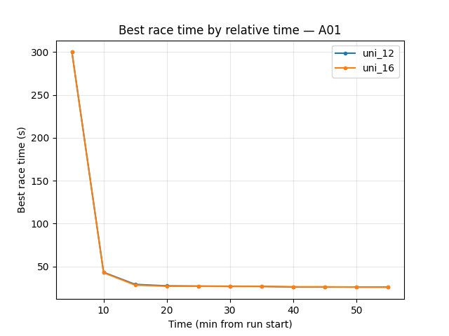

trained_A01 — Explo (common window up to 55 min)
~~~~~~~~~~~~~~~~~~~~~~~~~~~~~~~~~~~~~~~~~~~~~~~~

- **Best time at 55 min:** uni_12 25.890s, uni_16 25.610s → **uni_16 slightly better**.
- **Finish rate at 55 min:** uni_12 47%, uni_16 53% → **uni_16 better**.

trained_hock — Explo (common window up to 55 min)
~~~~~~~~~~~~~~~~~~~~~~~~~~~~~~~~~~~~~~~~~~~~~~~~~

- **Best time at 55 min:** uni_12 61.680s, uni_16 61.440s → **uni_16 slightly better**.
- **Finish rate at 55 min:** uni_12 17%, uni_16 18%.

Training Loss
~~~~~~~~~~~~~

- At 20 min: uni_12 256.84, uni_16 211.12.
- At 40 min: uni_12 144.92, uni_16 125.57 → uni_16 lower in mid training.
- At 55 min: uni_12 **102.84**, uni_16 109.16 → **uni_12 lower** at end of common window.

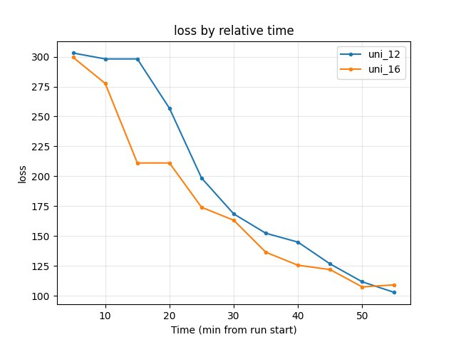

Average Q-values (RL/avg_Q_trained_A01)
~~~~~~~~~~~~~~~~~~~~~~~~~~~~~~~~~~~~~~~

- At 55 min: uni_12 **-0.71**, uni_16 **-1.33** → uni_16 more negative. This is **consistent with Double DQN reducing Q overestimation** (lower, less optimistic Q).

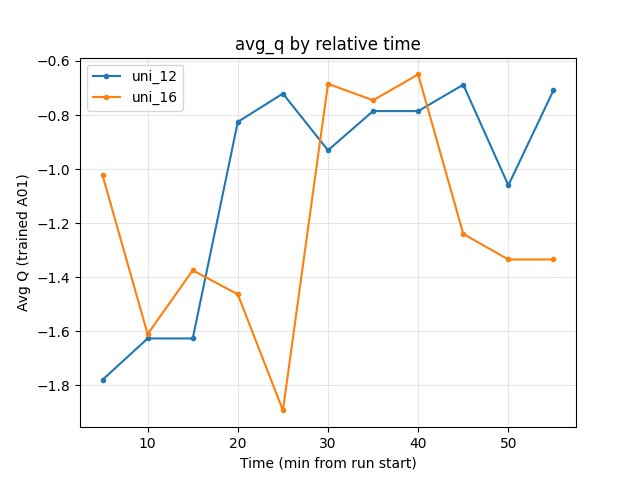

GPU Utilization (Performance/learner_percentage_training)
~~~~~~~~~~~~~~~~~~~~~~~~~~~~~~~~~~~~~~~~~~~~~~~~~~~~~~~~~~

- Both runs ~71–72% over the window; no significant difference.

Configuration Changes
----------------------

**Neural network** (``neural_network`` section in config YAML):

- **uni_12:** use_ddqn = False (target network both selects and evaluates next action).
- **uni_16:** use_ddqn = True (online network selects next action, target network evaluates it — Double DQN).

All other parameters (batch_size, running_speed, map cycle, etc.) matched between runs.

Hardware
--------

- **GPU:** Same as uni_12 setup (see training_speed experiment).
- **Parallel instances:** 8 collectors.
- **System:** Same as other recent experiments.

Conclusions
-----------

- **Overall:** No clear “better” run over 55 min by relative time. **uni_12** is better on **eval** (best time 24.85s, finish rate 50%). **uni_16** is better on **exploration** (explo best time, explo finish rate, Hock best).
- **Double DQN effect:** **uni_16** shows **lower average Q** (-1.33 vs -0.71 at 55 min), which is consistent with **reduced Q overestimation** from use_ddqn = True. So the intended effect of Double DQN (less overestimation) is visible; it did not translate into a clear eval win in this 55-minute window.
- **Loss:** DDQN had lower loss in mid training but slightly higher loss at 55 min; mixed.

Recommendations
---------------

- **use_ddqn = True** is reasonable if you care about **less Q overestimation** and possibly **better exploration**; in this experiment it did not improve eval best time or eval finish rate over 55 min.
- For **eval-focused** comparisons, standard DQN-style (use_ddqn = False) was better in this single comparison; more runs or longer runs would be needed to generalize.
- When comparing DDQN vs standard, always compare by **relative time** and report both **race metrics** (eval and explo) and **Q / loss** to separate “less overestimation” from “better policy”.

-------------------------------------------------------------------------------
Experiment 2: iqn_embedding_dimension (128 vs 64)
-------------------------------------------------------------------------------

Experiment Overview
-------------------

This experiment compared **uni_17** (iqn_embedding_dimension = 128) with **uni_16** (iqn_embedding_dimension = 64). Both runs used use_ddqn = True and the same batch/speed/map cycle (64 hock – 64 A01).

**Goal:** See whether a larger quantile embedding dimension (more expressive return distribution) improves race times and stability, at the cost of extra parameters and compute.

Results
-------

**Important:** Run durations differed (uni_16 ~70 min, uni_17 ~91 min). All findings are by **relative time**; comparison uses the **common window up to 70 min**.

**Key findings:**

- **Eval (trained_A01):** **uni_17 better** — best time 24.71s–24.80s from 40 min onward; uni_16 reached 26.41s until 70 min when it hit 24.69s. Eval finish rate at 70 min: uni_17 52%, uni_16 36%. Larger embedding reached good eval times earlier and had higher eval finish rate.
- **Explo (trained_A01):** At 70 min best times close (uni_16 25.20s, uni_17 25.27s); finish rate uni_17 62% vs uni_16 59% — **uni_17 slightly better** on finish rate.
- **Hock (explo):** **uni_16 better** — at 70 min best 59.16s vs uni_17 62.30s; finish rate 24% vs 13%. Larger embedding **worsened** Hock in this window.
- **Training loss:** At 70 min uni_16 **81.73**, uni_17 109.87 → **uni_16 lower** (smaller embedding had lower loss by end of common window).
- **Average Q:** At 70 min uni_16 -0.90, uni_17 -1.03 — similar.
- **GPU utilization:** uni_17 slightly higher (~74–76%) vs uni_16 (~70–72%).

**Takeaway:** Larger iqn_embedding_dimension (128) **improved A01** (eval best time, eval finish rate, explo finish rate) but **hurt Hock** (slower best time, lower finish rate) and increased loss. Trade-off: better short-track (A01), worse long track (Hock) over 70 min.

Run Analysis
------------

- **uni_16**: iqn_embedding_dimension = 64, use_ddqn = True, **~70 min** (relative time).
- **uni_17**: iqn_embedding_dimension = 128, use_ddqn = True, same other config, **~91 min** (relative time).

Comparison is over the **common window up to 70 min**.

Detailed TensorBoard Metrics Analysis (uni_16 vs uni_17)
---------------------------------------------------------

**Methodology — Relative time (and by steps):** Checkpoints 5, 10, … 70 min; script also outputs BY STEP tables. Source: ``python scripts/analyze_experiment_by_relative_time.py uni_16 uni_17 --interval 5 [--step_interval 50000]``.

trained_A01 — Eval (common window up to 70 min)
~~~~~~~~~~~~~~~~~~~~~~~~~~~~~~~~~~~~~~~~~~~~~~~

- **Best time:** uni_17 24.80s from 40 min, 24.71s at 65–70 min; uni_16 26.41s until 70 min when 24.69s → **uni_17 reached good eval times earlier**.
- **Finish rate at 70 min:** uni_16 36%, uni_17 52% → **uni_17 better**.

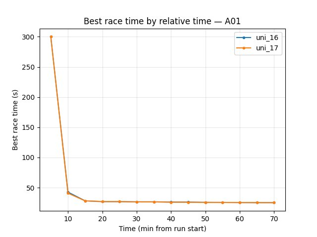

trained_A01 — Explo (common window up to 70 min)
~~~~~~~~~~~~~~~~~~~~~~~~~~~~~~~~~~~~~~~~~~~~~~~~

- **Best time at 70 min:** uni_16 25.20s, uni_17 25.27s (close).
- **Finish rate at 70 min:** uni_16 59%, uni_17 62% → **uni_17 slightly better**.

trained_hock — Explo (common window up to 70 min)
~~~~~~~~~~~~~~~~~~~~~~~~~~~~~~~~~~~~~~~~~~~~~~~~~

- **Best time at 70 min:** uni_16 **59.16s**, uni_17 62.30s → **uni_16 better** (~3s faster).
- **Finish rate at 70 min:** uni_16 24%, uni_17 13% → **uni_16 better**.

Training Loss
~~~~~~~~~~~~~

- At 40 min: uni_16 125.57, uni_17 146.63.
- At 70 min: uni_16 **81.73**, uni_17 109.87 → **uni_16 lower**.

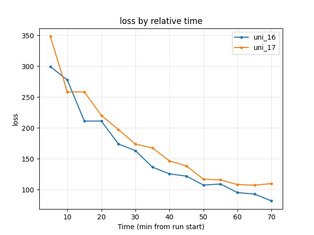

Average Q-values (RL/avg_Q_trained_A01)
~~~~~~~~~~~~~~~~~~~~~~~~~~~~~~~~~~~~~~~

- At 70 min: uni_16 -0.90, uni_17 -1.03 — similar.

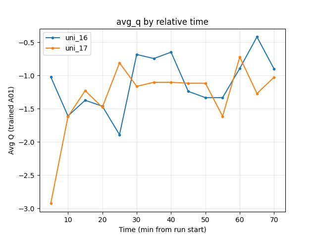

GPU Utilization
~~~~~~~~~~~~~~~

- uni_16 ~70–72%; uni_17 ~74–76% over the window.

Configuration Changes (Experiment 2)
-------------------------------------

**Neural network** (``neural_network`` section in config YAML):

- **uni_16:** iqn_embedding_dimension = 64.
- **uni_17:** iqn_embedding_dimension = 128.

All other parameters (use_ddqn = True, batch, speed, map cycle) matched.

Conclusions (Experiment 2)
----------------------------

- **A01:** Larger embedding (128) **better** — earlier and better eval best times, higher eval and explo finish rates over 70 min.
- **Hock:** Larger embedding **worse** — slower best time (62.30s vs 59.16s) and lower finish rate; uni_16 (64) clearly better on Hock.
- **Loss:** Smaller embedding (64) had **lower** loss at 70 min.
- **Trade-off:** iqn_embedding_dimension = 128 helps short track (A01) and hurts long track (Hock) in this comparison; more runs or longer runs would be needed to generalize.

Recommendations (Experiment 2)
-------------------------------

- For **A01-focused** training, iqn_embedding_dimension = 128 may be worth trying; in this run it improved eval and explo on A01.
- For **Hock / long maps**, keeping 64 (or testing 128 with more data) is reasonable; 128 degraded Hock over 70 min.
- When comparing embedding sizes, compare by **relative time** and report **both** A01 and Hock (or all maps) to see the trade-off.

-------------------------------------------------------------------------------
Experiment 3: Image dimensions (W_downsized / H_downsized 256 vs 128)
-------------------------------------------------------------------------------

Experiment Overview
-------------------

This experiment compared **uni_18** (W_downsized = 256, H_downsized = 256) with **uni_17** (W_downsized = 128, H_downsized = 128). Both runs used the same IQN settings (iqn_embedding_dimension = 128, use_ddqn = True) and batch/speed/map cycle (64 hock – 64 A01).

**Goal:** See whether larger input images (256×256 vs 128×128) improve race times and stability at the cost of more CNN compute and memory.

Results
-------

**Important:** Run durations differed (uni_17 ~91 min, uni_18 ~146 min). All findings are by **relative time**; comparison uses the **common window up to 90 min**.

**Key findings:**

- **Eval (trained_A01):** By 90 min **best time** is close — uni_17 24.71s, uni_18 24.70s (uni_18 slightly better). **Finish rate at 90 min:** uni_17 **59%**, uni_18 44% → **uni_17 better**. uni_18 reached first eval finish much later (first finish ~32 min vs ~7.6 min for uni_17); **slower convergence** with 256×256.
- **Explo (trained_A01):** **uni_17 better** — at 90 min best 25.07s vs uni_18 25.82s; finish rate 68% vs 53%.
- **Hock (explo):** **uni_17 better** — at 90 min best 58.60s vs uni_18 61.29s (~2.7s faster); finish rate 19% vs 15%.
- **Training loss:** At 90 min uni_17 **78.86**, uni_18 116.27 → **uni_17 lower**.
- **Average Q:** At 90 min uni_17 -0.74, uni_18 -0.86 — similar.
- **GPU utilization:** uni_17 ~73–76%; uni_18 **~89–90%** — 256×256 uses **much more GPU** (larger CNN), so more compute per step and potentially slower throughput.

**Takeaway:** Larger image (256×256) in uni_18 led to **slower convergence** (later first finishes, lower finish rates over 90 min), **worse** explo best times and Hock (61.29s vs 58.60s), and **higher loss**. Only a marginal gain on eval best A01 (24.70s vs 24.71s) by 90 min. Over the 90-minute common window, **128×128 (uni_17) is better** on most metrics; 256×256 did not pay off in this run.

Run Analysis
------------

- **uni_17**: W_downsized = 128, H_downsized = 128, iqn_embedding_dimension = 128, use_ddqn = True, **~91 min** (relative time).
- **uni_18**: W_downsized = 256, H_downsized = 256, same IQN/batch/speed/map cycle, **~146 min** (relative time).

Comparison is over the **common window up to 90 min**.

Detailed TensorBoard Metrics Analysis (uni_17 vs uni_18)
--------------------------------------------------------

**Methodology — Relative time (and by steps):** Checkpoints 5, 10, … 90 min; script also outputs BY STEP tables. Source: ``python scripts/analyze_experiment_by_relative_time.py uni_17 uni_18 --interval 5 [--step_interval 50000]``.

trained_A01 — Eval (common window up to 90 min)
~~~~~~~~~~~~~~~~~~~~~~~~~~~~~~~~~~~~~~~~~~~~~~~

- **Best time at 90 min:** uni_17 24.71s, uni_18 24.70s (close; uni_18 marginally better).
- **Finish rate at 90 min:** uni_17 **59%**, uni_18 44% → **uni_17 better**.
- **First finish:** uni_17 ~7.6 min, uni_18 ~32.2 min → **uni_17 converged much earlier**.

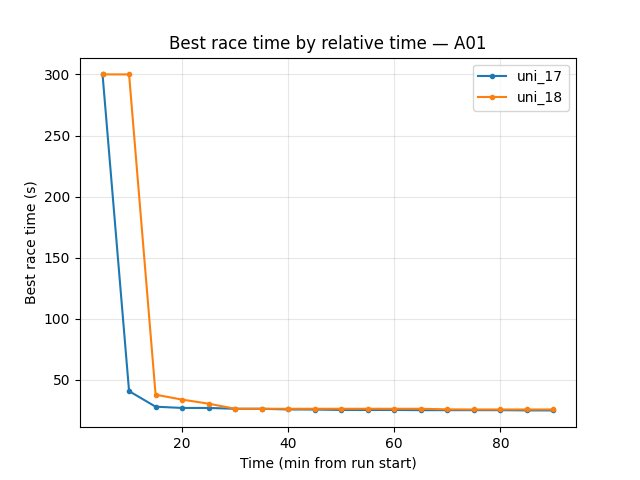

trained_A01 — Explo (common window up to 90 min)
~~~~~~~~~~~~~~~~~~~~~~~~~~~~~~~~~~~~~~~~~~~~~~~~

- **Best time at 90 min:** uni_17 **25.07s**, uni_18 25.82s → **uni_17 better**.
- **Finish rate at 90 min:** uni_17 68%, uni_18 53% → **uni_17 better**.

trained_hock — Explo (common window up to 90 min)
~~~~~~~~~~~~~~~~~~~~~~~~~~~~~~~~~~~~~~~~~~~~~~~~~~

- **Best time at 90 min:** uni_17 **58.60s**, uni_18 61.29s → **uni_17 better** (~2.7s faster).
- **Finish rate at 90 min:** uni_17 19%, uni_18 15%.

Training Loss
~~~~~~~~~~~~~

- At 85 min: uni_17 78.84, uni_18 126.49.
- At 90 min: uni_17 **78.86**, uni_18 116.27 → **uni_17 lower**.

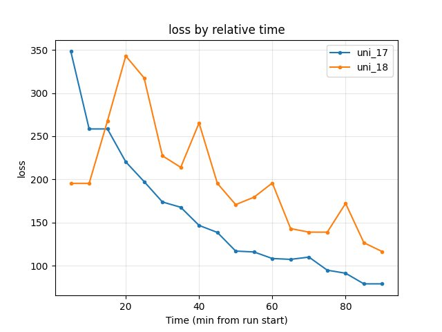

Average Q-values (RL/avg_Q_trained_A01)
~~~~~~~~~~~~~~~~~~~~~~~~~~~~~~~~~~~~~~~

- At 90 min: uni_17 -0.74, uni_18 -0.86 — similar.

GPU Utilization (Performance/learner_percentage_training)
~~~~~~~~~~~~~~~~~~~~~~~~~~~~~~~~~~~~~~~~~~~~~~~~~~~~~~~~~~

- uni_17 ~73–76% over the window; uni_18 **~89–90%** — **uni_18 uses much more GPU** (4× pixels, larger CNN).

Configuration Changes (Experiment 3)
-------------------------------------

**Neural network** (``neural_network`` section in config YAML):

- **uni_17:** W_downsized = 128, H_downsized = 128.
- **uni_18:** W_downsized = 256, H_downsized = 256.

All other parameters (iqn_embedding_dimension = 128, use_ddqn = True, batch, speed, map cycle) matched.

Conclusions (Experiment 3)
----------------------------

- **Convergence:** 256×256 (uni_18) **slower** — first eval finish ~32 min vs ~7.6 min for 128×128 (uni_17).
- **Eval best time:** By 90 min nearly tied (24.70s vs 24.71s); **eval finish rate** and **explo/Hock** clearly **better** for 128×128.
- **Loss:** 128×128 had **lower** loss at 90 min.
- **GPU:** 256×256 raised GPU use to ~90% vs ~74%; more compute per step did not yield better policy over 90 min.
- **Recommendation:** **128×128** is better in this 90-minute window; 256×256 did not pay off.

Recommendations (Experiment 3)
-------------------------------

- **Keep W_downsized / H_downsized = 128** for this setup unless longer runs or different maps show a clear gain for 256×256.
- If trying 256×256 again, compare by **relative time** over a long common window and report finish rates and Hock as well as eval best time; expect higher GPU use and slower convergence early.

Interpretation and literature (Experiment 3)
-------------------------------------------

The following are **plausible interpretations** from the literature; they are not proven for this specific setup but help frame the 256×256 vs 128×128 results.

**1. Is the worse performance because the larger model simply learns slower?**

- **Partly plausible.** In DRL, larger networks (more parameters, higher-resolution inputs) often need **more gradient steps and more data** to reach the same performance; optimal learning rate also tends to **decrease** with longer training. Over a fixed 90-minute wall-clock window, the 256×256 run does fewer effective updates per minute (higher GPU use per step), so it is both “slower per step” and “fewer steps in the same time.” So **slower learning in wall-clock time** is a reasonable part of the explanation.
- Literature: scaling surveys suggest longer training and tuned learning-rate scaling for larger models; see e.g. “Scaling DRL for Decision Making” (data, network, and training budget) and work on learning-rate scaling with model/training size.

**2. Or is it because the model is not just bigger but excessively big (memorizing instead of generalizing)?**

- **Possible but harder to separate here.** In supervised settings, excess capacity can lead to memorization and worse generalization; in DRL the picture is mixed — some work reports that **naively increasing capacity** in DRL often hurts (instability, no gain) rather than improving. Vision-based RL with higher resolution also increases the risk of **confounding visual factors** and overfitting to training tracks. In this experiment we did not test on unseen maps; worse **finish rates** and **Hock** for 256×256 could reflect either slower learning or worse generalization (e.g. overfitting to A01). So **“excess capacity / memorization”** is a plausible contributing factor but not distinguishable from “just slower” in this single comparison.
- Literature: “Training Larger Networks for Deep Reinforcement Learning” (Ota et al., arXiv:2102.07920) shows that naively scaling network size in DRL does not improve performance and can cause instability; successful scaling in that work required architectural and training changes (wider DenseNet-like connections, decoupling representation learning, distributed training to reduce overfitting).

**3. What might need to be tuned to train the larger (256×256) model properly?**

- **Likely candidates (from literature and practice):**
  - **Longer training:** Compare 256×256 vs 128×128 at **equal number of gradient steps** or **equal environment steps**, not only equal wall-clock time; and/or run 256×256 for much longer (e.g. 2×–3×) to see if it eventually matches or surpasses 128×128.
  - **Learning rate:** Larger models often need different (often smaller) learning rates; try a lower learning rate for the 256×256 setup, or use a schedule that keeps LR lower in the second half of training.
  - **Batch size / replay:** Larger batches or more replay can stabilize training for larger networks; if GPU memory allows, try a larger batch size for 256×256 so that each update uses more data.
  - **Architecture and training recipe:** Ota et al. (arXiv:2102.07920) argue that **wider networks with skip (DenseNet-like) connections**, **decoupling representation learning from RL** (e.g. pretrain or separately train the CNN), and **distributed / multi-GPU training** to mitigate overfitting are important for scaling DRL. Our setup uses a single CNN trained end-to-end; adding representation decoupling or different connectivity could help 256×256.
  - **Regularization:** Slightly stronger regularization (e.g. weight decay, dropout in the CNN) might help if the larger model is overfitting.

**Summary:** The 90-minute results are consistent with **slower learning in wall-clock time** for 256×256 (fewer updates, same hyperparameters). **Excess capacity / memorization** is a possible additional factor but not verified here. To give 256×256 a fair chance, try **longer runs**, **learning-rate and batch-size tuning**, and optionally **architectural / representation-learning** changes as in the “Training Larger Networks for Deep RL” line of work.

-------------------------------------------------------------------------------
Experiment 4: Image dimensions 64×64 vs 128×128 (downsized model)
-------------------------------------------------------------------------------

Experiment Overview
-------------------

This experiment compared **uni_19** (W_downsized = 64, H_downsized = 64, iqn_embedding_dimension = 64) with **uni_17** (W_downsized = 128, H_downsized = 128, iqn_embedding_dimension = 128). Both runs used use_ddqn = True and the same batch/speed/map cycle (64 hock – 64 A01).

**Goal:** See whether a downsized model (smaller images and smaller embedding) can match or improve race times while reducing GPU compute, or whether the lower resolution hurts performance.

**Note:** uni_19 differs in **two** parameters — image size (64×64 vs 128×128) and embedding (64 vs 128) — so this is a "downsized model" comparison rather than an isolated image-size test.

Results
-------

**Important:** Run durations differed (uni_17 ~91 min, uni_19 ~150 min). All findings are by **relative time**; comparison uses the **common window up to 90 min**.

**Key findings:**

- **Eval (trained_A01):** **uni_17 better** — best time at 90 min 24.71s vs 24.95s; finish rate 59% vs 47%; first eval finish ~7.6 min vs ~23.5 min. uni_17 converged much earlier and had better eval best time and finish rate.
- **Explo (trained_A01):** **uni_19 better on best time** — at 90 min 24.86s vs 25.07s (~0.2s faster); finish rate uni_17 68% vs uni_19 64% (close). So 64×64 reached a slightly better explo best A01 time by 90 min.
- **Hock (explo):** **uni_17 much better** — at 90 min best 58.60s vs uni_19 65.52s (~7s faster); finish rate 19% vs 3%. Early in training (5–45 min), uni_19 had better Hock times (e.g. 67.23s vs 64.33s at 45 min); uni_17 overtook and pulled ahead by 90 min.
- **Training loss:** At 90 min uni_17 **78.86**, uni_19 108.72 → **uni_17 lower**.
- **Average Q:** At 90 min uni_17 -0.74, uni_19 -1.09 — similar.
- **GPU utilization:** uni_17 ~73–76%; uni_19 **~66–69%** — 64×64 uses **less GPU** (smaller CNN and embedding).

**Takeaway:** The downsized model (64×64, embedding 64) reached a slightly better explo A01 best time by 90 min and used less GPU, but had **slower convergence** (later first eval finish), **lower eval finish rate**, and **much worse Hock** (best time 65.52s vs 58.60s). Trade-off: lower compute and marginally better explo A01 best vs worse eval and Hock.

Run Analysis
------------

- **uni_17**: W_downsized = 128, H_downsized = 128, iqn_embedding_dimension = 128, use_ddqn = True, **~91 min** (relative time).
- **uni_19**: W_downsized = 64, H_downsized = 64, iqn_embedding_dimension = 64, use_ddqn = True, same batch/speed/map cycle, **~150 min** (relative time).

Comparison is over the **common window up to 90 min**.

Detailed TensorBoard Metrics Analysis (uni_17 vs uni_19)
--------------------------------------------------------

**Methodology — Relative time (and by steps):** Checkpoints 5, 10, … 90 min; script also outputs BY STEP tables. Source: ``python scripts/analyze_experiment_by_relative_time.py uni_17 uni_19 --interval 5 [--step_interval 50000]``.

trained_A01 — Eval (common window up to 90 min)
~~~~~~~~~~~~~~~~~~~~~~~~~~~~~~~~~~~~~~~~~~~~~~~

- **Best time at 90 min:** uni_17 **24.71s**, uni_19 24.95s → **uni_17 better**.
- **Finish rate at 90 min:** uni_17 **59%**, uni_19 47% → **uni_17 better**.
- **First finish:** uni_17 ~7.6 min, uni_19 ~23.5 min → **uni_17 converged much earlier**.

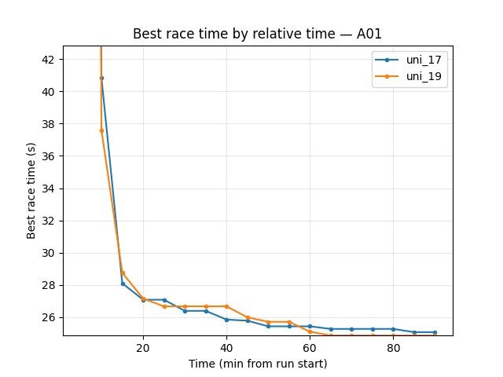

trained_A01 — Explo (common window up to 90 min)
~~~~~~~~~~~~~~~~~~~~~~~~~~~~~~~~~~~~~~~~~~~~~~~~

- **Best time at 90 min:** uni_17 25.07s, uni_19 **24.86s** → **uni_19 better** (~0.2s faster).
- **Finish rate at 90 min:** uni_17 68%, uni_19 64% (close).

trained_hock — Explo (common window up to 90 min)
~~~~~~~~~~~~~~~~~~~~~~~~~~~~~~~~~~~~~~~~~~~~~~~~~

- **Best time at 90 min:** uni_17 **58.60s**, uni_19 65.52s → **uni_17 better** (~7s faster).
- **Finish rate at 90 min:** uni_17 19%, uni_19 3%.
- Early on (5–45 min): uni_19 had better Hock (67.23s, 67.47s) vs uni_17 (72.16s down to 64.33s); uni_17 overtook by ~50 min.

Training Loss
~~~~~~~~~~~~~

- At 90 min: uni_17 **78.86**, uni_19 108.72 → **uni_17 lower**.

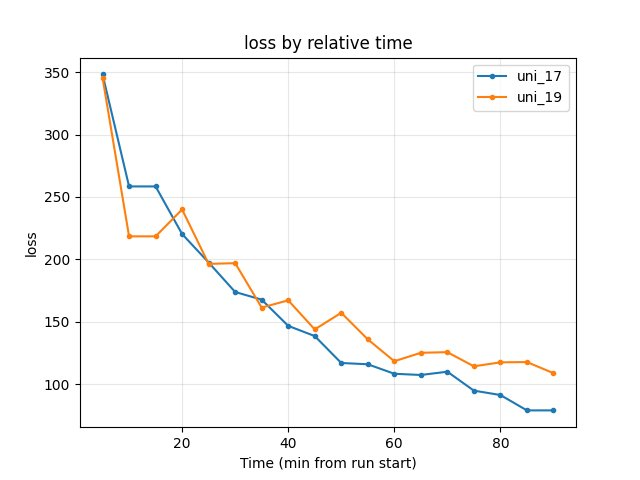

Average Q-values (RL/avg_Q_trained_A01)
~~~~~~~~~~~~~~~~~~~~~~~~~~~~~~~~~~~~~~~

- At 90 min: uni_17 -0.74, uni_19 -1.09 — similar.

GPU Utilization (Performance/learner_percentage_training)
~~~~~~~~~~~~~~~~~~~~~~~~~~~~~~~~~~~~~~~~~~~~~~~~~~~~~~~~~

- uni_17 ~73–76%; uni_19 ~66–69% over the window — **uni_19 uses less GPU**.

By steps (common step window up to 3.3M steps)
~~~~~~~~~~~~~~~~~~~~~~~~~~~~~~~~~~~~~~~~~~~~~~

- **Eval best A01 at 3.3M steps:** uni_17 24.71s, uni_19 24.95s (uni_19 reached this at ~3M steps).
- **Explo best A01 at 3.3M steps:** uni_17 25.05s, uni_19 **24.86s** → uni_19 better.
- **Hock best at 3.3M steps:** uni_17 **58.60s**, uni_19 65.52s → uni_17 better.
- **Loss at 3.3M steps:** uni_17 75.87, uni_19 117.59 → uni_17 lower.

Configuration Changes (Experiment 4)
------------------------------------

**Neural network** (``neural_network`` section in config YAML):

- **uni_17:** W_downsized = 128, H_downsized = 128, iqn_embedding_dimension = 128.
- **uni_19:** W_downsized = 64, H_downsized = 64, iqn_embedding_dimension = 64.

All other parameters (use_ddqn = True, batch, speed, map cycle) matched.

Conclusions (Experiment 4)
--------------------------

- **Eval:** 64×64 (uni_19) **slower convergence** (first eval finish ~23.5 min vs ~7.6 min) and **worse** best time and finish rate at 90 min.
- **Explo A01:** 64×64 reached **slightly better** best explo A01 (24.86s vs 25.07s) by 90 min; finish rates similar.
- **Hock:** 64×64 **much worse** — best 65.52s vs 58.60s, finish rate 3% vs 19%.
- **GPU:** 64×64 uses **less GPU** (~67% vs ~74%).
- **Loss:** 128×128 had **lower** loss at 90 min.
- **Trade-off:** 64×64 reduces compute and can match or slightly beat explo A01 best time, but at the cost of slower convergence, worse eval, and much worse Hock.

Recommendations (Experiment 4)
------------------------------

- **Keep 128×128** for balanced performance across eval, explo, and Hock unless GPU is severely constrained.
- **64×64** is viable if you prioritize **A01-only** training or **lower GPU usage** and can accept worse Hock and slower eval convergence.
- For **Hock / long maps**, 64×64 with embedding 64 is not recommended; see Experiment 5 for 64×64 with embedding 128 (much better Hock).

-------------------------------------------------------------------------------
Experiment 5: Image dimensions 64×64 vs 128×128 (embedding 128 — isolates resolution)
-------------------------------------------------------------------------------

Experiment Overview
-------------------

This experiment compared **uni_20** (W_downsized = 64, H_downsized = 64, iqn_embedding_dimension = 128) with **uni_17** (W_downsized = 128, H_downsized = 128, iqn_embedding_dimension = 128). Both runs used use_ddqn = True and the same batch/speed/map cycle (64 hock – 64 A01).

**Goal:** Isolate the effect of image resolution by keeping embedding at 128. This answers whether the poor Hock performance in uni_19 (64×64, embedding 64) was caused by lower resolution or by the smaller embedding.

**Note:** Only **image size** differs — embedding is 128 in both. This is the clean image-resolution comparison.

Results
-------

**Important:** Run durations differed (uni_17 ~91 min, uni_20 ~120 min). All findings are by **relative time**; comparison uses the **common window up to 90 min**.

**Key findings:**

- **Eval (trained_A01):** **uni_20 better** — best time at 90 min 24.72s vs 24.71s (tied); finish rate **70%** vs 59%; first eval finish ~15.5 min vs ~7.6 min (uni_17 converged earlier, but uni_20 reached higher finish rate by 90 min).
- **Explo (trained_A01):** **uni_20 better** — at 90 min best 24.84s vs 25.07s (~0.23s faster); finish rate 67% vs 68% (similar).
- **Hock (explo):** **uni_17 slightly better** — at 90 min best 58.60s vs uni_20 59.09s (~0.5s gap). Finish rate uni_20 **23%** vs uni_17 19% — uni_20 better on finish rate. The Hock gap is **much smaller** than in uni_19 (65.52s) vs uni_17 (58.60s), confirming that the ~7s deficit in uni_19 came from embedding 64, not image resolution.
- **Training loss:** At 90 min uni_17 78.86, uni_20 **77.84** → **uni_20 lower**.
- **Average Q:** At 90 min similar (uni_17 -0.74, uni_20 -1.26).
- **GPU utilization:** uni_17 ~73–76%; uni_20 **~66–67%** — 64×64 uses **less GPU**.

**Takeaway:** 64×64 with embedding 128 (uni_20) is **competitive with 128×128** (uni_17). It matches or beats on eval finish rate, explo best A01, and loss; uses less GPU; Hock is only ~0.5s slower vs ~7s in uni_19. **Conclusion: the poor Hock in uni_19 was due to embedding 64, not image resolution.**

Run Analysis
------------

- **uni_17**: W_downsized = 128, H_downsized = 128, iqn_embedding_dimension = 128, use_ddqn = True, **~91 min** (relative time).
- **uni_20**: W_downsized = 64, H_downsized = 64, iqn_embedding_dimension = 128, use_ddqn = True, same batch/speed/map cycle, **~120 min** (relative time).

Comparison is over the **common window up to 90 min**.

Detailed TensorBoard Metrics Analysis (uni_17 vs uni_20)
--------------------------------------------------------

**Methodology — Relative time (and by steps):** Checkpoints 5, 10, … 90 min; script also outputs BY STEP tables. Source: ``python scripts/analyze_experiment_by_relative_time.py uni_17 uni_20 --interval 5 [--step_interval 50000]``.

trained_A01 — Eval (common window up to 90 min)
~~~~~~~~~~~~~~~~~~~~~~~~~~~~~~~~~~~~~~~~~~~~~~~

- **Best time at 90 min:** uni_17 24.71s, uni_20 24.72s (tied).
- **Finish rate at 90 min:** uni_17 59%, uni_20 **70%** → **uni_20 better**.
- **First finish:** uni_17 ~7.6 min, uni_20 ~15.5 min → uni_17 converged earlier.

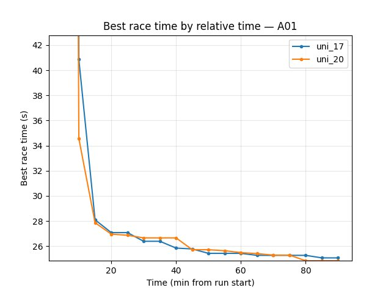

trained_A01 — Explo (common window up to 90 min)
~~~~~~~~~~~~~~~~~~~~~~~~~~~~~~~~~~~~~~~~~~~~~~~~

- **Best time at 90 min:** uni_17 25.07s, uni_20 **24.84s** → **uni_20 better** (~0.23s faster).
- **Finish rate at 90 min:** uni_17 68%, uni_20 67% (similar).

trained_hock — Explo (common window up to 90 min)
~~~~~~~~~~~~~~~~~~~~~~~~~~~~~~~~~~~~~~~~~~~~~~~~~

- **Best time at 90 min:** uni_17 **58.60s**, uni_20 59.09s → uni_17 slightly better (~0.5s). Compare to uni_19 (65.52s): the embedding-128 run (uni_20) closes most of the gap.
- **Finish rate at 90 min:** uni_17 19%, uni_20 **23%** → uni_20 better.

Training Loss
~~~~~~~~~~~~~

- At 90 min: uni_17 78.86, uni_20 **77.84** → **uni_20 lower**.

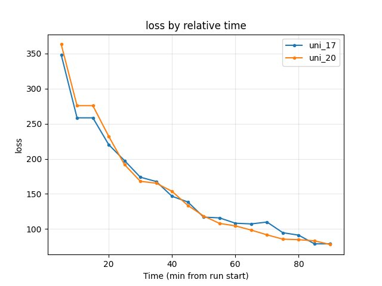

Average Q-values (RL/avg_Q_trained_A01)
~~~~~~~~~~~~~~~~~~~~~~~~~~~~~~~~~~~~~~~

- At 90 min: uni_17 -0.74, uni_20 -1.26 — similar range.

GPU Utilization (Performance/learner_percentage_training)
~~~~~~~~~~~~~~~~~~~~~~~~~~~~~~~~~~~~~~~~~~~~~~~~~~~~~~~~~

- uni_17 ~73–76%; uni_20 ~66–67% over the window — **uni_20 uses less GPU**.

By steps (common step window up to 3.3M steps)
~~~~~~~~~~~~~~~~~~~~~~~~~~~~~~~~~~~~~~~~~~~~~~

- **Eval best A01 at 3.3M steps:** uni_17 24.71s, uni_20 24.72s (tied).
- **Explo best A01 at 3.3M steps:** uni_17 25.05s, uni_20 **24.84s** → uni_20 better.
- **Hock best at 3.3M steps:** uni_17 **58.60s**, uni_20 59.09s → uni_17 slightly better.
- **Loss at 3.3M steps:** uni_17 75.87, uni_20 77.84 — similar.

Configuration Changes (Experiment 5)
------------------------------------

**Neural network** (``neural_network`` section in config YAML):

- **uni_17:** W_downsized = 128, H_downsized = 128, iqn_embedding_dimension = 128.
- **uni_20:** W_downsized = 64, H_downsized = 64, iqn_embedding_dimension = 128.

All other parameters (use_ddqn = True, batch, speed, map cycle) matched.

Conclusions (Experiment 5)
--------------------------

- **64×64 with embedding 128 is competitive with 128×128.** Uni_20 matches or beats uni_17 on eval finish rate (70% vs 59%), explo best A01 (24.84s vs 25.07s), and loss; uses less GPU.
- **Hock:** Only ~0.5s slower (59.09s vs 58.60s). The ~7s deficit in uni_19 (64×64, embedding 64) vs uni_17 was due to **embedding 64**, not image resolution.
- **Recommendation:** **64×64 with embedding 128** is a viable default — lower GPU use, competitive performance across A01 and Hock.

Recommendations (Experiment 5)
------------------------------

- **Prefer 64×64 with embedding 128** over 128×128 when GPU is constrained; performance is competitive.
- **Keep embedding 128** for Hock and long maps; embedding 64 (uni_19) hurt Hock significantly.
- **128×128** remains slightly better on Hock best time (~0.5s); use if every second counts on long tracks.

-------------------------------------------------------------------------------
Analysis tools (all IQN experiments)
-------------------------------------------------------------------------------

- By **relative time and by steps:** ``python scripts/analyze_experiment_by_relative_time.py uni_12 uni_16 --interval 5 [--step_interval 50000]`` (Exp 1); ``uni_16 uni_17`` (Exp 2); ``uni_17 uni_18`` (Exp 3); ``uni_17 uni_19`` (Exp 4); ``uni_17 uni_20`` (Exp 5). Script outputs both relative-time and BY STEP tables. Use ``--logdir "<path>"`` if not from project root.
- By last value: ``python scripts/analyze_experiment.py <run1> <run2> ...`` (less meaningful when durations differ).
- Key metrics: Per-race ``Race/eval_race_time_*``, ``Race/explo_race_time_*``; scalars ``Training/loss``, ``RL/avg_Q_*``, ``Performance/learner_percentage_training`` (see :doc:`tensorboard_metrics`).
