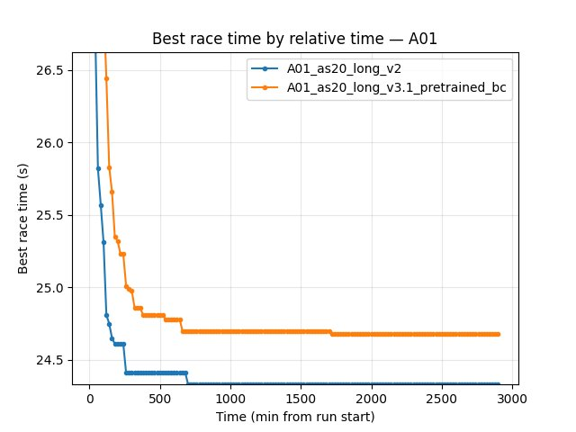
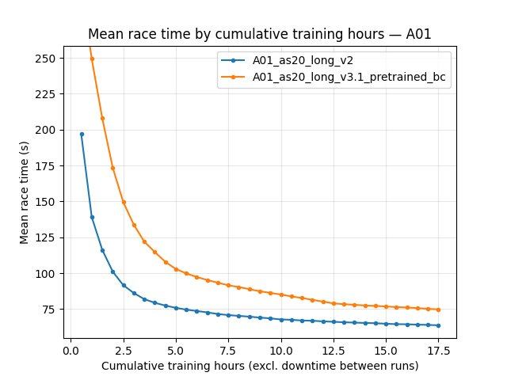

Experiment: Multi-action Offset Training (A01_as20_long v3 series)
===================================================================

Experiment Overview
-------------------

This experiment evaluates a new RL training mode where the agent learns with **multi-action time offsets**.

In multi-action mode (``rl_action_offsets_ms`` has more than one value), the policy makes a single forward pass and predicts ``N`` actions for offsets ``0, 10, 20, ...`` ms. The rollout then applies these actions on a 10 ms step period, and a replay transition corresponds to one **decision block** (N actions + aggregated reward over N steps). Exploration can be configured as either:

- ``multi_action_exploration: per_action``: epsilon is sampled independently per action inside the block.
- ``multi_action_exploration: per_block``: one epsilon draw applies to the whole block (either all greedy or all random).

Because a decision is made per block (N actions spanning multiple 10 ms steps), multi-action lookahead is applied at a lower decision frequency than single-action training, and in ``per_block`` mode the fully-random blocks become increasingly rare as epsilon decays.

Runs compared on map ``A01``:

- ``A01_as20_long_v3``: multi-action enabled, ``multi_action_exploration`` default (per_action), ``global_schedule_speed = 1``, no BC head pretrain.
- ``A01_as20_long_v3.1``: same multi-action setup, ``multi_action_exploration = per_block`` and faster schedules (``global_schedule_speed = 4``).
- ``A01_as20_long_v3.1_pretrained_bc``: same as v3.1 but initializes RL from BC heads with ``pretrain_bc_heads_path: output/ptretrain/bc/v5_multi_offset``.

Notes on why ``global_schedule_speed = 4``: this choice is based on the earlier ablation in ``docs/source/experiments/global_schedule_speed.rst`` (A01 long v2 series). The best saved A01 time is ``alltime_min_ms['A01'] = 24150`` (i.e. ~``24.15s``) in ``save\\A01_as20_long_v2``; in TensorBoard it shows up in the suffixed continuation run ``tensorboard\\A01_as20_long_v2_3``.

For “longest run” comparison (almost 100M+ training steps): ``A01_as20_long`` (single-map A01, trained with ``tensorboard_suffix_schedule`` up to ~150M steps).

Results
-------

Important: run lengths differ. **Primary quantitative comparisons here use training steps** (BY STEP tables from the analysis script). Any **time-axis** prose or regenerated tables must use **cumulative training hours** (``--time-axis auto`` or ``cumul_training_hours``), not raw TensorBoard wall minutes across merged logs — see :doc:`index`.

Key findings

- Multi-action schedule speedup (v3 → v3.1): ``A01_as20_long_v3.1`` reaches strong ``alltime_min_ms_A01`` much earlier **in environment steps** than ``A01_as20_long_v3`` (see BY STEP output from the analysis command in `Analysis Tools`_).
- BC head pretraining (v3.1 → v3.1_pretrained_bc) improves peak time and finish rate at matched steps:
  - At 20M steps: eval best time ``24.570s`` and finish rate ``59%`` for ``v3.1_pretrained_bc`` vs ``24.850s`` and ``45%`` for ``v3.1``.
  - At 80M steps: eval best time ``24.260s`` and finish rate ``73%`` for ``v3.1_pretrained_bc`` vs ``24.410s`` and ``67%`` for ``v3.1``.
- Comparison with the longest run ``A01_as20_long`` (step overlap is limited — common window only to ~19.2M steps): at that shared step, ``v3.1_pretrained_bc`` has better best time (``24.570s`` vs ``24.510s``) but lower finish rate (``59%`` vs ``71%``). The full ``v3.1_pretrained_bc`` run continues well beyond that overlap; the final logged best **A01 24.26s** comes from the longer run.
- Direct check: ``A01_as20_long_v3.1`` vs ``A01_as20_long_v2`` (TB merged across suffix dirs). **By steps** (1M checkpoints), ``v2`` stays ahead on A01 eval best time (e.g. 20M: ``24.460s`` vs ``24.850s``; 40M: ``24.300s`` vs ``24.470s``; 80M: ``24.200s`` vs ``24.410s``). Final saved bests from ``save/<run>/accumulated_stats.joblib``: ``v2 = 24.150s`` (``24150`` ms), ``v3.1 = 24.410s`` (``24410`` ms).
- **Main baseline vs multi-offset + BC heads:** ``A01_as20_long_v2`` (single-action) vs ``A01_as20_long_v3.1_pretrained_bc`` (multi-action + ``v5_multi_offset`` BC init); see `Direct comparison: v2 vs v3.1_pretrained_bc`_ for tables, plots, and save-state check. In short: ``v2`` keeps better **best** and **mean** eval times and higher eval finish rate in the common window; saved ``alltime_min_ms['A01']`` is ``24150`` ms vs ``24260`` ms.

Run Analysis
------------

- ``A01_as20_long_v3`` / ``v3.1`` / ``v3.1_pretrained_bc``: merged TensorBoard dirs. **Cumulative training** for curves = ``cumul_training_hours`` (TB / ``save/.../accumulated_stats.joblib``). Example: ``save/A01_as20_long_v3.1_pretrained_bc/`` ≈ **24.5 h** training, A01 best **24260 ms**.
- ``A01_as20_long`` (longest reference): same rules; see :doc:`time_axis_conventions` audit table.
- ``A01_as20_long_v2``: merged **3** TB dirs. **Audited (local logs):** **~17.7 h** cumulative training vs **~2898 min** TB wall span (ratio **~2.7×**) — wall minutes **must not** be read as training duration. Pair with ``v3.1_pretrained_bc``: **~24.5 h** training vs **~3222 min** wall (**~2.2×**).

Direct comparison: v2 vs v3.1_pretrained_bc
-------------------------------------------

This section compares **single-action** ``A01_as20_long_v2`` to **multi-action + BC-pretrained** ``A01_as20_long_v3.1_pretrained_bc``. Merged suffix logs (**3** vs **4** dirs). **Cumulative training** totals: **~17.74 h** (v2) vs **~24.51 h** (v3.1_bc); **common BY TIME window** ends at **~17.74 h** (v2 stops earlier in training time). TB **wall** spans are **~2900 min** vs **~3220 min** — **not** the same as those training hours (see :doc:`time_axis_conventions`).

**Save-state cross-check:** ``save/.../accumulated_stats.joblib`` bests **24150 ms** vs **24260 ms** — matches **100M-step** BY STEP eval-best rows and the last **cumul_training_hours** checkpoints below.

**Recomputed BY TIME table** (``Race/eval_race_time_trained_A01``, ``--time-axis cumul_training_hours``, ``--interval-training-hours 1``, merged TB, 2026-03):

- **2 h:** best **24.55s** vs **25.58s**; mean **129.4s** vs **184.7s**; eval finish rate **62%** vs **43%**.
- **8 h:** best **24.29s** vs **24.40s**; mean **91.0s** vs **115.7s**; rate **76%** vs **68%**.
- **~17.7 h** (end of common window): best **24.15s** vs **24.26s**; mean **80.7s** vs **98.6s**; rate **80%** vs **74%**.

**By-step** comparisons use a common window up to **100M** steps. Embedded figures use **cumulative training hours** on X (``generate_experiment_plots.py`` default **auto**).

Detailed TensorBoard Metrics Analysis
~~~~~~~~~~~~~~~~~~~~~~~~~~~~~~~~~~~~~

**Methodology — By time vs by steps:** Regenerate the BY TIME grid with explicit training-hours axis::

   python scripts/analyze_experiment_by_relative_time.py A01_as20_long_v2 A01_as20_long_v3.1_pretrained_bc --time-axis cumul_training_hours --interval-training-hours 1 --step_interval 5000000

**BY STEP** uses the same command (step grid unchanged). Do **not** use wall-minute checkpoints for this pair: wall span **>2×** active training time (:doc:`time_axis_conventions`).

**Figures:** ``python scripts/generate_experiment_plots.py --experiments multi_offset_v2_vs_v31bc_pretrained``

A01 eval — best time (``Race/eval_race_time_trained_A01``)
^^^^^^^^^^^^^^^^^^^^^^^^^^^^^^^^^^^^^^^^^^^^^^^^^^^^^^^^^^^^

**By cumulative training hours:** see the **2 h / 8 h / ~17.7 h** rows in the section above (recomputed from merged TensorBoard).

**By steps:** at 20M — **24.46s** vs **24.57s**; at 100M — **24.15s** vs **24.26s**.

A01 eval — mean time (all episodes; includes DNF / cutoff races)
^^^^^^^^^^^^^^^^^^^^^^^^^^^^^^^^^^^^^^^^^^^^^^^^^^^^^^^^^^^^^^^^^

Mean time is dominated by non-finished runs; use it as a **stability / typical-episode** signal alongside best time.

**By cumulative training hours:** mean-time checkpoints are in the same BY TIME table output as for best time (see command above).

**By steps:** at 100M — **80.69s** vs **98.50s** mean eval time; eval finish rate **80%** vs **74%**.

Configuration differences (this pair)
~~~~~~~~~~~~~~~~~~~~~~~~~~~~~~~~~~~~~

**``A01_as20_long_v2``** (``save/A01_as20_long_v2/config_snapshot.yaml``): single-action setup (no ``rl_action_offsets_ms`` list in snapshot; ``n_prev_actions_in_inputs: 5``); ``training.global_schedule_speed: 4``; ``training.pretrain_bc_heads_path: null``.

**``A01_as20_long_v3.1_pretrained_bc``** (``save/A01_as20_long_v3.1_pretrained_bc/config_snapshot.yaml``): ``environment.rl_action_offsets_ms: [0, 10, 20, 30, 40]``; ``n_prev_actions_in_inputs: 25``; ``exploration.multi_action_exploration: per_block``; ``training.global_schedule_speed: 4``; ``training.pretrain_bc_heads_path: output/ptretrain/bc/v5_multi_offset``.

Configuration Changes
---------------------

The runs share the same multi-action offsets:

- ``environment.rl_action_offsets_ms = [0, 10, 20, 30, 40]`` (N=5 actions per decision block; applied on 10 ms rollout cadence).

Differences:

- ``A01_as20_long_v3``:
  - ``training.global_schedule_speed = 1``
  - ``exploration.multi_action_exploration`` uses default (per_action)
  - ``training.pretrain_bc_heads_path = null``
- ``A01_as20_long_v3.1``:
  - ``training.global_schedule_speed = 4``
  - ``exploration.multi_action_exploration = per_block``
  - ``training.pretrain_bc_heads_path = null``
- ``A01_as20_long_v3.1_pretrained_bc``:
  - ``training.global_schedule_speed = 4``
  - ``exploration.multi_action_exploration = per_block``
  - ``training.pretrain_bc_heads_path = output/ptretrain/bc/v5_multi_offset``

Hardware
--------

- GPU: not extracted here (see individual run logs).
- Parallel instances: ``gpu_collectors_count = 8`` for the v3.1_pretrained_bc run.

Conclusions
-----------

- Multi-action offset training works and is sensitive to schedule speed and exploration granularity:
  - Going from v3 to v3.1 (faster schedule + per_block exploration) improves early learning and reaches the ~24.8-24.5 s range quickly.
- Pretraining the RL heads from the multi-offset BC run (v5_multi_offset) provides a durable benefit:
  - Higher peak time and higher finish rate at the same step levels (20M -> 80M).
  - Best time improvements continue through **tens of millions of steps** (see BY STEP rows above).
  - Likely reason: better temporal/action mapping between pretrain and RL. In BC pretrain, the model predicts 5 offset actions at 10 ms spacing; in multi-action RL, one decision is taken every ~50 ms and outputs a 5-action block. This alignment is much closer than the older single-action RL setup (one action every ~50 ms), where pretrain-to-RL mapping was weak.
- Against the longest existing baseline (``A01_as20_long`` trained up to ~150M steps), the offset+pretrained agent has a slower start but catches up later and slightly improves the final peak time in the shared window.
- Against **``A01_as20_long_v2``** (single-action, same ``global_schedule_speed = 4``), multi-offset + BC heads (**``v3.1_pretrained_bc``**) still trails on **best** eval time, **mean** eval time, and eval **finish rate** on the shared **cumulative-training-hours** window (figures / BY TIME table) and at **100M** steps; saved bests **24.150s** vs **24.260s** (see `Direct comparison: v2 vs v3.1_pretrained_bc`_).

Recommendations
---------------

- If you adopt multi-action offsets, try ``global_schedule_speed = 4`` and ``multi_action_exploration = per_block`` as the first tuning pair.
- If you can afford it, initialize from a multi-offset BC run (here: ``v5_multi_offset``) to improve long-run finish rate and to raise the achievable best time at large step counts.
- For comparisons against other “longest run” baselines, expect limited **step** overlap if logging stops at different ranges; use **training-hours** (or wall, if you must) curves from the analysis script or embedded plots.

Analysis Tools
---------------

- Compare v3 variants (default **auto** time axis + by steps; recommended: ``--step_interval 1000000``):

  ``python scripts/analyze_experiment_by_relative_time.py A01_as20_long_v3 A01_as20_long_v3.1 A01_as20_long_v3.1_pretrained_bc --interval-training-hours 0.5 --step_interval 1000000``

- Compare against the longest baseline ``A01_as20_long``:

  ``python scripts/analyze_experiment_by_relative_time.py A01_as20_long_v3.1_pretrained_bc A01_as20_long --interval-training-hours 0.5 --step_interval 1000000``

- Compare **v2** vs **v3.1_pretrained_bc** (BY TIME + BY STEP): ``python scripts/analyze_experiment_by_relative_time.py A01_as20_long_v2 A01_as20_long_v3.1_pretrained_bc --interval-training-hours 0.5 --step_interval 5000000``

- **Plots** for docs: ``python scripts/generate_experiment_plots.py --experiments multi_offset_v2_vs_v31bc_pretrained``. One-off JPG: ``python scripts/analyze_experiment_by_relative_time.py A01_as20_long_v2 A01_as20_long_v3.1_pretrained_bc --time-axis cumul_training_hours --interval-training-hours 0.5 --step_interval 5000000 --plot --output-dir docs/source/_static --prefix exp_multi_offset_v2_vs_v31bc_pretrained``

- Audit wall vs training time: ``python scripts/audit_tensorboard_training_timeline.py --runs A01_as20_long_v2 A01_as20_long_v3.1_pretrained_bc``

