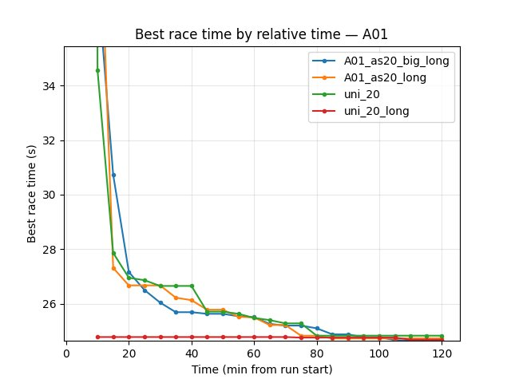
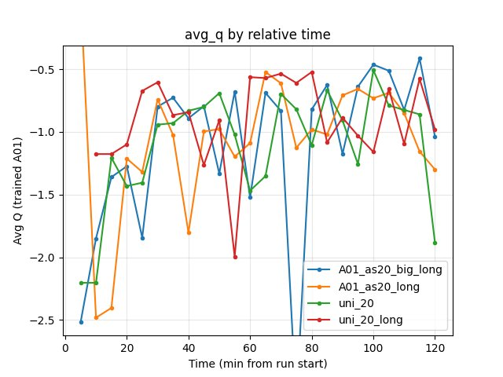

Experiment: Network Size and Long-Training Convergence
======================================================

This experiment tests **how strongly network size affects convergence on long training runs**: whether a bigger network needs more wall-clock time and more steps to converge, and whether it then achieves a better final score than a small network given enough training.

**Main question:** If a small network needs ~3 h and ~5M steps to converge, might a bigger network need ~10 h and ~15M steps but end up with a much better score (or not)?

**Runs compared (all single-map A01, long training from scratch unless noted):**

- **A01_as20_big_long**: **Larger network** — 128×128 image, iqn_embedding_dimension 256, iqn_n 16, iqn_k 64. **~561 min**.
- **A01_as20_long**: Small network — 64×64, embedding 128, iqn_n 8, iqn_k 32. **~495 min**.
- **uni_20**: Small network, **two maps** (A01 + Hock), from scratch. **~120 min** (baseline duration).
- **uni_20_long**: Small network, two maps, from uni_20 checkpoint. **~824 min**.

Comparisons are by **relative time** (common window 120 min) and by **steps** where applicable.

Experiment Overview
-------------------

We compared **A01_as20_big_long** (single map A01, larger CNN + IQN) with **A01_as20_long** (same task, small network), and with **uni_20** / **uni_20_long** (small network, two maps) for context. Same training hyperparameters (batch 512, speed 512, lr/gamma schedules); only differences are **neural_network** (image size, embedding, iqn_n/iqn_k) and map cycle (A01 only vs A01+Hock). Goal: see how network size affects time-to-convergence and final A01 performance on long runs.

Results
-------

**Important:** Run durations differ (A01_as20_big_long ~561 min, A01_as20_long ~495 min, uni_20 ~120 min, uni_20_long ~824 min). All findings below are by **relative time** over the common 120 min window (and by steps when comparing equal gradient updates).

**Key findings (at 120 min, common window):**

- **A01 best time:** **A01_as20_big_long 24.49s** (best of all four), A01_as20_long 24.59s, uni_20_long 24.61s, uni_20 24.72s. The bigger network achieves the best A01 time at 120 min.
- **A01 eval finish rate:** uni_20_long 78%, uni_20 76%, **A01_as20_big_long 64%**, A01_as20_long 56%. Big network has higher finish rate than small single-map run.
- **First eval finish:** A01_as20_long ~8.3 min, **A01_as20_big_long ~16.2 min**. The bigger network converges later (needs more time to first finish).
- **Training loss at 120 min:** A01_as20_long 69.74 (lowest), uni_20 81.61, uni_20_long 80.88, A01_as20_big_long 103.21. Big network has higher loss (more parameters to fit).
- **Explo A01 at 120 min:** A01_as20_big_long best 24.65s, rate 72%; A01_as20_long 24.74s, 70%. Big network slightly better on both.

**Conclusion:** Network size **does** affect long-run convergence: the bigger network needs more time to reach first finish (~16 min vs ~8 min) and has higher loss in the first hour, but **by 120 min it achieves the best A01 time (24.49s) and better finish rate (64% vs 56%)** than the small single-map run. So: a bigger network can need more time/steps to converge but with long training can achieve a better final score.

**Post-120 min dynamics (A01_as20_big_long vs A01_as20_long only):**

To see whether training beyond 120 min is useful, the two single-map long runs were compared over their full common window (~495 min). Command: ``python scripts/analyze_experiment_by_relative_time.py A01_as20_big_long A01_as20_long --interval 5 --step_interval 50000``.

- **A01 best time:** After 120 min both models keep improving slightly. Big: 24.49s (120 min) → 24.44s (200 min) → **24.43s (490 min)**. Small: 24.59s (120 min) → 24.53s (210 min) → **24.51s (490 min)**. Gains are small (tenths of a second) but present.
- **Eval finish rate:** Strong improvement after 120 min. Big: 64% (120 min) → 71% (200 min) → 77% (350 min) → **79% (490 min)**. Small: 56% (120 min) → 60% (200 min) → 66% (350 min) → **71% (490 min)**. Training beyond 120 min clearly improves stability and completion rate.
- **Mean race time (consistency):** Both improve (lower mean over time). Big: mean 26.82s at 120 min → 25.48s at 490 min; small: 27.60s → 25.97s.
- **Loss:** Both decrease further after 120 min. Big: 103.21 (120 min) → 68.08 (490 min); small: 69.74 → 37.88. So both models are still learning.

**Verdict:** Training after 120 min is **not useless**. The main benefit is **finish rate** and consistency (mean time, std); best-time gains are modest but real. If you care about reliability (finish rate) and have compute, continuing training past 120 min is worthwhile for both big and small single-map runs.

Run Analysis
------------

- **A01_as20_big_long**: Single map A01. **Larger network:** w_downsized = 128, h_downsized = 128, iqn_embedding_dimension = 256, iqn_n = 16, iqn_k = 64. Batch 512, speed 512, same lr/gamma as _20_ exps. **~561 min** — logs merged from 3 dirs (A01_as20_big_long, _2, _3).
- **A01_as20_long**: Single map A01. **Small network:** 64×64, embedding 128, iqn_n 8, iqn_k 32. **~495 min** (3 dirs).
- **uni_20**: Two maps (A01 + Hock), small network (64×64, embedding 128). **~120 min**.
- **uni_20_long**: Two maps, small network, from uni_20 checkpoint. **~824 min** (4 dirs).

TensorBoard: ``tensorboard\A01_as20_big_long`` (and _2, _3), ``tensorboard\A01_as20_long``, ``tensorboard\uni_20``, ``tensorboard\uni_20_long``. Reproduce: ``python scripts/analyze_experiment_by_relative_time.py A01_as20_big_long A01_as20_long uni_20 uni_20_long --interval 5 --step_interval 50000``.

Detailed TensorBoard Metrics Analysis
--------------------------------------

**Methodology — Relative time and by steps:** Metrics at checkpoints 5, 10, … 120 min (common window); step checkpoints in BY STEP tables. The figures below show one metric per graph (runs as lines, by relative time).

Big vs small network (A01_as20_big_long vs A01_as20_long) — common window 120 min
~~~~~~~~~~~~~~~~~~~~~~~~~~~~~~~~~~~~~~~~~~~~~~~~~~~~~~~~~~~~~~~~~~~~~~~~~~~~~~~~~~

- **A01_as20_big_long**: First eval finish ~16.2 min. At 70 min A01 best 24.72s; at 85 min 24.59s; at 120 min **24.49s**, eval rate 64%. Explo at 120 min: 24.65s, 72%.
- **A01_as20_long**: First eval finish ~8.3 min. At 90 min A01 best 24.61s; at 120 min 24.59s, eval rate 56%. Explo at 120 min: 24.74s, 70%.
- Big network is slower to first finish but by 85–120 min reaches better best time and higher finish rate. Loss: big starts much higher (694.9 at 5 min vs small 167 at 10 min) and at 120 min big 103.21, small 69.74.

.. image:: ../_static/exp_network_size_big_long_loss.jpg
   :alt: Training loss by relative time (A01_as20_big_long vs A01_as20_long vs uni_20 vs uni_20_long)

Configuration Changes
----------------------

**Small network (uni_20, uni_20_long, A01_as20_long):**

- ``neural_network``: w_downsized = 64, h_downsized = 64, iqn_embedding_dimension = 128, iqn_n = 8, iqn_k = 32.

**Big network (A01_as20_big_long):**

- ``neural_network``: w_downsized = **128**, h_downsized = **128**, iqn_embedding_dimension = **256**, iqn_n = **16**, iqn_k = **64**. Other training/performance params unchanged (batch 512, speed 512, map_cycle A01 only).

Hardware
--------

- **GPU**: Same as other _20_ experiments (see :doc:`extended_training`).
- **Parallel instances**: 4 collectors (gpu_collectors_count = 4).
- **System**: Same as other experiments.

Conclusions
-----------

- **How much does network size affect long-run convergence?** Strongly. The bigger network (128×128, embedding 256, n=16, k=64) needs roughly **twice the wall-clock time to first eval finish** (~16 min vs ~8 min for the small network on the same task). Loss stays higher for the big network throughout the 120 min window (more parameters to fit).
- **Does a bigger network need more time/steps and then get a better score?** Yes, in this experiment. By 120 min the big network has the **best A01 time (24.49s)** and **higher finish rate (64% eval, 72% explo)** than the small single-map run (24.59s, 56%, 70%). So with long training (~2 h and beyond), the bigger network overtakes the small one and achieves a better final score. The small network converges faster in the first hour but plateaus earlier; the big network catches up and then surpasses it.
- **Practical takeaway:** If you have enough compute and time, a larger network trained long can yield better final performance than a small network, at the cost of slower initial convergence and higher loss early on. For short runs (e.g. 1–2 h), the small network may still be competitive or ahead; for long runs (5+ h), the big network can pay off.

Recommendations
---------------

- **When to use a bigger network:** When you plan long training (many hours) and care about final score on a single map or a few maps. Expect slower time-to-first-finish and higher loss in the first hour.
- **When to keep the small network:** For quick iteration, limited compute, or when you need good performance in the first 1–2 h. The small network converges faster and can match or beat the big one in that window.
- **Analysis:** Compare by relative time and by steps: ``python scripts/analyze_experiment_by_relative_time.py A01_as20_big_long A01_as20_long uni_20 uni_20_long --interval 5 --step_interval 50000``. Use BY STEP tables to compare at equal gradient updates (e.g. 5M, 10M steps).

**Analysis Tools:**

- By **relative time and by steps**: ``python scripts/analyze_experiment_by_relative_time.py A01_as20_big_long A01_as20_long uni_20 uni_20_long --interval 5 --step_interval 50000``.
- With plots: ``--plot --output-dir docs/source/_static --prefix exp_network_size_big_long``.
- Or ``python scripts/generate_experiment_plots.py --experiments network_size_big_long``.
