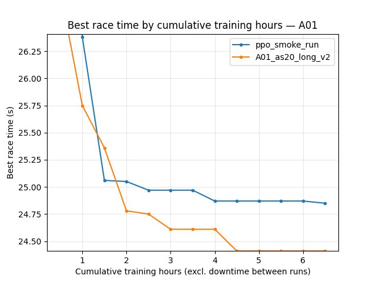
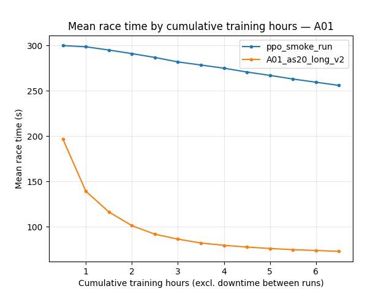
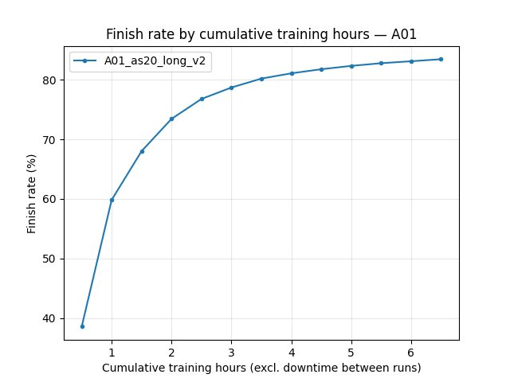
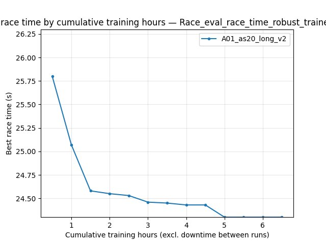
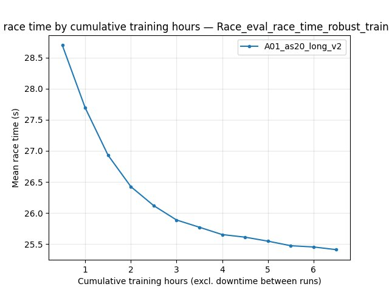
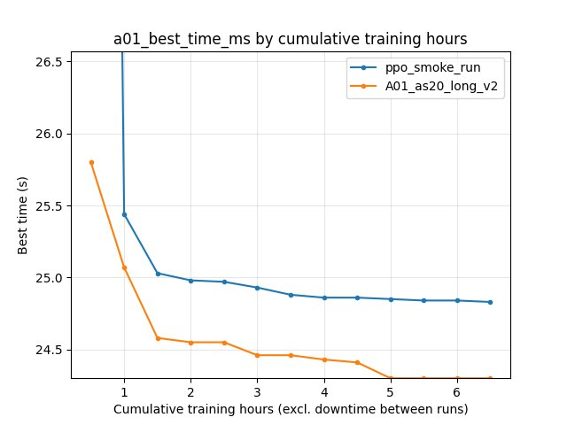
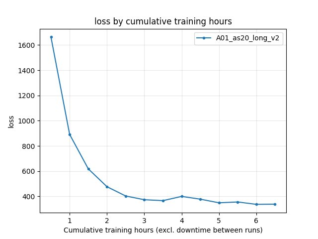
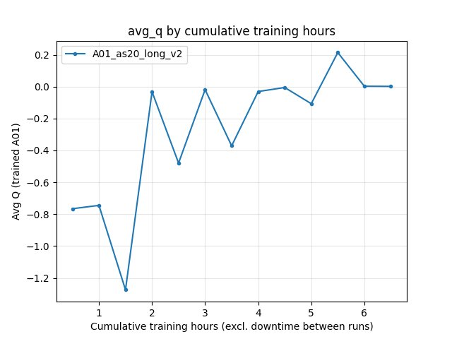
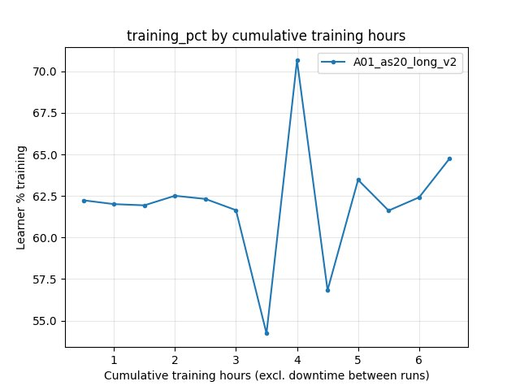

Experiment: PPO Smoke Run vs IQN Baseline (A01_as20_long_v2)
=============================================================

Experiment Overview
-------------------

This note compares the **PPO** run **ppo_smoke_run** (on-policy actor-critic, ``save/ppo_smoke_run/config_snapshot.yaml``) to the **IQN** baseline **A01_as20_long_v2** (see :doc:`global_schedule_speed`).

**TensorBoard layout:** use a **single** logical run name for the baseline: ``A01_as20_long_v2``. The analysis script merges suffix chunks automatically:

- ``tensorboard/A01_as20_long_v2``
- ``tensorboard/A01_as20_long_v2_2``
- ``tensorboard/A01_as20_long_v2_3``

PPO logs live in ``tensorboard/ppo_smoke_run``.

**What differs vs the IQN baseline:** algorithm (**ppo** vs IQN), on-policy rollouts vs replay, network stack, and **performance** (e.g. PPO ``running_speed: 32`` vs typical long IQN settings). This is **not** a controlled single-variable experiment.

**Goal:** Compare learning curves **by cumulative training hours** and **by environment steps** over the **common window** where both runs overlap.

Results
-------

**Important:** Tables and plots use ``scripts/analyze_experiment_by_relative_time.py`` with ``--time-axis auto`` (**cumulative training hours**). **ppo_smoke_run** lasted **~6.61 h** of cumulative training; **A01_as20_long_v2** (merged TB) **~17.74 h**. All **by-time** comparisons below use checkpoints **0.5, 1.0, …, 6.5 h** (common window ends when the shorter run stops). **BY STEP** comparisons use checkpoints **1M … 21M** (common window = min of max steps across runs).

**Key findings:**

- **alltime_min_ms_A01** (scalar best-so-far): at **6.5 h** cumulative training, **ppo_smoke_run** **24.830 s** vs **A01_as20_long_v2** **24.300 s** (IQN ahead by **~0.53 s**). At **21M** steps: **24.830 s** vs **24.450 s** (IQN still ahead).
- **Per-race eval** (``Race/eval_race_time_trained_A01``): at **6.5 h**, best **24.930 s** (PPO) vs **24.300 s** (IQN); eval **finish rate** (IQN only, from per-race finished events) **~75%** at 6.5 h vs **36%** at 0.5 h. PPO’s legacy log has **no** ``eval_race_finished_*`` events, so PPO rate columns stay empty.
- **Per-race explo:** at **6.5 h**, best **24.850 s** (PPO) vs **24.410 s** (IQN).
- **Robust eval** (``Race/eval_race_time_robust_trained_A01``): logged for **IQN only**; at **6.5 h** best **24.300 s** (mean **25.41 s** over finished robust races in that window).
- **Training/loss** (IQN): **~337.8** at **6.5 h** (not comparable to PPO objective). **RL/avg_Q_trained_A01** at **6.5 h**: **~0.0017**. **Performance/learner_percentage_training** at **6.5 h**: **~64.8%**.
- **Documented final** IQN best for this series remains **24.150 s** from saved state over the **full** long run (:doc:`global_schedule_speed`). **ppo_smoke_run** ``accumulated_stats.joblib`` best **24.830 s** (**21,627,235** frames).
- **Legacy PPO loss logging:** ``Training/ppo_loss`` in the smoke TensorBoard used **update index** as step, so **BY STEP** loss and loss-vs-hours alignment are **not** trustworthy until a re-run with the fixed learner (frame-aligned ``global_step``). A misleading dual-run **ppo_loss** JPG is **not** committed.

Run Analysis
------------

- **ppo_smoke_run:** PPO; ``rollout_steps_per_update: 2048``; ``running_speed: 32``; ``gpu_collectors_count: 8``. **~6.61 h** cumulative training (script). TensorBoard: ``tensorboard/ppo_smoke_run``.
- **A01_as20_long_v2:** IQN baseline; TensorBoard merged from **three** folders (see Overview). **~17.74 h** cumulative training (script). Save / final best: :doc:`global_schedule_speed`.

**Reproduce (tables + optional plots):**

::

   python scripts/analyze_experiment_by_relative_time.py --logdir tensorboard ppo_smoke_run A01_as20_long_v2 --interval-training-hours 0.5 --step_interval 1000000

::

   python scripts/analyze_experiment_by_relative_time.py --logdir tensorboard ppo_smoke_run A01_as20_long_v2 --interval-training-hours 0.5 --step_interval 1000000 --plot --output-dir docs/source/_static --prefix exp_ppo_smoke_vs_A01_v2

Detailed TensorBoard Metrics Analysis
-------------------------------------

**Methodology:** Same as ``analyze_experiment_by_relative_time.py`` output: per-race stats and scalars at shared cumulative-training-hour and step checkpoints. The figures below show **one metric per graph** (both runs as lines, **cumulative training hours** on the X axis).

A01 eval — best time (``Race/eval_race_time_trained_A01``)
~~~~~~~~~~~~~~~~~~~~~~~~~~~~~~~~~~~~~~~~~~~~~~~~~~~~~~~~~~~

- **6.5 h:** PPO best **24.930 s**; IQN best **24.300 s**.
- **21M steps:** PPO best **24.930 s**; IQN best **24.450 s**.

A01 eval — mean time (all episodes)
~~~~~~~~~~~~~~~~~~~~~~~~~~~~~~~~~~~~~

- **6.5 h:** PPO mean **296.67 s**; IQN mean **94.16 s** (IQN finishes a larger fraction of eval races).

A01 eval — finish rate (IQN only in this comparison)
~~~~~~~~~~~~~~~~~~~~~~~~~~~~~~~~~~~~~~~~~~~~~~~~~~~~

- **6.5 h:** IQN **75%** finish rate (PPO column empty in script: no legacy ``eval_race_finished_*`` in TB).

Robust eval (IQN only): ``Race/eval_race_time_robust_trained_A01``
~~~~~~~~~~~~~~~~~~~~~~~~~~~~~~~~~~~~~~~~~~~~~~~~~~~~~~~~~~~~~~~~~~

- PPO does not log this tag; the figure shows the **IQN** series only.

Best-so-far scalar (``alltime_min_ms_A01``)
~~~~~~~~~~~~~~~~~~~~~~~~~~~~~~~~~~~~~~~~~~~

- **6.5 h:** **24.830 s** (PPO) vs **24.300 s** (IQN).

Training loss (IQN: ``Training/loss``)
~~~~~~~~~~~~~~~~~~~~~~~~~~~~~~~~~~~~~~~

- **6.5 h:** IQN **~337.82** (last value at checkpoint). PPO has no IQN loss.

Average Q (IQN: ``RL/avg_Q_trained_A01``)
~~~~~~~~~~~~~~~~~~~~~~~~~~~~~~~~~~~~~~~~~

- **6.5 h:** **~0.0017**.

Learner training percentage (IQN)
~~~~~~~~~~~~~~~~~~~~~~~~~~~~~~~~~~~

- **6.5 h:** **~64.8%**.

Configuration Changes
---------------------

**ppo_smoke_run** (``save/ppo_smoke_run/config_snapshot.yaml``): ``training.algorithm: ppo``, ``run_name: ppo_smoke_run``, ``global_schedule_speed: 1``, PPO block as in snapshot; ``performance.running_speed: 32``, ``gpu_collectors_count: 8``.

**A01_as20_long_v2** (IQN): :doc:`global_schedule_speed` (e.g. ``global_schedule_speed: 4``, ``batch_size: 4096``).

Hardware
--------

- **PPO run:** 8 GPU collectors per config; GPU model and host are local to the machine that produced the logs.

Conclusions
-----------

- With **merged** TensorBoard (**``A01_as20_long_v2`` + ``_2`` + ``_3``**), IQN is **ahead** of this PPO smoke run on **alltime_min**, **eval best**, and **explo best** within the **shared 6.5 h** and **21M-step** windows, and shows **high eval finish rate** while PPO’s eval mean time remains dominated by non-finishes.
- **Robust eval** and **Q / IQN loss** metrics are **IQN-specific**; PPO comparison should rely on race times and ``alltime_min_ms_*`` (and frame-aligned PPO scalars after the learner fix).

Recommendations
---------------

- Always pass the **base** run name ``A01_as20_long_v2`` to the script so **``_2`` / ``_3``** chunks merge; do not analyze only the first folder.
- For PPO vs IQN at **equal cumulative training**, use ``--interval-training-hours`` and the printed hour checkpoints; for **equal env steps**, use the **BY STEP** section.
- Re-run PPO with frame-aligned ``Training/ppo_loss`` logging before comparing policy-gradient loss to IQN loss.

**Analysis tools**

- ``python scripts/analyze_experiment_by_relative_time.py ppo_smoke_run A01_as20_long_v2 --logdir tensorboard --interval-training-hours 0.5 --step_interval 1000000``
- Plots: ``--plot --output-dir docs/source/_static --prefix exp_ppo_smoke_vs_A01_v2`` (omit regenerating ``*_ppo_loss.jpg`` until PPO TB steps are fixed).
