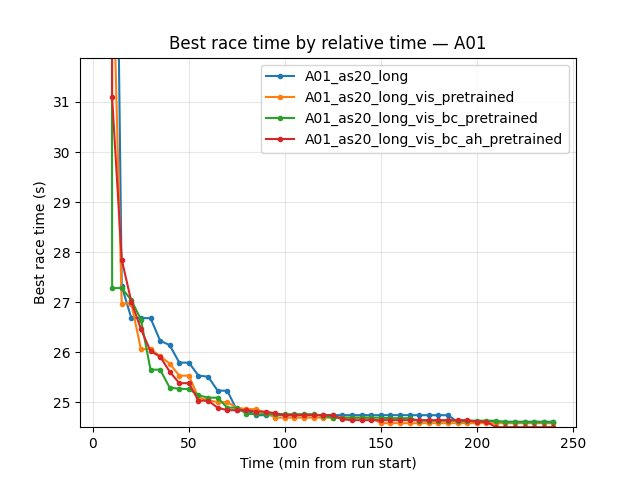
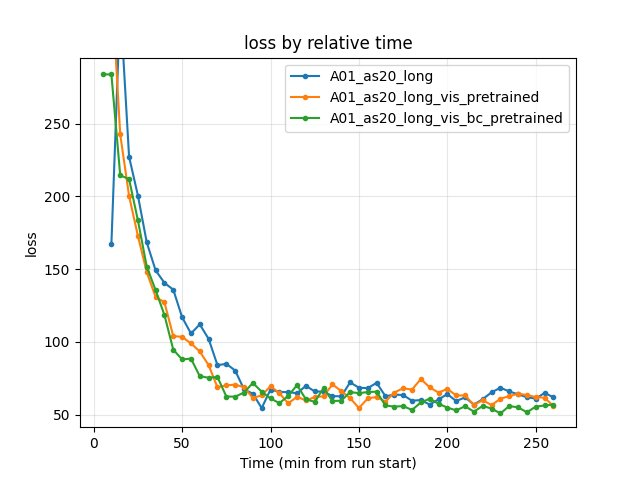
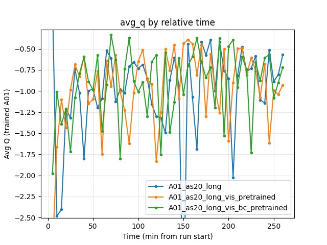

.. _pretrain_bc:

BC pretraining
==============

Experiment Overview
-------------------

This experiment tested whether **adding behavioral cloning (BC) pretraining** on top of the visual backbone pretraining improves RL training. The new run (**A01_as20_long_vis_bc_pretrained**) was obtained in three stages:

1. **Visual pretrain** — same as A01_as20_long_vis_pretrained: autoencoder on replay frames (``config_files/pretrain_config.yaml``), producing ``output/ptretrain/vis/v1/encoder.pt``.
2. **BC pretrain** — train a CNN to predict actions from images, initialized from the vis encoder (``config_files/pretrain_config_bc.yaml``). BC mode ``backbone``: only the encoder is saved (``output/ptretrain/bc/v1.1/encoder.pt``) and injected into IQN. In this experiment BC was simply **action prediction from a single frame** (no temporal context).
3. **RL training** — same RL config as the other runs, with ``pretrain_encoder_path: "output/ptretrain/bc/v1.1/encoder.pt"`` so the BC-trained encoder is used as the IQN visual backbone.

**Hypothesis:** BC might provide a better initialization than visual-only pretraining by aligning the backbone with action-relevant features.

**Main question:** Does BC help or not in the current setup (simple action prediction from image)?

Results
-------

**Important:** Run durations differed (A01_as20_long ~495 min, A01_as20_long_vis_pretrained ~275 min, A01_as20_long_vis_bc_pretrained ~262 min), so all findings below are by **relative time** (minutes from run start) and by **steps** (training step checkpoints). Comparing by "last value" is invalid.

**Key Findings:**

- **BC does not improve final performance over vis-only.** By the end of the common window (260 min), **vis_pretrained has the best A01 time (24.47s)**, then bc_pretrained (24.49s), then baseline (24.53s). So adding BC on top of visual pretraining gives a **slightly worse** best time than vis-only (~20 ms slower at 260 min).
- **BC gives the fastest early convergence:** First eval finish at **5.1 min** (bc) vs 8.3 min (baseline) vs 11.2 min (vis_pretrained). At 10 min, bc already has 24.92s best time; baseline and vis have much worse. So BC helps in the **very early** phase (first minutes).
- **By steps:** At 10.85M steps (common max), same ordering: vis_pretrained 24.47s, bc 24.49s, baseline 24.53s. Vis-only wins at equal gradient updates.
- **Eval finish rate at 260 min:** vis_pretrained 73%, bc_pretrained 70%, baseline 63%. BC is between vis and baseline.
- **Training loss at 260 min:** vis_pretrained 55.81, bc 56.79, baseline 61.79. Vis-only has the lowest loss.
- **Conclusion:** In the current setup (action prediction from a single image), **BC does not help** beyond visual pretraining. It speeds up the very early phase but vis-only catches up and slightly outperforms by the end. Possible reasons: BC may overfit to expert actions and harm exploration; or the gain from "action-aware" features is small compared to the visual pretrain.

Run Analysis
------------

- **A01_as20_long** (baseline): No pretrain. ``pretrain_encoder_path: null``. IQN from random weights. **~495 min**, 3 TensorBoard log dirs merged.
- **A01_as20_long_vis_pretrained**: Visual pretrain only. ``pretrain_encoder_path: "output/ptretrain/vis/v1/encoder.pt"``. **~275 min**, 2 log dirs merged.
- **A01_as20_long_vis_bc_pretrained** (new): Vis pretrain then BC pretrain then RL. ``pretrain_encoder_path: "output/ptretrain/bc/v1.1/encoder.pt"``. BC encoder from ``config_files/pretrain_config_bc.yaml`` (encoder_init_path: vis v1, bc_mode: backbone, 50 epochs, action prediction from image). **~262 min**, 2 log dirs merged.

Detailed TensorBoard Metrics Analysis
-------------------------------------

**Methodology — Relative time and by steps:** Metrics are compared (1) at checkpoints 5, 10, 15, 20, … min (only up to the shortest run, 260 min) and (2) at step checkpoints 50k, 100k, … (only up to the smallest max step). The figures below show one metric per graph (runs as lines, by relative time).

A01 Map Performance (common window up to 260 min)
~~~~~~~~~~~~~~~~~~~~~~~~~~~~~~~~~~~~~~~~~~~~~~~~~

- **Baseline (A01_as20_long):** at 35 min — 25.02s; at 85 min — 24.71s; at 150 min — 24.59s; at 260 min — 24.53s. First eval finish ~8.3 min.
- **Vis pretrained (A01_as20_long_vis_pretrained):** at 35 min — 24.79s; at 85 min — 24.55s; at 150 min — 24.50s; at 260 min — **24.47s**. First eval finish ~11.2 min.
- **BC pretrained (A01_as20_long_vis_bc_pretrained):** at 10 min — 24.92s (fastest early); at 35 min — 24.89s; at 85 min — 24.59s; at 150 min — 24.55s; at 260 min — 24.49s. First eval finish **~5.1 min** (earliest).

Training Loss
~~~~~~~~~~~~~

- **Baseline:** at 90 min — 64.29; at 260 min — 61.79.
- **Vis pretrained:** at 90 min — 61.35; at 260 min — 55.81 (lowest).
- **BC pretrained:** at 90 min — 71.70; at 260 min — 56.79.

Average Q-values
~~~~~~~~~~~~~~~~

- All three runs show similar Q dynamics; no clear winner. At 260 min: baseline -0.57, vis_pretrained -0.93, bc_pretrained -0.72.

GPU Utilization
~~~~~~~~~~~~~~~

- All ~69–72% over the common window; no significant difference.

Configuration Changes
---------------------

**RL training** (only encoder source differs):

.. code-block:: yaml

   # Baseline
   pretrain_encoder_path: null

   # Vis pretrained
   pretrain_encoder_path: "output/ptretrain/vis/v1/encoder.pt"

   # BC pretrained (vis -> BC -> RL)
   pretrain_encoder_path: "output/ptretrain/bc/v1.1/encoder.pt"

**Visual pretrain** (``config_files/pretrain_config.yaml``): task ae, image_size 64, n_stack 1, epochs 50, batch_size 4096, output_dir output/ptretrain/vis, run_name v1.

**BC pretrain** (``config_files/pretrain_config_bc.yaml``):

.. code-block:: yaml

   encoder_init_path: "output/ptretrain/vis/v1/encoder.pt"
   bc_mode: backbone
   n_actions: 12
   image_size: 64
   n_stack: 1
   epochs: 50
   batch_size: 4096
   output_dir: output/ptretrain/bc
   run_name: v1.1

Hardware
--------

- **GPU:** Same as other A01 runs.
- **Parallel instances:** Same gpu_collectors_count (from config_default).
- **System:** Windows.

Conclusions
-----------

- **Does BC help in the current variant?** **No.** Adding BC (action prediction from image) on top of visual pretraining does **not** improve final RL performance. By relative time and by steps, **vis_pretrained achieves the best A01 time (24.47s)** and highest eval finish rate (73%); bc_pretrained is in between (24.49s, 70%); baseline is worst (24.53s, 63%).
- **BC advantage:** Only in the **very early** phase: earliest first finish (5.1 min), good initial time (24.92s by 10 min). So BC gives a faster "cold start" but vis-only catches up and overtakes.
- **Possible reasons:** (1) BC may overfit to expert actions and reduce exploration. (2) Single-frame action prediction may be too weak a signal. (3) Visual pretrain already provides good features; BC fine-tuning might discard some useful structure. (4) Different BC setups (e.g. temporal context, auxiliary head in IQN) might behave differently.

Recommendations
---------------

- **For best final A01 performance:** Use **visual pretrain only** (``pretrain_encoder_path: "output/ptretrain/vis/v1/encoder.pt"``). Do not add the current BC stage.
- **If you need fastest early convergence (e.g. for debugging):** BC pretrain can give the earliest first finish and a good initial time in the first 10–20 min; then consider switching to vis-only for long runs.
- **Future experiments:** Try BC with temporal context (n_stack > 1), or BC as auxiliary head inside IQN instead of replacing the backbone; or different BC data/objectives.

**Analysis Tools:**

- By **relative time and by steps**: ``python scripts/analyze_experiment_by_relative_time.py A01_as20_long A01_as20_long_vis_pretrained A01_as20_long_vis_bc_pretrained --interval 5 --step_interval 50000``
- Plots: ``python scripts/generate_experiment_plots.py --experiments pretrain_bc``
