.. _pretrain_bc:

BC pretraining
==============

Experiment Overview
-------------------

This experiment tested whether **adding behavioral cloning (BC) pretraining** on top of the visual backbone pretraining improves RL training. Two BC-based RL variants are compared:

- **A01_as20_long_vis_bc_pretrained** — three stages: (1) Visual pretrain (vis v1), (2) BC pretrain with **backbone only** (single-frame action prediction, encoder saved), (3) RL with that encoder.
- **A01_as20_long_vis_bc_ah_pretrained** — uses **both** the visual encoder (**img head**) and the **action head (A_head)** from the **v2_multi_offset_ahead_dropout_inner** BC experiment (see :ref:`pretrain_bc_behavioral_cloning`). That BC run uses multi-offset action prediction, IQN-style A_head (MLP) with dropout (0.2 on features, 0.1 inside head), vis v2 backbone, and achieves best val_acc 0.597 / val_loss 1.971. RL injects ``encoder.pt`` and ``actions_head.pt`` from ``output/ptretrain/bc/v2_multi_offset_ahead_dropout_inner/``.

Stages for the first variant:

1. **Visual pretrain** — same as A01_as20_long_vis_pretrained: autoencoder on replay frames (``config_files/pretrain/vis/pretrain_config.yaml``), producing ``output/ptretrain/vis/v1/encoder.pt``.
2. **BC pretrain** — train a CNN to predict actions from images, initialized from the vis encoder (``config_files/pretrain/bc/pretrain_config_bc.yaml``). BC mode ``backbone``: only the encoder is saved (``output/ptretrain/bc/v1.1/encoder.pt``) and injected into IQN. In this experiment BC was simply **action prediction from a single frame** (no temporal context).
3. **RL training** — same RL config as the other runs, with ``pretrain_encoder_path: "output/ptretrain/bc/v1.1/encoder.pt"`` so the BC-trained encoder is used as the IQN visual backbone.

**Hypothesis:** BC might provide a better initialization than visual-only pretraining by aligning the backbone with action-relevant features. Using **both** encoder and A_head (bc_ah) may give a stronger policy prior than encoder-only.

**Main question:** Does BC help over vis-only? Does adding the pretrained A_head (bc_ah) improve over encoder-only BC (bc_pretrained)?

Results
-------

**Important:** Run durations differed (A01_as20_long ~495 min, A01_as20_long_vis_pretrained ~275 min, A01_as20_long_vis_bc_pretrained ~262 min, A01_as20_long_vis_bc_ah_pretrained ~244 min). All findings below are by **relative time** (minutes from run start) and by **steps** (training step checkpoints). Comparing by "last value" is invalid. Common window for all four runs: **up to 244 min** (shortest = bc_ah).

**Key Findings:**

- **BC does not improve final performance over vis-only (encoder-only BC).** By the end of the common window (260 min for the first three runs), **vis_pretrained has the best A01 time (24.47s)**, then bc_pretrained (24.49s), then baseline (24.53s).
- **BC + A_head (bc_ah) matches the best A01 time.** At 240 min (end of bc_ah run), **bc_ah reaches 24.47s** — tied with vis_pretrained and better than bc_pretrained (24.49s) and baseline (24.53s). So the new experiment (encoder + A_head from v2_multi_offset_ahead_dropout_inner) is **as good as vis-only** on final best time and **better than encoder-only BC**.
- **BC gives the fastest early convergence (encoder-only):** First eval finish at **5.1 min** (bc) vs 8.3 min (baseline) vs 11.2 min (vis_pretrained). **bc_ah** has first eval finish at **15.2 min** (slowest of the four) — pretrained A_head does not help early first finish.
- **By steps:** At 10.85M steps (common max for first three), same ordering: vis_pretrained 24.47s, bc 24.49s, baseline 24.53s. bc_ah run is shorter; at equal relative time (244 min) bc_ah reaches 24.47s.
- **Eval finish rate at 240 min:** vis_pretrained 74%, bc_pretrained 70%, bc_ah 68%, baseline 63%. bc_ah is between bc and baseline.
- **Training loss at 240 min:** bc_pretrained 54.93 (lowest), bc_ah 62.58, baseline 63.89, vis_pretrained 64.33. bc_ah has lower loss than baseline and vis.
- **Conclusion:** **BC + A_head (bc_ah) is the only BC variant that matches vis-only on final A01 best time (24.47s)** and beats encoder-only BC (24.49s). It does not improve over vis on finish rate or early first finish; it is a viable alternative when using the multi-offset A_head pretrain.

**Does pretrain and transfer help? (Summary)**

**Question:** With the setups tried so far, does pretrain (BC encoder + A_head) and transfer actually help, or is it not working?

**Answer:** **Yes, pretrain helps when used correctly.** Evidence: **bc_ah** (encoder + A_head trainable) reaches **24.47s** — tied with vis-only. **enc_ah_freeze** (both frozen) fails (24.97s, 22% finish rate). **enc_ah_freeze_resume** (unfreeze + lower lr/epsilon) **recovers** to **24.51s** from the poor enc_ah_freeze checkpoint. So pretrain works when allowed to fine-tune; freezing A_head hurts; unfreezing with gentle lr/epsilon recovers. It does not beat vis-only on final time, but is a viable path. For best final time, use bc_ah or vis-only; avoid freezing A_head.

Run Analysis
------------

- **A01_as20_long** (baseline): No pretrain. ``pretrain_encoder_path: null``. IQN from random weights. **~495 min**, 3 TensorBoard log dirs merged.
- **A01_as20_long_vis_pretrained**: Visual pretrain only. ``pretrain_encoder_path: "output/ptretrain/vis/v1/encoder.pt"``. **~275 min**, 2 log dirs merged.
- **A01_as20_long_vis_bc_pretrained**: Vis pretrain then BC pretrain then RL. ``pretrain_encoder_path: "output/ptretrain/bc/v1.1/encoder.pt"``. BC encoder from ``config_files/pretrain/bc/pretrain_config_bc.yaml`` (encoder_init_path: vis v1, bc_mode: backbone, 50 epochs, action prediction from image). **~262 min**, 2 log dirs merged.
- **A01_as20_long_vis_bc_ah_pretrained**: RL with **encoder + A_head** from **v2_multi_offset_ahead_dropout_inner**. ``pretrain_encoder_path: "output/ptretrain/bc/v2_multi_offset_ahead_dropout_inner/encoder.pt"``, ``pretrain_actions_head_path: "output/ptretrain/bc/v2_multi_offset_ahead_dropout_inner/actions_head.pt"``. BC run: ``config_files/pretrain/bc/pretrain_config_bc_v2_multi_offset_ahead_dropout_inner.yaml`` — vis v2 backbone, multi-offset ``bc_time_offsets_ms: [-10, 0, 10, 100]``, ``use_actions_head: true``, dropout 0.2 on features, action_head_dropout 0.1; val_acc 0.597, val_loss 1.971 (best A_head variant). **~244 min**, 2 log dirs merged.
- **A01_as20_long_vis_bc_ah_pretrained_enc_freeze**: Same pretrain sources as bc_ah, but **encoder frozen** during RL: ``pretrain_encoder_freeze: true``. A_head, float_feature_extractor, iqn_fc, V_head trainable. **~158 min**, 2 log dirs merged.
- **A01_as20_long_vis_bc_ah_pretrained_enc_ah_freeze**: Same pretrain, but **both encoder and A_head frozen** during RL: ``pretrain_encoder_freeze: true``, ``pretrain_actions_head_freeze: true``. Only float_feature_extractor, iqn_fc, V_head trainable. **~228 min**, 2 log dirs merged.
- **A01_as20_long_vis_bc_ah_pretrained_enc_ah_freeze_resume**: Resumed from enc_ah_freeze weights; **encoder and A_head unfrozen**, lower lr (5e-5 at start, 1e-4 from 500k) and lower epsilon (0.1 at start vs 1.0). All parts trainable. **~259 min**, 2 log dirs merged.
- **A01_as20_long_full_iqn_bc**: **Full IQN** from BC run v3_multi_offset. ``pretrain_bc_heads_path: "output/ptretrain/bc/v3_multi_offset"``. **~192 min**, 2 log dirs. See "Experiment: Full IQN from BC (full_iqn_bc)".
- **A01_as20_long_full_iqn_bc_2**: Same setup, **separate run** (run_name set to _2). **~1020 min**, 2 TensorBoard log dirs merged. See "Runs full_iqn_bc_2 and full_iqn_bc_3 (separate runs)".
- **A01_as20_long_full_iqn_bc_3**: Same setup, **separate run** (run_name set to _3). **~1166 min**, 5 TensorBoard log dirs merged. See "Runs full_iqn_bc_2 and full_iqn_bc_3 (separate runs)" and "Why run _3 showed almost no improvement over long time".
- **A01_as20_long_full_iqn_bc_3_best_ref**: Full IQN from BC (v3_multi_offset) with **reference line from the best human-driven run** (``A01_0.5m_cl_best.npy``) in ``map_cycle``. **~265 min**, 2 TensorBoard log dirs merged. See "Experiment: Full IQN from BC with human best reference line (best_ref)".
- **A01_as20_long_full_iqn_bc_3_4explo**: Same full IQN from BC (v3_multi_offset) with **exploration repeat 4** instead of 64 in ``map_cycle`` (fewer exploration episodes per cycle). **~337 min**, 2 TensorBoard log dirs merged. See "Experiment: Full IQN from BC with 4 exploration episodes (4explo)".

Detailed TensorBoard Metrics Analysis
-------------------------------------

**Methodology — Relative time and by steps:** Metrics are compared (1) at checkpoints 5, 10, 15, 20, … min (only up to the shortest run; when including bc_ah, use the common window of all four runs) and (2) at step checkpoints 50k, 100k, … (only up to the smallest max step). The figures below show one metric per graph (runs as lines, by relative time). To generate plots including bc_ah, use the four-run command in Analysis Tools and regenerate with ``--experiments pretrain_bc``.

A01 Map Performance (common window up to 244 min for all four runs)
~~~~~~~~~~~~~~~~~~~~~~~~~~~~~~~~~~~~~~~~~~~~~~~~~~~~~~~~~~~~~~~~~~

- **Baseline (A01_as20_long):** at 35 min — 25.02s; at 85 min — 24.71s; at 150 min — 24.59s; at 240 min — 24.53s. First eval finish ~8.3 min.
- **Vis pretrained (A01_as20_long_vis_pretrained):** at 35 min — 24.79s; at 85 min — 24.55s; at 150 min — 24.50s; at 240 min — **24.47s**. First eval finish ~11.2 min.
- **BC pretrained (A01_as20_long_vis_bc_pretrained):** at 10 min — 24.92s (fastest early); at 35 min — 24.89s; at 85 min — 24.59s; at 150 min — 24.55s; at 240 min — 24.49s. First eval finish **~5.1 min** (earliest).
- **BC + A_head (A01_as20_long_vis_bc_ah_pretrained):** First eval finish **~15.2 min** (latest of the four). At 30 min — 24.83s; at 65 min — 24.59s; at 100 min — 24.55s; at 140 min — 24.53s; at 190 min — 24.47s; at 240 min — **24.47s** (tied with vis_pretrained for best). Eval finish rate at 240 min: 68%.

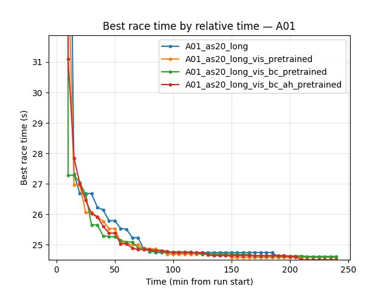

Training Loss
~~~~~~~~~~~~~

- **Baseline:** at 90 min — 64.29; at 240 min — 63.89.
- **Vis pretrained:** at 90 min — 61.35; at 240 min — 64.33.
- **BC pretrained:** at 90 min — 71.70; at 240 min — 54.93 (lowest at 240 min).
- **BC + A_head (bc_ah):** at 90 min — 54.06; at 240 min — 62.58. Lower than baseline and vis at 240 min.

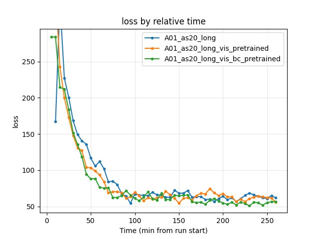

Average Q-values
~~~~~~~~~~~~~~~~

- At 240 min: baseline -1.14, vis_pretrained -0.68, bc_pretrained -0.61, bc_ah -1.49. No clear winner; bc_ah is more negative (more conservative Q).

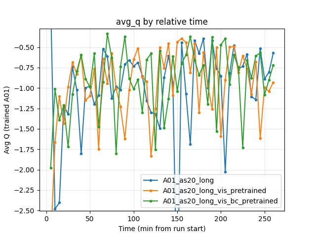

GPU Utilization
~~~~~~~~~~~~~~~

- All ~69–72% over the common window; no significant difference.

Experiment: Encoder freeze (bc_ah vs enc_freeze)
~~~~~~~~~~~~~~~~~~~~~~~~~~~~~~~~~~~~~~~~~~~~~~~~

**Goal:** Compare **A01_as20_long_vis_bc_ah_pretrained** (encoder + A_head from v2_multi_offset_ahead_dropout_inner, **encoder trainable**) with **A01_as20_long_vis_bc_ah_pretrained_enc_freeze** (same pretrain, **img_head frozen** during RL). Only difference: ``pretrain_encoder_freeze: true`` in enc_freeze.

**Common window:** Up to **158 min** (shortest run = enc_freeze). All comparisons below are by relative time over this window.

**A01 map performance:**

- **bc_ah (encoder trainable):** First eval finish **~15.2 min**. At 60 min — 24.80s; at 100 min — 24.55s; at 155 min — **24.50s**. Eval finish rate at 155 min — 66%. Run continued to 244 min and reached 24.47s.
- **enc_freeze (encoder frozen):** First eval finish **~4.1 min** (much earlier than bc_ah). At 60 min — 24.81s; at 100 min — 24.60s; at 155 min — **24.55s**. Eval finish rate at 155 min — 64%. Run ended at ~158 min; best time in window 24.55s.

**Conclusion (encoder freeze):** Over the common window (158 min), **bc_ah has slightly better best A01 time** (24.50s vs 24.55s at 155 min) and **slightly higher eval finish rate** (66% vs 64%). **enc_freeze has much earlier first eval finish** (4.1 min vs 15.2 min). Training loss at 155 min: bc_ah 57.29, enc_freeze 63.33 (bc_ah lower). So **freezing the encoder** preserves a strong policy prior (very fast first finish) but does **not** match the trainable-encoder run on best time within 158 min; the trainable encoder (bc_ah) pulls ahead by ~50 ms and has lower loss. For best final A01 time in long runs, keep the encoder trainable; use enc_freeze if you want fastest early first finish or fewer parameters to train.

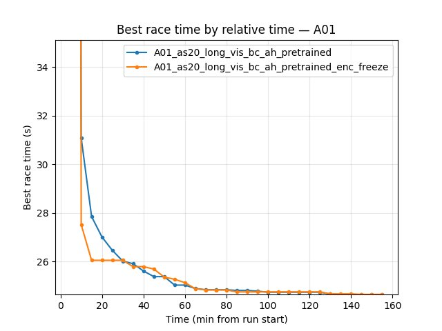

**Training loss and avg Q (at 60, 100, 155 min):**

- **Loss:** bc_ah 74.89 / 60.07 / 57.29; enc_freeze 89.35 / 62.26 / 63.33. bc_ah lower at all checkpoints.
- **Avg Q:** Both fluctuate; at 155 min bc_ah -0.66, enc_freeze -1.34.

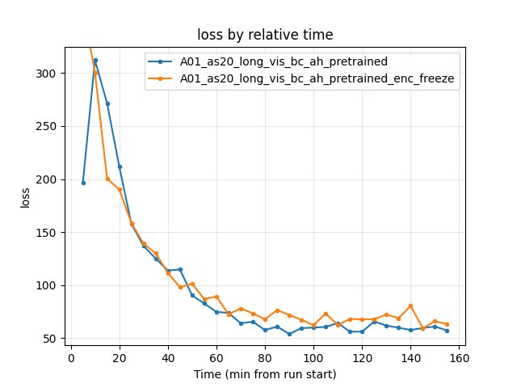

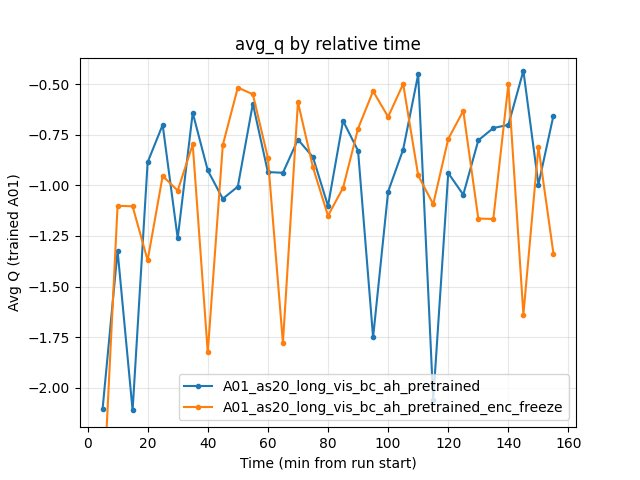

**Reproduce:** ``python scripts/analyze_experiment_by_relative_time.py A01_as20_long_vis_bc_ah_pretrained A01_as20_long_vis_bc_ah_pretrained_enc_freeze --interval 5 --step_interval 50000``

Experiment: Encoder + A_head freeze (three-way: bc_ah vs enc_freeze vs enc_ah_freeze)
~~~~~~~~~~~~~~~~~~~~~~~~~~~~~~~~~~~~~~~~~~~~~~~~~~~~~~~~~~~~~~~~~~~~~~~~~~~~~~~~~~~~~

**Goal:** Compare all three freeze variants with the same BC+AH pretrain: (1) **bc_ah** — both encoder and A_head trainable; (2) **enc_freeze** — encoder frozen, A_head trainable; (3) **enc_ah_freeze** — **both** encoder and A_head frozen (only float_feature_extractor, iqn_fc, V_head trainable).

**Common window:** Up to **158 min** (shortest = enc_freeze). All three runs have data up to 155 min.

**A01 map performance (at 155 min):**

| Run | Encoder | A_head | Best time (155 min) | First eval finish | Eval finish rate (155 min) | Loss (155 min) |
|-----|---------|--------|---------------------|-------------------|----------------------------|----------------|
| **bc_ah** | trainable | trainable | **24.50s** | 15.2 min | 66% | 57.29 |
| **enc_freeze** | frozen | trainable | **24.55s** | **4.1 min** | 64% | 63.33 |
| **enc_ah_freeze** | frozen | frozen | **24.97s** | 8.9 min | 22% | 279.12 |

**Conclusions (what to freeze):**

- **Freezing both encoder and A_head** (enc_ah_freeze) **severely hurts** RL: best time 24.97s (~470 ms worse than bc_ah), finish rate 22% (vs 66%), loss ~5x higher. The frozen A_head blocks policy adaptation; float_feature_extractor, iqn_fc, and V_head alone cannot compensate. **Do not freeze A_head.**
- **Freezing only the encoder** (enc_freeze) is **acceptable**: best time 24.55s (~50 ms worse than bc_ah), finish rate 64%, loss slightly higher. enc_freeze has **much earlier first eval finish** (4.1 min vs 15.2 min). Use when you want fastest early first finish or fewer trainable parameters.
- **Best final A01 time:** Keep **both encoder and A_head trainable** (bc_ah). For long runs aiming at 24.47s, do not freeze either.

**Summary:** Freeze **encoder only** if you prioritize early first finish; never freeze A_head. For best final time, train both.

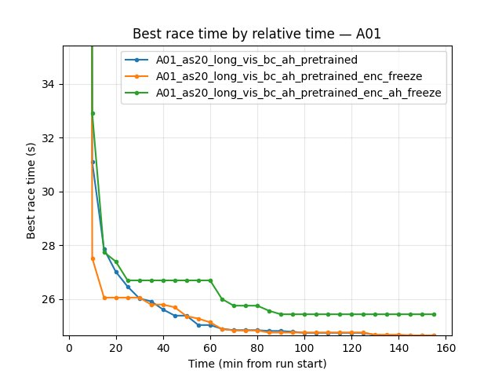

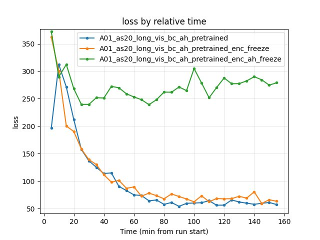

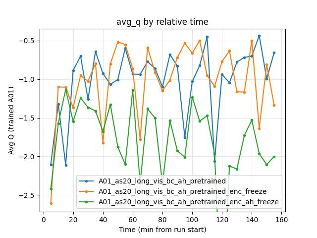

**Reproduce:** ``python scripts/analyze_experiment_by_relative_time.py A01_as20_long_vis_bc_ah_pretrained A01_as20_long_vis_bc_ah_pretrained_enc_freeze A01_as20_long_vis_bc_ah_pretrained_enc_ah_freeze --interval 5 --step_interval 50000``

Experiment: Resume from enc_ah_freeze (unfreeze + lower lr and epsilon)
~~~~~~~~~~~~~~~~~~~~~~~~~~~~~~~~~~~~~~~~~~~~~~~~~~~~~~~~~~~~~~~~~~~~~~~

**Goal:** Take enc_ah_freeze checkpoint (both encoder and A_head frozen during RL; best 24.97s, 22% finish rate), **resume** training with everything **unfrozen** and **reduced lr/epsilon**. Hypothesis: gentle fine-tuning of the pretrained parts will recover or improve performance.

**Setup:** Load weights from enc_ah_freeze; set ``pretrain_encoder_freeze: false``, ``pretrain_actions_head_freeze: false``; lr_schedule: 5e-5 (0–500k), 1e-4 (500k–3M), 5e-5 (3M+); epsilon: 0.1 at start (vs 1.0 in enc_ah_freeze), 0.5 at 300k, 0.03 by 3M.

**Common window:** Up to **228 min** (shortest = enc_ah_freeze). enc_ah_freeze_resume ran ~259 min.

**A01 map performance (by relative time):**

| Run | Best time (225 min) | First eval finish | Eval finish rate (225 min) | Loss (225 min) |
|-----|---------------------|-------------------|----------------------------|----------------|
| **enc_ah_freeze** | **24.97s** | 8.9 min | 29% | 229.71 |
| **enc_ah_freeze_resume** | **24.51s** | **6.0 min** | **56%** | 73.39 |

**By steps (at 9.65M steps, common for both):** enc_ah_freeze best 24.97s; enc_ah_freeze_resume best **24.51s** (460 ms better).

**Conclusions:**

- **Unfreezing + lower lr/epsilon recovers from enc_ah_freeze.** enc_ah_freeze_resume reaches **24.51s** vs 24.97s — ~460 ms improvement. Finish rate 56% vs 22%; loss ~73 vs ~230. The pretrained encoder and A_head, when allowed to fine-tune gently, quickly adapt and improve.
- **First eval finish:** resume 6.0 min vs freeze 8.9 min — slightly earlier.
- **Recommendation:** If you ran enc_ah_freeze and it plateaued poorly, resume with unfreeze + lower lr (5e-5–1e-4) and lower epsilon (0.1 at start) to recover.

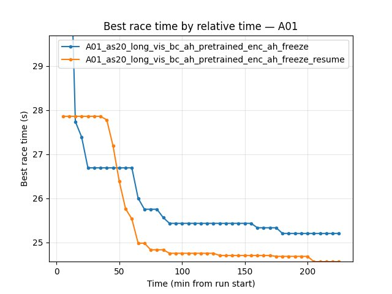

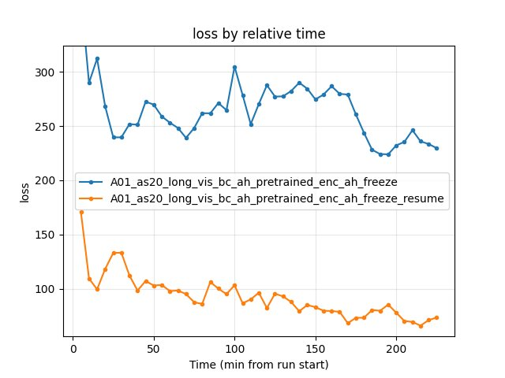

**Reproduce:** ``python scripts/analyze_experiment_by_relative_time.py A01_as20_long_vis_bc_ah_pretrained_enc_ah_freeze A01_as20_long_vis_bc_ah_pretrained_enc_ah_freeze_resume --interval 5 --step_interval 50000``

Experiment: Full IQN from BC (full_iqn_bc)
~~~~~~~~~~~~~~~~~~~~~~~~~~~~~~~~~~~~~~~~~~

**Goal:** Test loading the **entire IQN** (img_head, float_feature_extractor, iqn_fc, A_head, V_head) from a BC pretrain run that used ``use_full_iqn: true``. The BC run **v3_multi_offset** (img 100 FPS, 11 offset heads, use_floats) produces ``iqn_bc.pt``; RL loads it via ``pretrain_bc_heads_path: "output/ptretrain/bc/v3_multi_offset"``.

**Config:** Same RL base as other A01_as20_long runs; ``pretrain_bc_heads_path: "output/ptretrain/bc/v3_multi_offset"`` (no separate encoder or A_head paths — the full state is in iqn_bc.pt). BC source: ``config_files/pretrain/bc/pretrain_config_bc_v3_multi_offset.yaml``.

**Common window:** Up to **192 min** (full_iqn_bc is the shortest run). All five runs compared: baseline, vis_pretrained, bc_pretrained, bc_ah, full_iqn_bc.

**Key findings**

- **A01 best time at 190 min:** **full_iqn_bc 24.50s** (tied with vis_pretrained); bc_ah **24.47s** (best); bc_pretrained 24.51s; baseline 24.58s. Full IQN pretrain reaches **same final performance as vis_pretrained**.
- **Overfitting:** No sign of overfitting. full_iqn_bc improves steadily: 25.84s (20 min) → 24.56s (60 min) → 24.50s (110 min) → 24.50s (190 min). Best time plateaus; run ended at 192 min before further training.
- **Training loss:** full_iqn_bc starts with a **very high loss** (~15,749 at 5 min) due to distribution shift (BC classification vs RL regression). By 15 min it drops to ~416; by 85 min ~53 (lowest among runs at that checkpoint). Recovers quickly.
- **First eval finish:** full_iqn_bc ~17.5 min (slower than bc_pretrained 5.1 min, similar to bc_ah 15.2 min).
- **Eval finish rate at 190 min:** full_iqn_bc 56%, vis_pretrained 76%, bc_ah 67%, baseline 59%.
- **Benefit from full pretrain:** **Faster wall-clock to result** — full_iqn_bc reaches 24.50s in **192 min** (run ended), while vis_pretrained and bc_ah need 244–275 min. For the same A01 time, full_iqn_bc is **~25% faster** in wall-clock. Final best time is **tied with vis_pretrained** and slightly worse than bc_ah (24.50s vs 24.47s).

**Conclusion:** Full IQN pretrain (v3_multi_offset) gives **comparable** A01 performance to vis_pretrained and **faster time-to-result**. No overfitting. bc_ah remains best for final time (24.47s); full_iqn_bc is a good option when you want **fast wall-clock convergence** with similar final performance. The high initial loss recovers within ~15 min.

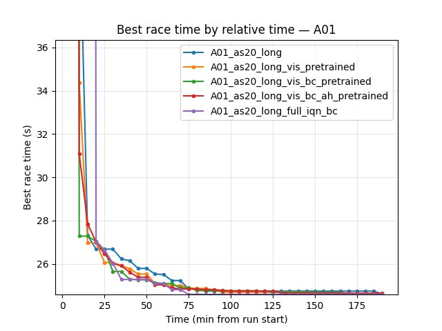

**Reproduce:** ``python scripts/analyze_experiment_by_relative_time.py A01_as20_long A01_as20_long_vis_pretrained A01_as20_long_vis_bc_pretrained A01_as20_long_vis_bc_ah_pretrained A01_as20_long_full_iqn_bc --interval 5 --step_interval 50000``

Runs full_iqn_bc_2 and full_iqn_bc_3 (separate runs)
~~~~~~~~~~~~~~~~~~~~~~~~~~~~~~~~~~~~~~~~~~~~~~~~~~~~~

**A01_as20_long_full_iqn_bc**, **A01_as20_long_full_iqn_bc_2**, and **A01_as20_long_full_iqn_bc_3** are **three separate runs** (same config, run_name overridden to base, _2, _3). Each has its own ``save/`` dir and its own TensorBoard log dir(s); within each run, ``tensorboard_suffix_schedule`` may split logs into _2, _3, … by step. Below we do **not** consider the first run (already documented); we analyze **run _2** and **run _3** in full.

**Run A01_as20_long_full_iqn_bc_2** (~1020 min, 2 TB dirs merged)

- **Best A01:** **24.510s** by ~30–40 min; then **flat** for the whole run (no further best-time improvement).
- **Eval (trained_A01):** Mean ~25.29s, rate ~68% from ~50 min until **~770 min**. At **~770 min** a **collapse**: eval mean jumps (25.29 → 26.49s), finish rate drops (68% → 29%), Training/loss spikes (~57 → 37306), RL/avg_Q spikes (399). Over the next ~240 min the run **partially recovers** (mean 26.20s, rate 48% by 1010 min; loss ~70), but never back to pre-collapse level. Best time stays 24.51s throughout.
- **By steps:** At 2M steps best 24.70s; at 8M steps best 24.51s. So best was reached well before the collapse.
- **Conclusion (run _2):** Early convergence to 24.51s; then a **major instability** around 770 min (coincides with switch to second TB log dir), with large loss/Q spike and drop in eval performance, then partial recovery. Best time unaffected; long tail did not help.

**Run A01_as20_long_full_iqn_bc_3** (~1166 min, 5 TB dirs merged)

- **Best A01:** Improves from 29.58s (30 min) → 25.04s (110 min) → 24.80s (130 min) → 24.50s (410 min) → 24.49s (650 min) → **24.48s** (910 min). So there *is* improvement over the run, but **after ~410 min** gains are **tiny**: 24.50s at 410 min, then only 24.49s by 650 min and 24.48s by 910 min (~20 ms total over ~500 min).
- **Eval mean and rate:** Mean improves (26.22s → 25.79s), rate 62% → 69%. Policy becomes slightly more consistent; best time barely moves in the long tail.
- **By steps:** 5M steps → 25.04s; 15M → 24.51s; 30M → 24.49s; 45M → 24.48s. Same picture: most gain in the first ~15M steps, then plateau.
- **Loss:** High at start (BC init), then 50–70; no large spikes like in run _2.

Why run _3 showed almost no improvement over long time
^^^^^^^^^^^^^^^^^^^^^^^^^^^^^^^^^^^^^^^^^^^^^^^^^^^^^^^

1. **Plateau at 24.50s.** Best time 24.50s is reached by ~410 min (~20M steps). For the next **~750 min** (25M–45M steps) the gain is only **20 ms** (24.50 → 24.48). So the run did not "fail" — it **plateaued**; further training with the current schedule adds almost nothing.

2. **Learning rate schedule.** LR is 1e-3 (0–10M), 5e-5 (10M–30M), 1e-5 (30M+). In the long tail (20M–45M steps) LR is 5e-5 or 1e-5. With such low LR, updates are small; breaking the 24.50s plateau would likely need a different schedule (e.g. less aggressive decay or a small LR bump after a plateau).

3. **No collapse in _3.** Unlike run _2, run _3 has no big loss/eval collapse; mean time and finish rate improve slowly. The "no improvement" is **flat best time**, not a crash.

4. **Recommendations.** (1) **Early stopping:** stop when best time is stable for 60–90 min (e.g. after ~400–500 min for this setup). (2) **Run _2 collapse:** investigate cause of the ~770 min instability (e.g. TB writer switch, env or learner restart); if reproducible, add safeguards or avoid very long runs without checkpoint/restart handling. (3) For **run _3**, treat 24.48s as the ceiling for this setup/schedule; longer runs are not worth the compute unless LR or schedule is changed.

**Reproduce:**

- Run _2: ``python scripts/analyze_experiment_by_relative_time.py A01_as20_long_full_iqn_bc_2 --logdir tensorboard --interval 10 --step_interval 2000000``
- Run _3: ``python scripts/analyze_experiment_by_relative_time.py A01_as20_long_full_iqn_bc_3 --logdir tensorboard --interval 10 --step_interval 5000000``

Experiment: Full IQN from BC with human best reference line (best_ref)
~~~~~~~~~~~~~~~~~~~~~~~~~~~~~~~~~~~~~~~~~~~~~~~~~~~~~~~~~~~~~~~~~~~~~~

**Goal:** Test RL with the same full IQN pretrain (v3_multi_offset) but with the **reference line taken from the best human-driven run** on A01. The reference line (``A01_0.5m_cl_best.npy``) is set in ``map_cycle`` so that the environment uses the trajectory/path from the human best run (e.g. for checkpoints or track representation). Hypothesis: aligning the task with the human reference may improve learning or final time.

**Setup:** Same as full_iqn_bc (``pretrain_bc_heads_path: "output/ptretrain/bc/v3_multi_offset"``). Only difference: ``map_cycle.entries`` use ``reference_line_path: "A01_0.5m_cl_best.npy"`` for the A01 map (reference line from best human run). Run name: ``A01_as20_long_full_iqn_bc_3_best_ref``.

**Run duration:** ~265 min (2 TensorBoard log dirs merged).

**Results (by relative time)**

- **Best A01 time:** 24.57s at 250–260 min (alltime_min_ms; eval best 24.57s at 260 min). First eval finish at **62.6 min** (much later than full_iqn_bc_3, which had first finish ~24 min).
- **Eval finish rate:** 36% at 260 min (vs full_iqn_bc_3 ~69% at 1160 min; at similar wall time ~260 min, full_iqn_bc_3 had ~51% and best 24.58s).
- **Eval mean time (trained_A01):** 201s at 260 min; improves from 294s (70 min) to 201s (260 min).
- **By steps:** At 4M steps best 25.25s, rate 10%; at 8M steps best 24.70s, rate 31%.
- **Training loss:** High at start (~16k), recovers to ~68 by 260 min. GPU learner % ~72–73%.

**Comparison with full_iqn_bc_3 (no reference line):** At ~260 min, best_ref reaches **24.57s** and 36% finish rate. full_iqn_bc_3 at ~260 min had best **24.58s** and ~51% rate. So best_ref is **slightly better** on best time (24.57s vs 24.58s) at similar wall time but **lower finish rate** (36% vs 51%) and **later first finish** (62.6 min vs ~24 min). The reference line does not clearly improve final performance in this run; the slower first finish suggests the different map/ref setup may change early exploration.

**Conclusions**

- **Reference line (human best)** in map_cycle yields **similar best time** (24.57s) to full_iqn_bc_3 at 260 min (24.58s) but **lower eval finish rate** and **later first eval finish**. Run was shorter (265 min); longer run would be needed to see if best_ref can match or beat 24.48s.
- **Recommendation:** If using the human best reference line, consider longer runs and compare finish rate and mean time; monitor whether first finish delay is due to env setup or exploration.

**Reproduce:** ``python scripts/analyze_experiment_by_relative_time.py A01_as20_long_full_iqn_bc_3_best_ref --logdir tensorboard --interval 10 --step_interval 2000000``

Experiment: Full IQN from BC with 4 exploration episodes (4explo)
~~~~~~~~~~~~~~~~~~~~~~~~~~~~~~~~~~~~~~~~~~~~~~~~~~~~~~~~~~~~~~~~~~

**Goal:** Test full IQN from BC (v3_multi_offset) with **4 exploration episodes per cycle** instead of 64. In ``map_cycle``, the exploration entry uses ``repeat: 4`` so that each time the collector switches to the exploration map, it runs only 4 episodes before switching back (vs 64 in the default setup). Hypothesis: fewer exploration episodes per block may change the exploration/exploitation balance or data mix and affect convergence or final time.

**Setup:** Same as full_iqn_bc (``pretrain_bc_heads_path: "output/ptretrain/bc/v3_multi_offset"``). Only difference: ``map_cycle`` has the exploration entry with ``repeat: 4`` (e.g. ``is_exploration: true, fill_buffer: true, repeat: 4``) instead of ``repeat: 64``. Run name: ``A01_as20_long_full_iqn_bc_3_4explo``.

**Run duration:** ~337 min (2 TensorBoard log dirs merged).

**Results (by relative time)**

- **Best A01 time:** **24.53s** at 310–330 min (alltime_min_ms; eval best 24.53s at 330 min). First eval finish at **18.1 min**.
- **Eval finish rate:** 63% at 330 min. Eval mean time improves from ~298s (20 min) to ~128s (330 min).
- **By steps:** At 2M steps best 24.96s, rate 10%; at 12M steps best **24.54s**, rate 61%.
- **Training loss:** High at start (~10k), recovers to ~62 by 330 min. GPU learner % ~69–70%.

**Comparison with full_iqn_bc_3 (repeat 64):** full_iqn_bc_3 at ~330 min had best **24.50s** and eval rate ~57%; at 12M steps best 24.51s. So 4explo reaches **24.53s** at 330 min and **24.54s** at 12M steps — **slightly worse** than full_iqn_bc_3 (24.50s at similar time/steps) but in the same ballpark. First eval finish is earlier in 4explo (18.1 min vs ~24 min in _3). Eval finish rate at 330 min: 4explo 63% vs full_iqn_bc_3 ~57% at 260 min (different run lengths). So **reducing exploration repeat from 64 to 4** does not improve best time and may slightly hurt it; finish rate is similar or slightly better in 4explo.

**Conclusions**

- **4 exploration episodes per cycle** (repeat: 4) yields best **24.53s** in ~337 min — comparable to but slightly worse than full_iqn_bc_3 with repeat 64 (24.50s at similar wall time). No clear benefit from fewer exploration episodes in this run.
- **Recommendation:** Keep default exploration repeat (64) for full_iqn_bc unless further ablation shows a benefit from 4.

**Reproduce:** ``python scripts/analyze_experiment_by_relative_time.py A01_as20_long_full_iqn_bc_3_4explo --logdir tensorboard --interval 10 --step_interval 2000000``

Configuration Changes
---------------------

**RL training** (encoder and optional A_head source):

.. code-block:: yaml

   # Baseline
   pretrain_encoder_path: null

   # Vis pretrained
   pretrain_encoder_path: "output/ptretrain/vis/v1/encoder.pt"

   # BC pretrained (vis -> BC -> RL, encoder only)
   pretrain_encoder_path: "output/ptretrain/bc/v1.1/encoder.pt"

   # BC + A_head (encoder and action head from v2_multi_offset_ahead_dropout_inner)
   pretrain_encoder_path: "output/ptretrain/bc/v2_multi_offset_ahead_dropout_inner/encoder.pt"
   pretrain_actions_head_path: "output/ptretrain/bc/v2_multi_offset_ahead_dropout_inner/actions_head.pt"

   # BC + A_head with encoder freeze (enc_freeze run; only difference: freeze img_head during RL)
   # pretrain_encoder_path and pretrain_actions_head_path same as above
   pretrain_encoder_freeze: true

   # BC + A_head with encoder AND A_head freeze (enc_ah_freeze run)
   pretrain_encoder_freeze: true
   pretrain_actions_head_freeze: true

   # enc_ah_freeze_resume: unfreeze and use lower lr/epsilon
   pretrain_encoder_freeze: false
   pretrain_actions_head_freeze: false
   lr_schedule: [[0, 0.00005], [500000, 0.0001], [3000000, 0.00005], ...]
   # epsilon_schedule: [[0, 0.1], [50000, 0.1], [300000, 0.5], [3000000, 0.03]]

   # Full IQN from BC (full_iqn_bc run)
   pretrain_bc_heads_path: "output/ptretrain/bc/v3_multi_offset"

   # Full IQN from BC with human best reference line (best_ref run)
   # Same as above; in addition, map_cycle uses reference_line_path from best human run:
   # map_cycle.entries: reference_line_path: "A01_0.5m_cl_best.npy" for A01 map.

   # Full IQN from BC with 4 exploration episodes (4explo run): map_cycle exploration entry repeat: 4 instead of 64.

**Visual pretrain** (``config_files/pretrain/vis/pretrain_config.yaml``): task ae, image_size 64, n_stack 1, epochs 50, batch_size 4096, output_dir output/ptretrain/vis, run_name v1.

**BC pretrain** (``config_files/pretrain/bc/pretrain_config_bc.yaml``):

.. code-block:: yaml

   encoder_init_path: "output/ptretrain/vis/v1/encoder.pt"
   bc_mode: backbone
   n_actions: 12
   image_size: 64
   n_stack: 1
   epochs: 50
   batch_size: 4096
   output_dir: output/ptretrain/bc
   run_name: v1.1

Hardware
--------

- **GPU:** Same as other A01 runs.
- **Parallel instances:** Same gpu_collectors_count (from config_default).
- **System:** Windows.

Conclusions
-----------

- **Does BC help in the current variant?** **No** for encoder-only BC: vis_pretrained still achieves the best A01 time (24.47s) and highest eval finish rate (73%) by 260 min among the first three runs.
- **BC + A_head (bc_ah) matches the best.** The run **A01_as20_long_vis_bc_ah_pretrained** (encoder + A_head from **v2_multi_offset_ahead_dropout_inner**) reaches **24.47s** at 240 min — **tied with vis_pretrained** and better than encoder-only bc_pretrained (24.49s) and baseline (24.53s). So **the new experiment is as good as the previous best (vis-only)** on final A01 time. bc_ah has slower first eval finish (15.2 min vs 5.1–11.2 min) and lower finish rate at 240 min (68% vs 74% vis); it is a viable alternative when using the multi-offset A_head pretrain.
- **BC advantage (encoder-only):** Only in the **very early** phase: earliest first finish (5.1 min), good initial time (24.92s by 10 min). So BC gives a faster "cold start" but vis-only catches up and slightly outperforms by 260 min.
- **Encoder freeze (bc_ah vs enc_freeze):** Over the **common window (158 min)**, **bc_ah** (encoder trainable) has **better best A01 time** (24.50s vs 24.55s at 155 min) and lower training loss; **enc_freeze** has **much earlier first eval finish** (4.1 min vs 15.2 min). So freezing the encoder keeps a strong policy prior for fast first finish but does not match the trainable-encoder run on final best time within the same wall-clock. For long runs aiming at best A01 time, keep encoder trainable (bc_ah); use enc_freeze if you need fastest early first finish or fewer trainable parameters.
- **Encoder + A_head freeze (enc_ah_freeze):** Freezing **both** encoder and A_head **severely hurts** RL: best time 24.97s (~470 ms worse than bc_ah), finish rate 22%, loss ~5x higher. The frozen A_head blocks policy adaptation. **Do not freeze A_head**; freeze encoder only if you prioritize early first finish.
- **Resume from enc_ah_freeze (enc_ah_freeze_resume):** Unfreezing everything and using **lower lr (5e-5 at start, 1e-4 from 500k) and lower epsilon (0.1 vs 1.0)** recovers: best time **24.51s** (vs 24.97s), finish rate 56% (vs 22%), loss ~73 (vs ~230). The pretrain prior is useful when allowed to fine-tune gently.
- **Full IQN from BC (full_iqn_bc):** Loading the **entire IQN** from v3_multi_offset (``pretrain_bc_heads_path``) gives **24.50s** at 190 min — tied with vis_pretrained, slightly worse than bc_ah (24.47s). **No overfitting.** Main benefit: **faster wall-clock** — reaches 24.50s in 192 min vs 244–275 min for other pretrained runs. High initial loss (BC classification vs RL) recovers by ~15 min.
- **Run full_iqn_bc_2** (~1020 min, separate run): Best **24.51s** early; at **~770 min** a **collapse** (loss/Q spike, eval rate 68% → 29%), then partial recovery. Best unchanged. Coincides with second TB log dir; investigate instability cause.
- **Run full_iqn_bc_3** (~1166 min, separate run): Best improves to **24.50s** by ~410 min, then only **24.49s** by 650 min and **24.48s** by 910 min (~20 ms over ~500 min). **Why almost no improvement:** plateau at 24.50s + low LR (5e-5, 1e-5) in long tail; no collapse. **Recommendation:** Early stop after ~400–500 min; treat 24.48s as ceiling for this schedule.
- **Run best_ref** (~265 min): Full IQN from BC with **reference line from best human-driven run** (``A01_0.5m_cl_best.npy`` in map_cycle). Best **24.57s** at 260 min; eval finish rate 36%; first eval finish 62.6 min. At similar wall time, similar best time to full_iqn_bc_3 (24.58s) but lower finish rate and later first finish. Reference line does not clearly improve final performance in this run.
- **Run 4explo** (~337 min): Full IQN from BC with **exploration repeat 4** (map_cycle exploration entry ``repeat: 4`` instead of 64). Best **24.53s** at 330 min; eval finish rate 63%; first eval finish 18.1 min. Slightly worse best time than full_iqn_bc_3 (24.50s at similar time); no clear benefit from fewer exploration episodes.

Recommendations
---------------

- **For best final A01 performance (current experiments):** Use **visual pretrain only** (``pretrain_encoder_path: "output/ptretrain/vis/v1/encoder.pt"``) or **BC + A_head (bc_ah)** — both reach 24.47s. Do not add the encoder-only BC stage (v1.1) if the goal is best final time; bc_ah matches vis and is better than encoder-only BC.
- **If you need fastest early convergence (e.g. for debugging):** BC pretrain (v1.1) gives the earliest first finish (5.1 min) and a good initial time in the first 10–20 min; then consider switching to vis-only or bc_ah for long runs.
- **BC + A_head (bc_ah):** Use ``pretrain_encoder_path`` and ``pretrain_actions_head_path`` from v2_multi_offset_ahead_dropout_inner; reaches 24.47s (tied with vis-only). To freeze encoder: ``pretrain_encoder_freeze: true`` (enc_freeze); **do not freeze A_head** — enc_ah_freeze performs poorly. If you have an enc_ah_freeze checkpoint, **resume with unfreeze + lower lr/epsilon** (enc_ah_freeze_resume) to recover to ~24.51s.

**Suggested RL variations to better understand pretrain contribution:**

- **Lower LR for pretrained parts:** Use a separate ``param_group`` with 0.1x or 0.01x LR for pretrained layers (encoder, A_head) vs random-initialized (float_feature_extractor, iqn_fc, V_head). Tests whether "gentle" fine-tuning of pretrain preserves or improves results.
- **Warmup with frozen pretrain:** Start RL with encoder (and optionally A_head) frozen for N steps (e.g. 50k–200k), then unfreeze. Compare with bc_ah and enc_freeze; tests if early stabilization helps.
- **Full IQN pretrain (full_iqn_bc):** Use ``pretrain_bc_heads_path: "output/ptretrain/bc/v3_multi_offset"`` for fast wall-clock convergence (24.50s in ~192 min); final time tied with vis_pretrained, slightly worse than bc_ah (24.47s). No overfitting.
- **Pretrain ablation:** Run RL from **random init** (baseline), **encoder only** (vis v2), **A_head only** (random encoder + BC A_head — would require loading only A_head), and **both** (bc_ah). Quantifies contribution of encoder vs A_head vs synergy.
- **Shorter runs with matched steps:** Run all variants for exactly the same number of gradient steps (e.g. 5M) to compare sample efficiency without wall-clock bias.
- **Different exploration schedules:** With pretrain, the policy is already reasonable; try faster epsilon decay (e.g. 0.1 by 100k instead of 3M) to reduce random actions and see if it helps or hurts.

Next experiments to improve final time
~~~~~~~~~~~~~~~~~~~~~~~~~~~~~~~~~~~~~~

Current best A01 time is **24.47s** (bc_ah, vis_pretrained). full_iqn_bc and long runs plateau at 24.48–24.50s; the main bottleneck in long runs is the **LR schedule** (5e-5 → 1e-5 leaves almost no room to improve). Below are **prioritized experiments** to try to go below 24.47s.

**1. Gentler LR decay (full_iqn_bc or bc_ah)** — *highest priority*

- **Idea:** Keep a higher LR in the plateau phase so the policy can still update. Current schedule drops to 1e-5 at 30M steps; after that, run _3 gained only ~20 ms in 15M steps.
- **Change:** e.g. keep 5e-5 until 50M steps, then 2e-5 (instead of 1e-5 at 30M). Or: 1e-3 (0–10M), 5e-5 (10M–40M), 2e-5 (40M+).
- **Run:** Same setup as full_iqn_bc (or bc_ah); only ``lr_schedule`` in config differs. Compare by relative time and by steps to current best runs.
- **Success:** Best time below 24.47s or clear gain (e.g. 24.45s) at similar wall-clock.

**2. LR “plateau breaker” (full_iqn_bc)**

- **Idea:** When best time has not improved for N minutes (e.g. 60–90), bump LR slightly (e.g. from 5e-5 to 1e-4) for a short phase, then decay again. Requires code change (callback or schedule that depends on eval metric).
- **Rationale:** Run _3 plateaued at 24.50s from ~410 min; a short higher-LR phase might escape the local optimum.

**3. bc_ah + longer training with gentler LR**

- **Idea:** bc_ah already reaches 24.47s (best so far) but runs were ~244 min. Run bc_ah with the **gentler LR** from (1) and train longer (e.g. 500–600 min) with early stopping.
- **Goal:** See if 24.47s is a ceiling for bc_ah or if more steps + higher LR in the tail push below (e.g. 24.45s).

**4. Full IQN from BC (v3_multi_offset) + gentler LR**

- **Idea:** full_iqn_bc converges fast but plateaus at 24.48–24.50s. Same pretrain, but use the gentler ``lr_schedule`` from (1) and run at least 400–500 min.
- **Goal:** Check if full_iqn_bc can match or beat 24.47s when the LR does not kill updates in the long tail.

**5. Lower LR for pretrained parts (bc_ah or full_iqn_bc)**

- **Idea:** Use a smaller LR (e.g. 0.1x) for pretrained layers (encoder, A_head or full IQN body) and normal LR for the rest. Reduces “forgetting” and may allow finer tuning at the end.
- **Requires:** Code change (param_groups in optimizer). Already listed in “Suggested RL variations” above.

**6. Exploration schedule**

- **Idea:** Try **slower** epsilon decay (e.g. 0.1 by 5M steps instead of 3M) so the policy explores more in the plateau phase; or try slightly higher ``epsilon_boltzmann_schedule`` so evaluation is less greedy.
- **Risk:** Can increase variance or slow convergence; compare by relative time and steps.

**7. Resume from best checkpoint + fine-tune**

- **Idea:** Take the best checkpoint from full_iqn_bc_3 (e.g. when best was 24.50s around 400 min) or bc_ah (24.47s), resume training with a **fixed small LR** (e.g. 2e-5 or 5e-5) for 200–300 min.
- **Goal:** “Fine-tuning” phase without the early high-LR phase; may refine the policy without destabilizing.

**Suggested order:** Do **(1) gentler LR** first (config-only, no code change). If (1) gives a clear gain, then try (3) bc_ah + gentler LR and (4) full_iqn_bc + gentler LR for a direct comparison. Then (5) and (2) if you can change the code; (6) and (7) as follow-ups.

**Analysis Tools:**

- By **relative time and by steps** (three runs): ``python scripts/analyze_experiment_by_relative_time.py A01_as20_long A01_as20_long_vis_pretrained A01_as20_long_vis_bc_pretrained --interval 5 --step_interval 50000``
- By **relative time and by steps** (four runs, include bc_ah): ``python scripts/analyze_experiment_by_relative_time.py A01_as20_long A01_as20_long_vis_pretrained A01_as20_long_vis_bc_pretrained A01_as20_long_vis_bc_ah_pretrained --interval 5 --step_interval 50000``
- **bc_ah vs enc_freeze (two runs):** ``python scripts/analyze_experiment_by_relative_time.py A01_as20_long_vis_bc_ah_pretrained A01_as20_long_vis_bc_ah_pretrained_enc_freeze --interval 5 --step_interval 50000``
- **bc_ah vs enc_freeze vs enc_ah_freeze (three runs):** ``python scripts/analyze_experiment_by_relative_time.py A01_as20_long_vis_bc_ah_pretrained A01_as20_long_vis_bc_ah_pretrained_enc_freeze A01_as20_long_vis_bc_ah_pretrained_enc_ah_freeze --interval 5 --step_interval 50000``
- **enc_ah_freeze vs enc_ah_freeze_resume:** ``python scripts/analyze_experiment_by_relative_time.py A01_as20_long_vis_bc_ah_pretrained_enc_ah_freeze A01_as20_long_vis_bc_ah_pretrained_enc_ah_freeze_resume --interval 5 --step_interval 50000``
- **Full IQN from BC (five runs):** ``python scripts/analyze_experiment_by_relative_time.py A01_as20_long A01_as20_long_vis_pretrained A01_as20_long_vis_bc_pretrained A01_as20_long_vis_bc_ah_pretrained A01_as20_long_full_iqn_bc --interval 5 --step_interval 50000``
- **Run full_iqn_bc_2:** ``python scripts/analyze_experiment_by_relative_time.py A01_as20_long_full_iqn_bc_2 --logdir tensorboard --interval 10 --step_interval 2000000``
- **Run full_iqn_bc_3:** ``python scripts/analyze_experiment_by_relative_time.py A01_as20_long_full_iqn_bc_3 --logdir tensorboard --interval 10 --step_interval 5000000``
- **Run best_ref (human reference line):** ``python scripts/analyze_experiment_by_relative_time.py A01_as20_long_full_iqn_bc_3_best_ref --logdir tensorboard --interval 10 --step_interval 2000000``
- **Run 4explo (exploration repeat 4):** ``python scripts/analyze_experiment_by_relative_time.py A01_as20_long_full_iqn_bc_3_4explo --logdir tensorboard --interval 10 --step_interval 2000000``
- Plots: ``python scripts/generate_experiment_plots.py --experiments pretrain_bc pretrain_bc_full_iqn pretrain_bc_enc_freeze pretrain_bc_enc_ah_freeze pretrain_bc_enc_ah_freeze_resume`` (generates comparison plots when tensorboard logs exist)
