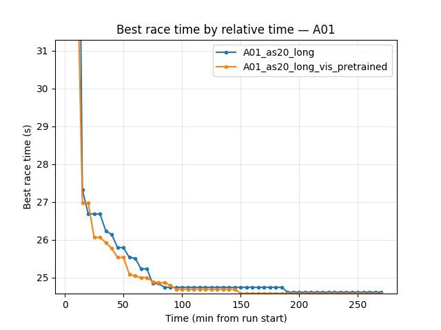
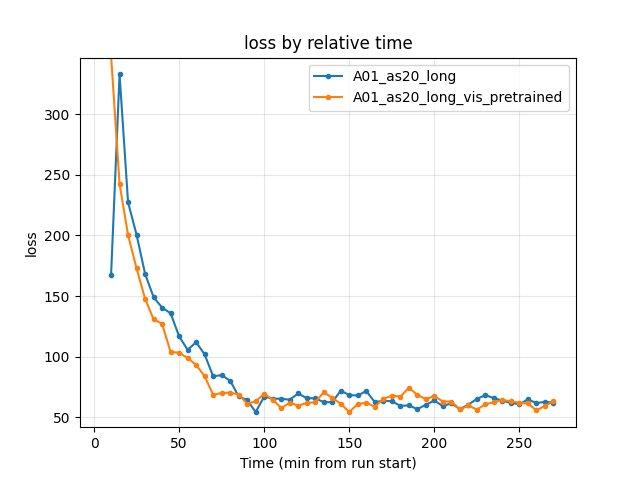
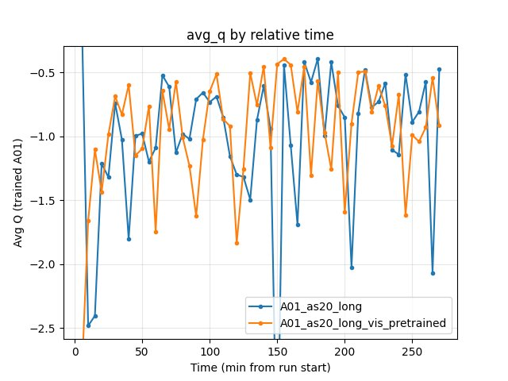

.. _pretrain_visual_backbone:

Visual backbone pretraining
===========================

Experiment Overview
-------------------

This experiment tested the **effect of pretraining the visual backbone** (CNN ``img_head``) on RL training performance. The pretrained encoder was trained on TrackMania replay frames using an autoencoder objective, then injected into a fresh IQN network before RL training.

**Hypothesis:** A pretrained visual backbone provides better image features from the start, leading to faster convergence and better final race times.

**Key parameters changed:** ``pretrain_encoder_path`` in training config (baseline: null; experimental: ``output/ptretrain/vis/v1/encoder.pt``). All other RL parameters were identical (batch_size, lr_schedule, maps, etc.).

Results
-------

**Important:** Run durations differed (A01_as20_long ~495 min, A01_as20_long_vis_pretrained ~275 min), so all findings below are by **relative time** (minutes from run start) and by **steps** (training step checkpoints). Comparing by "last value" is invalid.

**Key Findings:**

- **Faster convergence:** A01_as20_long_vis_pretrained reaches good A01 times much earlier. At 35 min: 24.79s vs 25.02s (baseline). At 75 min: 24.55s vs 24.77s. At 150 min: 24.50s vs 24.59s.
- **Better best time at common window:** By 270 min (end of pretrained run): vis_pretrained 24.47s, baseline 24.53s (~60 ms faster).
- **Higher finish rate:** At 270 min, pretrained has 74% eval finish rate vs 63% baseline; explo 78% vs 76%.
- **Lower mean/std of race times:** Pretrained shows lower std and better mean at same checkpoints (more stable policy).
- **By steps:** At 11.15M steps (common max), pretrained best 24.47s vs baseline 24.53s. Pretrained reached 24.50s by ~6M steps; baseline needed more steps.
- **Training loss:** Similar by end of common window (~62–63); pretrained had slightly lower loss in early phase (e.g. at 90 min: 61.35 vs 64.29).
- **GPU utilization:** Both ~70–72% over the window; no significant difference.

Run Analysis
------------

- **A01_as20_long** (baseline): Same config as A01_as20_long_vis_pretrained except ``pretrain_encoder_path: null``. IQN starts from random weights. **~495 min** (relative time), 3 TensorBoard log dirs merged.
- **A01_as20_long_vis_pretrained**: ``pretrain_encoder_path: "output/ptretrain/vis/v1/encoder.pt"``. Encoder injected into IQN before training start. **~275 min** (relative time), 2 TensorBoard log dirs merged.

**Pretrain encoder source:** ``output/ptretrain/vis/v1``, trained with ``config_files/pretrain/vis/pretrain_config.yaml``:
  - Task: autoencoder (ae)
  - Framework: PyTorch Lightning
  - Image size: 64×64 (matches IQN ``w_downsized`` / ``h_downsized``)
  - Epochs: 50
  - Batch size: 4096
  - Final train_loss: 0.0112
  - Dataset: 441,247 samples from ``maps/img``

Detailed TensorBoard Metrics Analysis
-------------------------------------

**Methodology — Relative time and by steps:** Metrics are compared (1) at checkpoints 5, 10, 15, 20, … min (only up to the shortest run, 270 min) and (2) at step checkpoints 50k, 100k, … (only up to the smallest max step). The figures below show one metric per graph (runs as lines, by relative time).

A01 Map Performance (common window up to 270 min)
~~~~~~~~~~~~~~~~~~~~~~~~~~~~~~~~~~~~~~~~~~~~~~~~~

- **Baseline (A01_as20_long):** at 35 min — 25.02s; at 85 min — 24.71s; at 150 min — 24.59s; at 270 min — 24.53s.
- **Pretrained (A01_as20_long_vis_pretrained):** at 35 min — 24.79s; at 85 min — 24.55s; at 150 min — 24.50s; at 270 min — 24.47s.

Training Loss
~~~~~~~~~~~~~~

- **Baseline:** at 90 min — 64.29; at 270 min — 62.27.
- **Pretrained:** at 90 min — 61.35; at 270 min — 63.28.

Average Q-values
~~~~~~~~~~~~~~~~

- Both runs show similar Q dynamics; no systematic advantage for either.
- **Baseline:** at 270 min — -0.47.
- **Pretrained:** at 270 min — -0.92.

GPU Utilization
~~~~~~~~~~~~~~~

- Both ~70–72% over the common window; no significant difference.

Configuration Changes
---------------------

**Training** (only change between runs):

.. code-block:: yaml

   pretrain_encoder_path: null   # baseline (A01_as20_long)
   pretrain_encoder_path: "output/ptretrain/vis/v1/encoder.pt"  # pretrained (A01_as20_long_vis_pretrained)

**Pretrain** (``config_files/pretrain/vis/pretrain_config.yaml``):

.. code-block:: yaml

   task: ae
   framework: lightning
   image_size: 64
   n_stack: 1
   epochs: 50
   batch_size: 4096
   lr: 0.001
   data_dir: maps/img
   output_dir: output/ptretrain/vis
   run_name: v1

Hardware
--------

- **GPU:** Same as other A01 runs (see training_speed / extended_training).
- **Parallel instances:** Same gpu_collectors_count (from config_default).
- **System:** Windows (from pretrain_meta.json path).

Conclusions
-----------

**Visual pretraining helps.** By relative time and by steps, A01_as20_long_vis_pretrained:

- Converges faster to good A01 times (e.g. 24.79s by 35 min vs 25.02s for baseline).
- Achieves a better best time at the common window (24.47s vs 24.53s).
- Shows higher finish rate and lower std of race times (more stable).

The pretrain phase (autoencoder on 441k replay frames, 50 epochs) adds upfront cost but reduces RL wall-clock time needed to reach the same performance. The encoder was trained with ``output/ptretrain/vis/v1`` config; see :ref:`pretrain_replay_roadmap` for further experiments (SimCLR vs AE, more epochs, etc.).

Recommendations
---------------

- **Use pretrained encoder** for new A01 (or similar) runs when replay frames are available. Inject with ``pretrain_encoder_path: "output/ptretrain/vis/v1/encoder.pt"`` (or your pretrain output path).
- **Reproduce pretrain:** ``python scripts/pretrain_visual_backbone.py`` with ``config_files/pretrain/vis/pretrain_config.yaml``.
- **Inject into IQN:** The training script auto-injects when ``weights1.torch`` does not exist. Manual injection: ``scripts/init_iqn_from_encoder.py``.
- **Next experiments:** Compare AE vs SimCLR pretrain; vary pretrain epochs; vary amount of pretrain data.

**Analysis Tools:**

- By **relative time and by steps**: ``python scripts/analyze_experiment_by_relative_time.py A01_as20_long A01_as20_long_vis_pretrained --interval 5 --step_interval 50000``
- Plots: ``python scripts/generate_experiment_plots.py --experiments pretrain_visual_backbone``
