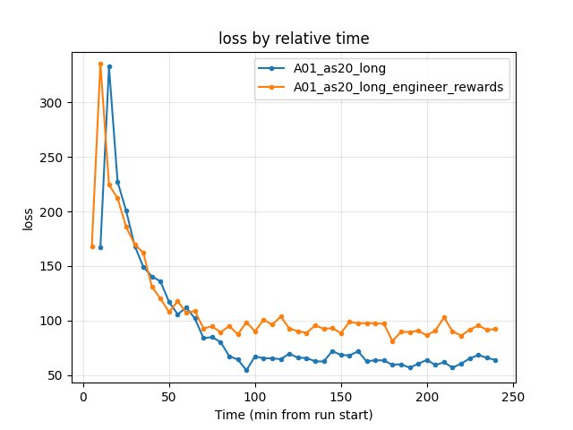

.. _reward_shaping:

Engineered rewards (speedslide, neoslide)
==========================================

Experiment Overview
-------------------

This experiment tested whether **adding engineered technique rewards** (speedslide and neoslide) throughout training improves RL performance. The baseline (A01_as20_long) uses only ``constant_reward_per_ms`` and ``reward_per_m_advanced_along_centerline``; the experimental run (A01_as20_long_engineer_rewards) adds small bonuses for speedslide and neoslide.

**Hypothesis:** Bonuses for driving techniques (speedslide: optimal sideways friction for speed; neoslide: lateral slip) might encourage faster, more efficient driving and improve best race times.

Results
-------

**Important:** Run durations differed: A01_as20_long ~495 min, A01_as20_long_engineer_rewards ~242 min. All findings below are by **relative time** (minutes from run start). Common window: **up to 242 min**.

**Key Findings:**

- **Best A01 time: baseline is better.** At 240 min: A01_as20_long **24.53s**, engineer_rewards **24.94s** (~410 ms slower). engineer_rewards plateaus at 24.94s and never matches the baseline.
- **Eval finish rate:** engineer_rewards 68% vs baseline 63% at 240 min — slightly higher with engineered rewards.
- **First eval finish:** baseline 8.3 min, engineer_rewards 19.4 min — baseline reaches first finish much earlier.
- **Training loss at 240 min:** baseline 63.89, engineer_rewards 92.26 — higher loss with engineered rewards.
- **Conclusion:** Adding speedslide (0.01) and neoslide (0.01) rewards did **not** improve best time; it made it worse (~410 ms) and delayed convergence. The extra reward signal may encourage suboptimal behavior or change the optimization landscape unfavorably.

Run Analysis
------------

- **A01_as20_long** (baseline): No pretrain, no engineered rewards. ``engineered_speedslide_reward_schedule: [[0, 0]]``, ``engineered_neoslide_reward_schedule: [[0, 0]]``. **~495 min**, 3 TensorBoard log dirs merged.
- **A01_as20_long_engineer_rewards**: Same config as baseline except ``engineered_speedslide_reward_schedule: [[0, 0.01]]``, ``engineered_neoslide_reward_schedule: [[0, 0.01]]``. **~242 min**, 2 log dirs merged.

Detailed TensorBoard Metrics Analysis
-------------------------------------

**Methodology — Relative time and by steps:** Metrics are compared at checkpoints 5, 10, 15, 20, … min (only up to the shortest run) and at step checkpoints 50k, 100k, … The figures below show one metric per graph (runs as lines, by relative time).

A01 Map Performance (common window up to 242 min)
~~~~~~~~~~~~~~~~~~~~~~~~~~~~~~~~~~~~~~~~~~~~~~~~~

- **A01_as20_long (baseline):** First eval finish ~8.3 min. At 60 min — 24.77s; at 120 min — 24.59s; at 180 min — 24.59s; at 240 min — **24.53s**.
- **A01_as20_long_engineer_rewards:** First eval finish ~19.4 min. At 60 min — 24.94s; at 120 min — 24.94s; at 180 min — 24.94s; at 240 min — **24.94s** (plateau).

.. image:: ../_static/exp_reward_shaping_A01_best.jpg
   :alt: A01 best time by relative time (A01_as20_long vs A01_as20_long_engineer_rewards)

Training Loss
~~~~~~~~~~~~~

- **Baseline:** at 240 min — 63.89.
- **Engineer rewards:** at 240 min — 92.26 (higher).

Configuration Changes
---------------------

**Rewards** (``rewards`` section in config YAML):

.. code-block:: yaml

   # Baseline: all engineered rewards disabled
   engineered_speedslide_reward_schedule: [[0, 0]]
   engineered_neoslide_reward_schedule: [[0, 0]]

   # Engineer_rewards run: small bonuses throughout training
   engineered_speedslide_reward_schedule: [[0, 0.01]]
   engineered_neoslide_reward_schedule: [[0, 0.01]]

Hardware
--------

- **GPU:** Same as other A01 runs.
- **System:** Windows.

Conclusions
-----------

- Adding speedslide (0.01) and neoslide (0.01) rewards **did not help** best A01 time. The engineer_rewards run plateaued at 24.94s vs baseline 24.53s (~410 ms worse).
- Eval finish rate was slightly higher (68% vs 63%), but first eval finish was much later (19.4 min vs 8.3 min).
- The extra reward signal may have encouraged over-sliding or changed the optimization landscape; loss was higher. For best time on A01, **keep engineered rewards disabled** or try lower values / different schedules.

Recommendations
---------------

- **For best A01 time:** Use baseline reward structure (no speedslide/neoslide bonuses). Current values (0.01 each) did not help.
- **Future experiments:** Try lower values (e.g. 0.001), or schedule rewards to kick in only after basic driving is learned (e.g. [[2000000, 0.01]]); or try close_to_vcp / kamikaze with small values.

**Analysis Tools:**

- By **relative time and by steps**: ``python scripts/analyze_experiment_by_relative_time.py A01_as20_long A01_as20_long_engineer_rewards --interval 5 --step_interval 50000``
- Plots: ``python scripts/generate_experiment_plots.py --experiments reward_shaping``
