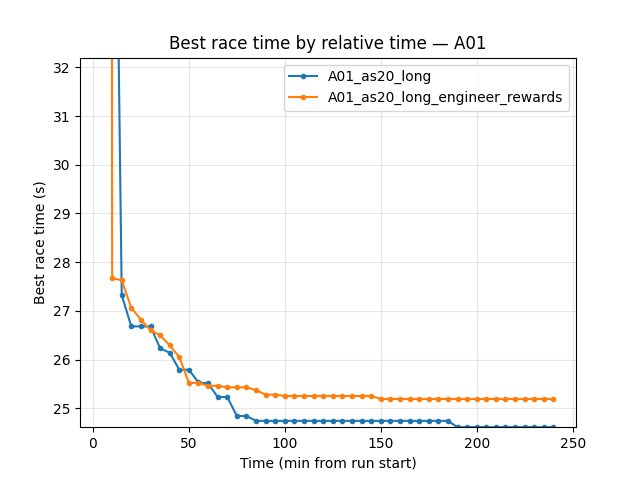
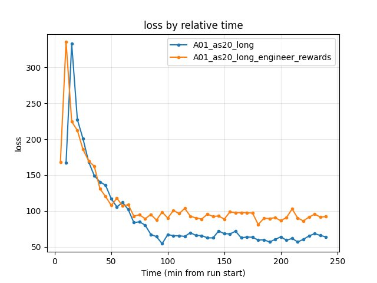
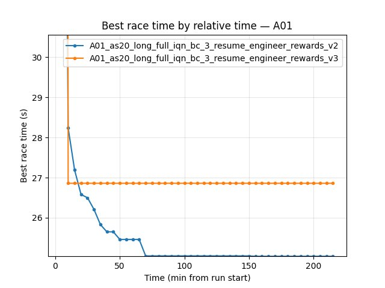

.. _reward_shaping:

Engineered rewards (speedslide, neoslide)
==========================================

Experiment Overview
-------------------

This experiment tested whether **adding engineered technique rewards** (speedslide and neoslide) throughout training improves RL performance. The baseline (A01_as20_long) uses only ``constant_reward_per_ms`` and ``reward_per_m_advanced_along_centerline``; the experimental run (A01_as20_long_engineer_rewards) adds small bonuses for speedslide and neoslide.

**Hypothesis:** Bonuses for driving techniques (speedslide: optimal sideways friction for speed; neoslide: lateral slip) might encourage faster, more efficient driving and improve best race times.

Results
-------

**Important:** Run durations differed: A01_as20_long ~495 min, A01_as20_long_engineer_rewards ~242 min. All findings below are by **relative time** (minutes from run start). Common window: **up to 242 min**.

**Key Findings:**

- **Best A01 time: baseline is better.** At 240 min: A01_as20_long **24.53s**, engineer_rewards **24.94s** (~410 ms slower). engineer_rewards plateaus at 24.94s and never matches the baseline.
- **Eval finish rate:** engineer_rewards 68% vs baseline 63% at 240 min — slightly higher with engineered rewards.
- **First eval finish:** baseline 8.3 min, engineer_rewards 19.4 min — baseline reaches first finish much earlier.
- **Training loss at 240 min:** baseline 63.89, engineer_rewards 92.26 — higher loss with engineered rewards.
- **Conclusion:** Adding speedslide (0.01) and neoslide (0.01) rewards did **not** improve best time; it made it worse (~410 ms) and delayed convergence. The extra reward signal may encourage suboptimal behavior or change the optimization landscape unfavorably.

Run Analysis
------------

- **A01_as20_long** (baseline): No pretrain, no engineered rewards. ``engineered_speedslide_reward_schedule: [[0, 0]]``, ``engineered_neoslide_reward_schedule: [[0, 0]]``. **~495 min**, 3 TensorBoard log dirs merged.
- **A01_as20_long_engineer_rewards**: Same config as baseline except ``engineered_speedslide_reward_schedule: [[0, 0.01]]``, ``engineered_neoslide_reward_schedule: [[0, 0.01]]``. **~242 min**, 2 log dirs merged.

Detailed TensorBoard Metrics Analysis
-------------------------------------

**Methodology — Relative time and by steps:** Metrics are compared at checkpoints 5, 10, 15, 20, … min (only up to the shortest run) and at step checkpoints 50k, 100k, … The figures below show one metric per graph (runs as lines, by relative time).

A01 Map Performance (common window up to 242 min)
~~~~~~~~~~~~~~~~~~~~~~~~~~~~~~~~~~~~~~~~~~~~~~~~~

- **A01_as20_long (baseline):** First eval finish ~8.3 min. At 60 min — 24.77s; at 120 min — 24.59s; at 180 min — 24.59s; at 240 min — **24.53s**.
- **A01_as20_long_engineer_rewards:** First eval finish ~19.4 min. At 60 min — 24.94s; at 120 min — 24.94s; at 180 min — 24.94s; at 240 min — **24.94s** (plateau).

Training Loss
~~~~~~~~~~~~~

- **Baseline:** at 240 min — 63.89.
- **Engineer rewards:** at 240 min — 92.26 (higher).

Configuration Changes
---------------------

**Rewards** (``rewards`` section in config YAML):

.. code-block:: yaml

   # Baseline: all engineered rewards disabled
   engineered_speedslide_reward_schedule: [[0, 0]]
   engineered_neoslide_reward_schedule: [[0, 0]]

   # Engineer_rewards run: small bonuses throughout training
   engineered_speedslide_reward_schedule: [[0, 0.01]]
   engineered_neoslide_reward_schedule: [[0, 0.01]]

Hardware
--------

- **GPU:** Same as other A01 runs.
- **System:** Windows.

Conclusions
-----------

- Adding speedslide (0.01) and neoslide (0.01) rewards **did not help** best A01 time. The engineer_rewards run plateaued at 24.94s vs baseline 24.53s (~410 ms worse).
- Eval finish rate was slightly higher (68% vs 63%), but first eval finish was much later (19.4 min vs 8.3 min).
- The extra reward signal may have encouraged over-sliding or changed the optimization landscape; loss was higher. For best time on A01, **keep engineered rewards disabled** or try lower values / different schedules.

Recommendations
---------------

- **For best A01 time:** Use baseline reward structure (no speedslide/neoslide bonuses). Current values (0.01 each) did not help.
- **Future experiments:** Try lower values (e.g. 0.001), or schedule rewards to kick in only after basic driving is learned (e.g. [[2000000, 0.01]]); or try close_to_vcp / kamikaze with small values.

**Analysis Tools:**

- By **relative time and by steps**: ``python scripts/analyze_experiment_by_relative_time.py A01_as20_long A01_as20_long_engineer_rewards --interval 5 --step_interval 50000``
- Plots: ``python scripts/generate_experiment_plots.py --experiments reward_shaping``

BC full IQN resume with engineered rewards (A01_as20_long_full_iqn_bc_3_resume_engineer_rewards)
----------------------------------------------------------------------------------------------

Experiment Overview
~~~~~~~~~~~~~~~~~~~

This run tests **engineered rewards (speedslide and neoslide) on top of a BC full IQN–pretrained agent**. It was **initialized from the checkpoint in** ``save/A01_as20_long_full_iqn_bc_3`` (weights and optimizer state from that run). Unlike the earlier engineer_rewards experiment (no pretrain), the policy thus starts from an already RL-trained BC full IQN; then training continues with higher engineered reward coefficients (0.1 each instead of 0.01).

**Goal:** See whether engineered rewards help or hurt when the agent already has good driving priors from BC.

Results
~~~~~~~

**Note:** TensorBoard logs for this run were not present under the default ``tensorboard/`` path at documentation time. Run the analysis script with your log dir to get metrics by relative time and by steps. When available, compare to ``A01_as20_long_full_iqn_bc_3`` (same BC pretrain, no engineered rewards) over the same time or step window.

Run Analysis
~~~~~~~~~~~~

- **A01_as20_long_full_iqn_bc_3_resume_engineer_rewards**: Initialized from ``save/A01_as20_long_full_iqn_bc_3`` (checkpoint and optimizer from that run). ``pretrain_bc_heads_path: null``. ``engineered_speedslide_reward_schedule: [[0, 0.1]]``, ``engineered_neoslide_reward_schedule: [[0, 0.1]]``. Map: A01, reference line ``A01_0.5m_cl.npy``. Config snapshot: ``save/A01_as20_long_full_iqn_bc_3_resume_engineer_rewards/config_snapshot.yaml``.
- **Baseline for comparison:** ``A01_as20_long_full_iqn_bc_3`` (the run this checkpoint was loaded from; no or zero engineered rewards). Compare by relative time once TensorBoard logs are available.

Configuration Changes
~~~~~~~~~~~~~~~~~~~~~

**Rewards** (from run config snapshot):

.. code-block:: yaml

   engineered_speedslide_reward_schedule: [[0, 0.1]]
   engineered_neoslide_reward_schedule: [[0, 0.1]]
   engineered_kamikaze_reward_schedule: [[0, 0.0]]
   engineered_close_to_vcp_reward_schedule: [[0, 0.0]]

**Training:** ``run_name: "A01_as20_long_full_iqn_bc_3_resume_engineer_rewards"``, ``batch_size: 512``, ``pretrain_bc_heads_path: null`` (resume from existing checkpoint). LR and gamma schedules as in the main config (e.g. lr 0.001 to 0.00005 to 0.00001 by steps).

Conclusions and Recommendations
~~~~~~~~~~~~~~~~~~~~~~~~~~~~~~~~

- Document run duration and key metrics (best A01 time, eval finish rate, loss at checkpoints) once TensorBoard data is available.
- Compare by **relative time** and **by steps** to ``A01_as20_long_full_iqn_bc_3`` to see if 0.1/0.1 engineered rewards improve or degrade performance after BC pretrain.
- **Analysis command** (when logs exist): ``python scripts/analyze_experiment_by_relative_time.py A01_as20_long_full_iqn_bc_3_resume_engineer_rewards A01_as20_long_full_iqn_bc_3 --interval 5 --step_interval 50000`` (add ``--logdir <path>`` if TensorBoard logs are not in ``tensorboard/``).

BC full IQN resume: v2 vs v3 (engineered reward coefficients)
-------------------------------------------------------------

Experiment Overview
~~~~~~~~~~~~~~~~~~~

Two runs resumed from the same BC full IQN checkpoint (from ``save/A01_as20_long_full_iqn_bc_3``), differing only in **engineered reward coefficients**:

- **v2:** ``engineered_speedslide_reward_schedule: [[0, 0.01]]``, ``engineered_neoslide_reward_schedule: [[0, 0.01]]`` (equal, low).
- **v3:** ``engineered_speedslide_reward_schedule: [[0, 0.05]]``, ``engineered_neoslide_reward_schedule: [[0, 0.01]]`` (5x higher speedslide, same neoslide).

Both use map_cycle with A01, exploration repeat 4 and eval repeat 4. **Goal:** Compare how different speedslide/neoslide strengths affect stability of best time, eval finish rate, and exploration best.

Results
~~~~~~~

**Important:** All findings below are by **relative time** (minutes from run start). v2 ~222 min, v3 ~217 min; common window **up to 215 min**.

**Key Findings:**

- **Best A01 time:** Both runs keep **24.52s** (inherited from checkpoint); no improvement over the window.
- **eval_race_time_robust_trained_A01 (near-best finishes):** v2 **improves** over time (mean 29.59s at 5 min → **25.59s** at 215 min). v3 **degrades** (mean 30.12s at 5 min → **32.32s** at 215 min). Lower engineered rewards (v2) preserve stable near-best performance; higher speedslide (v3) worsens it.
- **eval_race_time_trained_A01 (all eval finishes):** v3 has **higher finish rate** (86% vs 77% at 215 min) and **lower mean time** (71.19s vs 88.84s at 215 min). So v3 finishes more often with better average among finishes, but v2 keeps better “robust” (close-to-best) behavior.
- **explo_race_time_trained_A01:** v2 exploration best **improves** (25.05s by 70 min and later). v3 exploration best **stays at 26.86s** (no improvement). v2 explores toward faster times; v3 does not.
- **Conclusion:** v2 (0.01/0.01) is better for **stability and best-time potential** (robust mean, explo best). v3 (0.05/0.01) gives **higher eval finish rate and better mean eval time** but worse robust mean and no exploration improvement. Trade-off: use v2 for pushing best time; v3 if finish rate / mean time matter more.

Run Analysis
~~~~~~~~~~~~

- **A01_as20_long_full_iqn_bc_3_resume_engineer_rewards_v2**: Speedslide 0.01, neoslide 0.01. Map A01, ref ``A01_0.5m_cl.npy``; exploration repeat 4, eval repeat 4. **~222 min.** Config: ``save/A01_as20_long_full_iqn_bc_3_resume_engineer_rewards_v2/config_snapshot.yaml``.
- **A01_as20_long_full_iqn_bc_3_resume_engineer_rewards_v3**: Speedslide 0.05, neoslide 0.01. Same map and repeat setup. **~217 min.** Config: ``save/A01_as20_long_full_iqn_bc_3_resume_engineer_rewards_v3/config_snapshot.yaml``.

Detailed TensorBoard Metrics Analysis
~~~~~~~~~~~~~~~~~~~~~~~~~~~~~~~~~~~~~

**Methodology — Relative time and by steps:** Metrics are compared at checkpoints 5, 10, 15, … min (up to the shortest run) and at step checkpoints (e.g. 50k, 100k). The figures below show one metric per graph (runs as lines, by relative time). Command: ``python scripts/analyze_experiment_by_relative_time.py A01_as20_long_full_iqn_bc_3_resume_engineer_rewards_v2 A01_as20_long_full_iqn_bc_3_resume_engineer_rewards_v3 --interval 5 --step_interval 50000 --plot --output-dir docs/source/_static --prefix exp_reward_shaping_bc_resume_v2_v3``.

A01 eval robust (near-best) and eval finish rate (common window up to 215 min)
~~~~~~~~~~~~~~~~~~~~~~~~~~~~~~~~~~~~~~~~~~~~~~~~~~~~~~~~~~~~~~~~~~~~~~~~~~~~~~

- **v2:** At 60 min — robust mean 26.06s, eval finish rate 67%. At 215 min — robust mean **25.59s**, eval finish rate **77%**.
- **v3:** At 60 min — robust mean 29.63s, eval finish rate 76%. At 215 min — robust mean **32.32s**, eval finish rate **86%**.

A01 exploration best
~~~~~~~~~~~~~~~~~~~~

- **v2:** Best improves from 28.24s (10 min) to **25.04s** (70 min and later).
- **v3:** Best stays at **26.86s** from 10 min onward (no improvement).

Configuration Changes
~~~~~~~~~~~~~~~~~~~~~

**Rewards** (only difference between v2 and v3):

.. code-block:: yaml

   # v2: low, equal
   engineered_speedslide_reward_schedule: [[0, 0.01]]
   engineered_neoslide_reward_schedule: [[0, 0.01]]

   # v3: 5x speedslide, same neoslide
   engineered_speedslide_reward_schedule: [[0, 0.05]]
   engineered_neoslide_reward_schedule: [[0, 0.01]]

**Map cycle (both):** A01, exploration repeat 4, eval repeat 4; reference line ``A01_0.5m_cl.npy``.

Hardware
~~~~~~~~

- Same as other BC-resume runs (4 GPU collectors, running_speed 512).

Conclusions
~~~~~~~~~~~

- **v2 (0.01/0.01)** keeps robust mean improving (25.59s at 215 min) and exploration best improving (25.04s). Better for **best-time focus and stability**.
- **v3 (0.05/0.01)** gives higher eval finish rate (86%) and better mean eval time (71.19s) but worse robust mean (32.32s) and no exploration best improvement. Better for **finish rate and average performance**.
- For pushing A01 best time after BC resume, **prefer v2-style (low, equal) engineered rewards**.

Recommendations
~~~~~~~~~~~~~~~

- Use **0.01/0.01** (v2) when optimizing for best time and stable near-best behavior.
- If you need higher finish rate and better mean time, try v3-style (higher speedslide), accepting worse robust mean and no explo best gain.
- **Analysis (and plots):** ``python scripts/analyze_experiment_by_relative_time.py A01_as20_long_full_iqn_bc_3_resume_engineer_rewards_v2 A01_as20_long_full_iqn_bc_3_resume_engineer_rewards_v3 --interval 5 --step_interval 50000 --plot --output-dir docs/source/_static --prefix exp_reward_shaping_bc_resume_v2_v3``

Overall conclusions: engineered rewards and 4 explo / 4 eval
-------------------------------------------------------------

**Do engineered rewards (speedslide, neoslide) actually help?**

Across the experiments on this page, the impact is **mixed and generally modest**:

- **Without BC pretrain** (A01_as20_long vs A01_as20_long_engineer_rewards): 0.01/0.01 **hurt** best time (~410 ms worse, 24.94s vs 24.53s), delayed first finish, and increased loss. So on a blank-slate agent, small engineered bonuses did not solve anything and made things worse.
- **With BC full IQN resume** (v2 vs v3): Low coefficients (v2: 0.01/0.01) **preserve** best time (24.52s), improve robust mean and exploration best. Higher speedslide (v3: 0.05/0.01) gives **better finish rate and mean eval time** but **worse** robust mean and no exploration best improvement. So engineered rewards do not “solve” best time; at best they can slightly improve finish rate and average performance at the cost of stability and best-time potential.
- **Takeaway:** Engineered rewards are **not** a reliable lever for improving best lap time. For best-time focus, keep them **zero or very low (0.01/0.01)**. Use higher values only if you care more about finish rate / mean time than about pushing the best time.

**Does the 4 explo / 4 eval map_cycle help?**

The **4 exploration + 4 eval** setup (repeat 4 for explo, repeat 4 for eval) was used in v2 and v3. It gives a **50/50 ratio** of exploration vs eval episodes, instead of the more common **64 explo / 1 eval** (≈98% exploration).

- **Pros:** More frequent eval episodes give a **steadier signal** of greedy performance (finish rate, mean time, robust mean) and more **greedy data** in the buffer. That can make tuning and interpretation easier and can reduce the risk of drifting away from good greedy behavior when exploration dominates.
- **Cons:** Fewer exploration steps per “cycle” (4 vs 64), so discovery of new good trajectories may be slower; total exploration per unit time is lower.
- **In practice (v2/v3):** Both runs kept 24.52s best, v2 improved robust mean and exploration best, v3 improved finish rate. So the 4/4 balance did not prevent good behavior and likely made the trade-off between v2 and v3 easier to read from metrics.
- **Takeaway:** The **4/4 approach is a reasonable choice** when you want a balanced view of explo vs eval and more stable metrics. For maximum exploration throughput you can still use 64/1; for tuning and clearer assessment, 4/4 (or similar balanced ratios) is justified.
