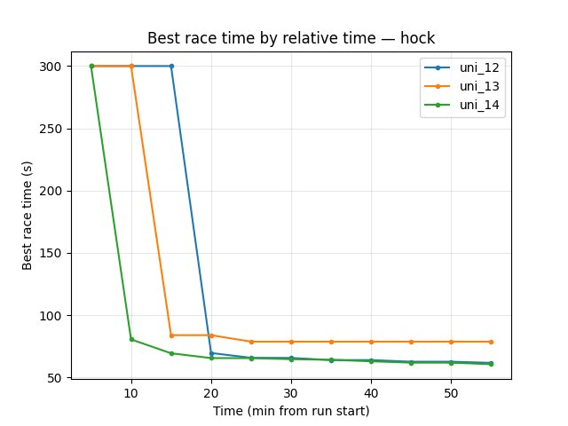
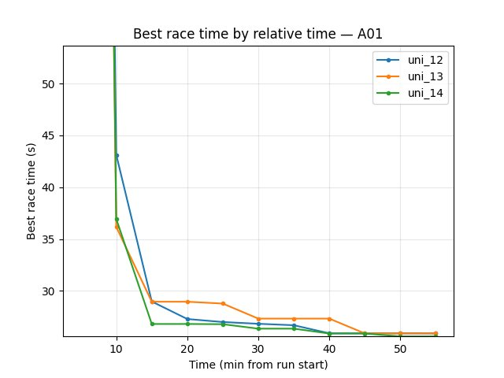

Temporal Mini-Race Duration
==========================

This experiment tests the effect of **temporal_mini_race_duration_ms** on convergence and policy quality. In this project, reward and value estimation use a **fixed-duration segment** of the trajectory (a "mini-race") rather than the full episode. In RL literature this is related to **temporal abstraction** (reasoning over trajectory segments; see Sutton et al. "Between MDPs and Semi-MDPs: A Framework for Temporal Abstraction in Reinforcement Learning") and **fixed-horizon** or **truncated-horizon** reward — i.e. using part of the trajectory instead of the full run.

**Runs:** **uni_12** (7000 ms), **uni_13** (14000 ms), **uni_14** (3500 ms). Baseline for comparison: **uni_12** (7 s).

Experiment Overview
-------------------

We compared segment durations: **uni_12** (7 s), **uni_13** (14 s), **uni_14** (3.5 s). uni_12 ran ~55 min; uni_13 and uni_14 ~100 min; comparison is by **relative time** over the common window up to 55 min. The primary change in this experiment is segment duration.

Results
-------

**Important:** Findings are by **relative time** (minutes from run start). Common window up to 55 min (uni_12 ended at 55 min; uni_13 and uni_14 ran ~100 min); metrics are compared at the same checkpoints (5, 10, …, 55 min).

**Data source:** Numbers are from ``scripts/analyze_experiment_by_relative_time.py`` (per-race tables: **Hock** = long track ~55–70 s, **A01** = short track ~24–25 s). Reproduce: ``python scripts/analyze_experiment_by_relative_time.py uni_12 uni_13 uni_14 --interval 5`` (``--logdir <path>`` if needed).

**Key findings (uni_12 vs uni_13):**

- **uni_12 (7 s)** converges faster: Hock (per-race explo) 69.61s by 20 min, 61.68s at 55 min; uni_13 still 78.73s at 55 min. A01 (eval) uni_12 24.85s by 20 min; uni_13 26.87s at 55 min.
- At 55 min: **Hock** uni_12 61.68s, uni_13 78.73s → **uni_12 better**. **A01** uni_12 24.85s, uni_13 26.87s → **uni_12 better**.
- **Training loss** at 55 min: uni_12 102.84, uni_13 454.31 → **uni_12 much lower** (better).
- **RL/avg_Q_trained_A01** at 55 min: uni_12 -0.71, uni_13 -1.17 → **uni_12 better** (less negative).
- **GPU utilization** similar (~69–74% uni_12, ~67–71% uni_13).

**Key findings (uni_12 vs uni_14):**

- At 55 min **uni_14 (3.5 s)** has slightly better **Hock** (60.59s vs 61.68s) and slightly better **A01** (24.74s vs 24.85s), much lower loss (46.78 vs 102.84), and better Q (-0.16 vs -0.71).
- **uni_12** converges much faster on A01: 24.85s by 20 min (uni_14 reaches 24.74s only by 55 min). Hock: uni_12 69.61s by 20 min, 61.68s at 55 min; uni_14 60.59s at 55 min (better final value but later).
- **GPU utilization** similar (~71–74% uni_12, ~67–69% uni_14).

**Conclusion (uni_12 vs uni_13):** Over the common 55 min window, **uni_12 (7 s)** outperforms **uni_13 (14 s)**: faster convergence, better race times (Hock 61.68s vs 78.73s, A01 24.85s vs 26.87s), much lower loss, better Q. Doubling the segment from 7 s to 14 s **did not help**.

**Conclusion (uni_12 vs uni_14):** At 55 min **uni_14 (3.5 s)** has slightly better Hock (60.59s vs 61.68s), slightly better A01 (24.74s vs 24.85s), much lower loss, and better Q. **uni_12 converges much faster** on A01 (24.85s by 20 min vs uni_14 by 55 min). So 3500 ms gives better final metrics at 55 min (loss, Q, Hock, A01) but **slower convergence** — **mixed result**: prefer 7 s for faster convergence; 3.5 s if you run longer and want slightly better final times.

Run Analysis
------------

- **uni_12**: temporal_mini_race_duration_ms = 7000, **~55 min**
- **uni_13**: temporal_mini_race_duration_ms = 14000, **~100 min**
- **uni_14**: temporal_mini_race_duration_ms = 3500, **~101 min**

TensorBoard logs: ``tensorboard\uni_12``, ``tensorboard\uni_13``, ``tensorboard\uni_14``. To reproduce (2+ runs supported): ``python scripts/analyze_experiment_by_relative_time.py uni_12 uni_13 uni_14 --interval 5`` (or ``uni_12 uni_13``, ``uni_12 uni_14``; ``--logdir "<path>"`` if not from project root).

Analysis methodology
~~~~~~~~~~~~~~~~~~~~

Same as in ``training_speed``: the script uses **per-race events** (``Race/eval_race_time_*``, ``Race/explo_race_time_*``) with one **run-wide t0** per run so comparison is by relative time. At each checkpoint: best/mean/std, best among finished, finish rate, first finish. Scalars ``alltime_min_ms_*``, loss, Q, GPU % at checkpoints.

Detailed TensorBoard Metrics Analysis
-------------------------------------

**Methodology — Relative time:** Metrics at checkpoints 5, 10, 15, …, 55 min; common window up to 55 min. Race times from per-race tables (Hock ~55–70 s, A01 ~24–25 s); loss/Q/GPU% = last value at that moment. The figures below illustrate each metric (one graph per metric, runs as lines, by relative time).

Hock (per-race explo_race_time_trained_hock)
~~~~~~~~~~~~~~~~~~~~~~~~~~~~~~~~~~~~~~~~~~~~~

- **uni_12**: at 10 min 300s (no finish); at 20 min 69.61s; at 55 min **61.68s**.
- **uni_13**: at 10 min 80.54s; at 15 min 83.92s; at 55 min **78.73s**.
- **uni_12** reaches good Hock earlier and is better at 55 min (61.68s vs 78.73s).

A01 (per-race eval_race_time_trained_A01)
~~~~~~~~~~~~~~~~~~~~~~~~~~~~~~~~~~~~~~~~~

- **uni_12**: at 20 min 24.85s; at 55 min 24.85s.
- **uni_13**: at 55 min 26.87s (best in window).
- **uni_12** better on A01: reaches 24.85s by 20 min; at 55 min uni_12 24.85s, uni_13 26.87s.

Training loss
~~~~~~~~~~~~~

- **uni_12**: at 55 min 102.84.
- **uni_13**: at 55 min 454.31; higher throughout the window.
- **uni_12** much lower (better); uni_13 loss remains high over the common 55 min.

.. image:: ../_static/exp_temporal_uni12_uni13_uni14_loss.jpg
   :alt: Training loss by relative time (temporal duration experiment)

Average Q-values (RL/avg_Q_trained_A01)
~~~~~~~~~~~~~~~~~~~~~~~~~~~~~~~~~~~~~~

- **uni_12**: at 20 min -0.83; at 55 min -0.71.
- **uni_13**: at 55 min -1.17; more negative over the run.
- **uni_12** better (less negative) at end of common window.

GPU utilization (Performance/learner_percentage_training)
~~~~~~~~~~~~~~~~~~~~~~~~~~~~~~~~~~~~~~~~~~~~~~~~~~~~~~~~~

- **uni_12**: ~71–74% over the window; at 55 min 71.9%.
- **uni_13**: ~67–71% over the window; at 55 min 69.6%.
- Similar; uni_12 slightly higher.

uni_12 vs uni_14 (7 s vs 3.5 s segment, common window up to 55 min)
~~~~~~~~~~~~~~~~~~~~~~~~~~~~~~~~~~~~~~~~~~~~~~~~~~~~~~~~~~~~~~~~~~~~

uni_14 — temporal_mini_race_duration_ms = **3500** (3.5 s segment). uni_12 ~55 min; uni_14 ~101 min.

Hock (per-race explo_race_time_trained_hock)
^^^^^^^^^^^^^^^^^^^^^^^^^^^^^^^^^^^^^^^^^^^

- **uni_12**: at 20 min 69.61s; at 55 min **61.68s**.
- **uni_14**: at 15 min 69.38s; at 55 min **60.59s**.
- **uni_14** slightly better Hock at 55 min (60.59s vs 61.68s); uni_12 and uni_14 both reach good Hock by 55 min.

A01 (per-race eval_race_time_trained_A01)
^^^^^^^^^^^^^^^^^^^^^^^^^^^^^^^^^^^^^^^^^

- **uni_12**: at 20 min 24.85s; at 55 min 24.85s.
- **uni_14**: at 40 min 26.56s; at 55 min **24.74s**.
- **uni_12** converges much faster on A01 (24.85s by 20 min); **uni_14** reaches slightly better A01 at 55 min (24.74s vs 24.85s).

Training loss
^^^^^^^^^^^^^

- **uni_12**: at 55 min 102.84.
- **uni_14**: at 55 min 46.78; lower throughout the window.
- **uni_14** much lower (better raw loss); but A01 performance worse, so loss alone is misleading.

Average Q-values (RL/avg_Q_trained_A01)
^^^^^^^^^^^^^^^^^^^^^^^^^^^^^^^^^^^^^^^

- **uni_12**: at 55 min -0.71.
- **uni_14**: at 55 min -0.16; less negative over the run.
- **uni_14** better (higher Q) at end of common window.

GPU utilization
^^^^^^^^^^^^^^^

- **uni_12**: ~71–74% over the window; at 55 min 71.9%.
- **uni_14**: ~67–69% over the window; at 55 min 67.2%.
- Similar; uni_12 slightly higher.

**Summary (uni_12 vs uni_14):** At 55 min 3.5 s (uni_14) gives slightly better Hock (60.59s vs 61.68s), slightly better A01 (24.74s vs 24.85s), much lower loss, and better Q. **uni_12 converges much faster** on A01 (24.85s by 20 min vs uni_14 by 55 min). Trade-off: 3.5 s improves final metrics at 55 min; 7 s gives faster convergence.

Configuration Changes
---------------------

**Environment** (``environment`` section in config YAML):

.. code-block:: python

   # uni_12: 7000 ms (7 s) — baseline; fastest convergence; best vs uni_13 (14 s) over 55 min
   # uni_13: 14000 ms (14 s) — worse than uni_12 over 55 min
   # uni_14: 3500 ms (3.5 s) — at 55 min slightly better Hock and A01, lower loss, better Q; slower convergence on A01
   temporal_mini_race_duration_ms = 7000  # or 3500 / 14000; see experiment doc

**Note:** ``temporal_mini_race_duration_actions`` is derived as ``temporal_mini_race_duration_ms // ms_per_action`` (e.g. 280 actions at 14 s with 50 ms per action). It affects state normalization, priority horizon (``min_horizon_to_update_priority_actions`` in the ``training`` section), and buffer collate logic in ``buffer_utilities.py``.

Hardware
--------

- **GPU**: RTX 5090 (same as other experiments)
- **Parallel instances**: 8 collectors
- **System**: Same across runs

Conclusions
-----------

1. **7 s vs 14 s (uni_12 vs uni_13):** Over the common 55 min window, uni_12 (7000 ms) converges faster and reaches better race times (Hock 61.68s vs 78.73s, A01 24.85s vs 26.87s), much lower loss, and better Q than uni_13 (14000 ms). Longer segment (14 s) did not help.
2. **7 s vs 3.5 s (uni_12 vs uni_14):** At 55 min uni_14 (3500 ms) has slightly better Hock (60.59s vs 61.68s), slightly better A01 (24.74s vs 24.85s), much lower loss (46.78 vs 102.84), and better Q (-0.16 vs -0.71). **uni_12 converges much faster** on A01 (24.85s by 20 min vs uni_14 by 55 min). Mixed: 3.5 s gives better final metrics at 55 min; 7 s gives faster convergence.
3. **Recommendation:** **7000 ms** remains a good default for fastest convergence. Use **3500 ms** if you run at least ~55 min and want slightly better final Hock and A01 and lower loss; avoid 14000 ms unless you re-test with longer runs.

Recommendations
--------------

- **Default:** Prefer **7000 ms** (7 s): fastest convergence; best vs 14 s (uni_13) over 55 min.
- **When to try 3500 ms (uni_14):** If you run at least ~55 min and want slightly better final Hock and A01, lower loss, and better Q; 3.5 s converges slower on A01.
- **When to try 14000 ms:** Only with longer runs; 14 s did not help over 55 min (uni_13).

**Analysis tools:**

- **By relative time** (2+ runs): ``python scripts/analyze_experiment_by_relative_time.py uni_12 uni_13 uni_14 --interval 5`` (``--logdir "<path>"`` if not from project root). Output: per-race tables (best/mean/std, finish rate, first finish) then scalar metrics.
- **Key metrics:** Per-race ``Race/eval_race_time_*``, ``Race/explo_race_time_*``; scalars ``alltime_min_ms_hock``, ``alltime_min_ms_A01``, ``Training/loss``, ``RL/avg_Q_trained_A01``, ``Performance/learner_percentage_training`` (see :doc:`tensorboard_metrics`).
